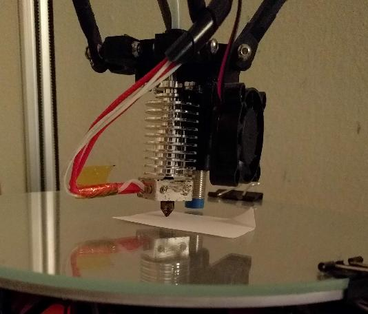

# Bed leveling

Bed leveling (sometimes also referred to as "bed tramming") is
critical to getting high quality prints. If a bed is not properly
"leveled" it can lead to poor bed adhesion, "warping", and subtle
problems throughout the print. This document serves as a guide to
performing bed leveling in Klipper.

It's important to understand the goal of bed leveling. If the printer
is commanded to a position `X0 Y0 Z10` during a print, then the goal
is for the printer's nozzle to be exactly 10mm from the printer's
bed. Further, should the printer then be commanded to a position of
`X50 Z10` the goal is for the nozzle to maintain an exact distance of
10mm from the bed during that entire horizontal move.

In order to get good quality prints the printer should be calibrated
so that Z distances are accurate to within about 25 microns (.025mm).
This is a small distance - significantly smaller than the width of a
typical human hair. This scale can not be measured "by eye". Subtle
effects (such as heat expansion) impact measurements at this scale.
The secret to getting high accuracy is to use a repeatable process and
to use a leveling method that leverages the high accuracy of the
printer's own motion system.

## Choose the appropriate calibration mechanism

Different types of printers use different methods for performing bed
leveling. All of them ultimately depend on the "paper test" (described
below). However, the actual process for a particular type of printer
is described in other documents.

Prior to running any of these calibration tools, be sure to run the
checks described in the [config check document](Config_checks.md). It
is necessary to verify basic printer motion before performing bed
leveling.

For printers with an "automatic Z probe" be sure to calibrate the
probe following the directions in the
[Probe Calibrate](Probe_Calibrate.md) document. For delta printers,
see the [Delta Calibrate](Delta_Calibrate.md) document. For printers
with bed screws and traditional Z endstops, see the
[Manual Level](Manual_Level.md) document.

During calibration it may be necessary to set the printer's Z
`position_min` to a negative number (eg, `position_min = -2`). The
printer enforces boundary checks even during calibration
routines. Setting a negative number allows the printer to move below
the nominal position of the bed, which may help when trying to
determine the actual bed position.

## The "paper test"

The primary bed calibration mechanism is the "paper test". It involves
placing a regular piece of "copy machine paper" between the printer's
bed and nozzle, and then commanding the nozzle to different Z heights
until one feels a small amount of friction when pushing the paper back
and forth.

It is important to understand the "paper test" even if one has an
"automatic Z probe". The probe itself often needs to be calibrated to
get good results. That probe calibration is done using this "paper
test".

In order to perform the paper test, cut a small rectangular piece of
paper using a pair of scissors (eg, 5x3 cm). The paper generally has a
width of around 100 microns (0.100mm). (The exact width of the paper
isn't crucial.)

The first step of the paper test is to inspect the printer's nozzle
and bed. Make sure there is no plastic (or other debris) on the nozzle
or bed.

**Inspect the nozzle and bed to ensure no plastic is present!**

If one always prints on a particular tape or printing surface then one
may perform the paper test with that tape/surface in place. However,
note that tape itself has a width and different tapes (or any other
printing surface) will impact Z measurements. Be sure to rerun the
paper test to measure each type of surface that is in use.

If there is plastic on the nozzle then heat up the extruder and use a
metal tweezers to remove that plastic. Wait for the extruder to fully
cool to room temperature before continuing with the paper test. While
the nozzle is cooling, use the metal tweezers to remove any plastic
that may ooze out.

**Always perform the paper test when both nozzle and bed are at room
temperature!**

When the nozzle is heated, its position (relative to the bed) changes
due to thermal expansion. This thermal expansion is typically around a
100 microns, which is about the same width as a typical piece of
printer paper. The exact amount of thermal expansion isn't crucial,
just as the exact width of the paper isn't crucial. Start with the
assumption that the two are equal (see below for a method of
determining the difference between the two widths).

It may seem odd to calibrate the distance at room temperature when the
goal is to have a consistent distance when heated. However, if one
calibrates when the nozzle is heated, it tends to impart small amounts
of molten plastic on to the paper, which changes the amount of
friction felt. That makes it harder to get a good calibration.
Calibrating while the bed/nozzle is hot also greatly increases the
risk of burning oneself. The amount of thermal expansion is stable, so
it is easily accounted for later in the calibration process.

**Use an automated tool to determine precise Z heights!**

Klipper has several helper scripts available (eg, MANUAL_PROBE,
Z_ENDSTOP_CALIBRATE, PROBE_CALIBRATE, DELTA_CALIBRATE). See the
documents
[described above](#choose-the-appropriate-calibration-mechanism) to
choose one of them.

Run the appropriate command in the OctoPrint terminal window. The
script will prompt for user interaction in the OctoPrint terminal
output. It will look something like:
```
Recv: // Starting manual Z probe. Use TESTZ to adjust position.
Recv: // Finish with ACCEPT or ABORT command.
Recv: // Z position: ?????? --> 5.000 <-- ??????
```

The current height of the nozzle (as the printer currently understands
it) is shown between the "--> <--". The number to the right is the
height of the last probe attempt just greater than the current height,
and to the left is the last probe attempt less than the current height
(or ?????? if no attempt has been made).

Place the paper between the nozzle and bed. It can be useful to fold a
corner of the paper so that it is easier to grab. (Try not to push
down on the bed when moving the paper back and forth.)



Use the TESTZ command to request the nozzle to move closer to the
paper. For example:
```
TESTZ Z=-.1
```

The TESTZ command will move the nozzle a relative distance from the
nozzle's current position. (So, `Z=-.1` requests the nozzle to move
closer to the bed by .1mm.) After the nozzle stops moving, push the
paper back and forth to check if the nozzle is in contact with the
paper and to feel the amount of friction. Continue issuing TESTZ
commands until one feels a small amount of friction when testing with
the paper.

If too much friction is found then one can use a positive Z value to
move the nozzle up. It is also possible to use `TESTZ Z=+` or `TESTZ
Z=-` to "bisect" the last position - that is to move to a position
half way between two positions. For example, if one received the
following prompt from a TESTZ command:
```
Recv: // Z position: 0.130 --> 0.230 <-- 0.280
```
Then a `TESTZ Z=-` would move the nozzle to a Z position of 0.180
(half way between 0.130 and 0.230). One can use this feature to help
rapidly narrow down to a consistent friction. It is also possible to
use `Z=++` and `Z=--` to return directly to a past measurement - for
example, after the above prompt a `TESTZ Z=--` command would move the
nozzle to a Z position of 0.130.

After finding a small amount of friction run the ACCEPT command:
```
ACCEPT
```
This will accept the given Z height and proceed with the given
calibration tool.

The exact amount of friction felt isn't crucial, just as the amount of
thermal expansion and exact width of the paper isn't crucial. Just try
to obtain the same amount of friction each time one runs the test.

If something goes wrong during the test, one can use the `ABORT`
command to exit the calibration tool.

## Determining Thermal Expansion

After successfully performing bed leveling, one may go on to calculate
a more precise value for the combined impact of "thermal expansion",
"width of the paper", and "amount of friction felt during the paper
test".

This type of calculation is generally not needed as most users find
the simple "paper test" provides good results.

The easiest way to make this calculation is to print a test object
that has straight walls on all sides. The large hollow square found in
[docs/prints/square.stl](prints/square.stl) can be used for this.
When slicing the object, make sure the slicer uses the same layer
height and extrusion widths for the first level that it does for all
subsequent layers. Use a coarse layer height (the layer height should
be around 75% of the nozzle diameter) and do not use a brim or raft.

Print the test object, wait for it to cool, and remove it from the
bed. Inspect the lowest layer of the object. (It may also be useful to
run a finger or nail along the bottom edge.) If one finds the bottom
layer bulges out slightly along all sides of the object then it
indicates the nozzle was slightly closer to the bed then it should
be. One can issue a `SET_GCODE_OFFSET Z=+.010` command to increase the
height. In subsequent prints one can inspect for this behavior and
make further adjustment as needed. Adjustments of this type are
typically in 10s of microns (.010mm).

If the bottom layer consistently appears narrower than subsequent
layers then one can use the SET_GCODE_OFFSET command to make a
negative Z adjustment. If one is unsure, then one can decrease the Z
adjustment until the bottom layer of prints exhibit a small bulge, and
then back-off until it disappears.

The easiest way to apply the desired Z adjustment is to create a
START_PRINT g-code macro, arrange for the slicer to call that macro
during the start of each print, and add a SET_GCODE_OFFSET command to
that macro. See the [slicers](Slicers.md) document for further
details.
