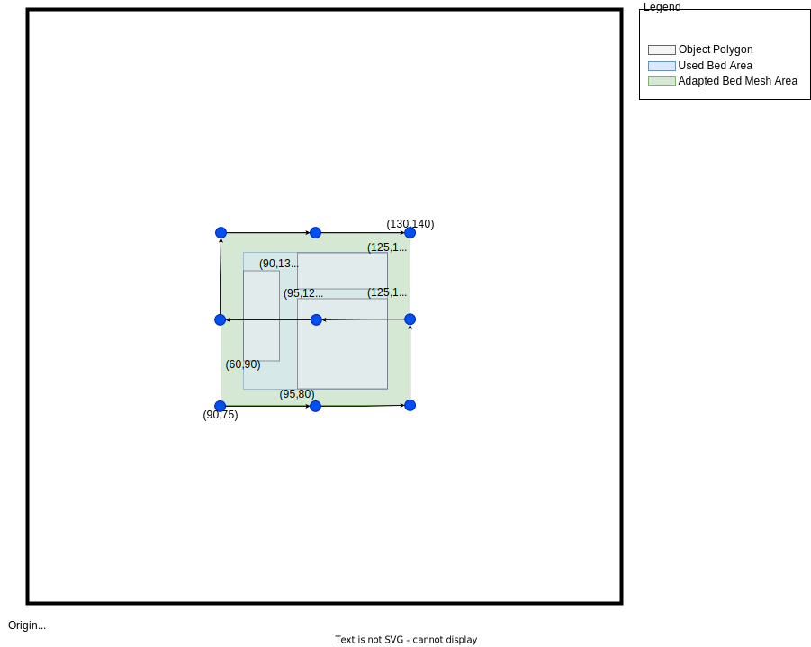

# Bed Mesh

The Bed Mesh module may be used to compensate for bed surface irregularities
to achieve a better first layer across the entire bed.  It should be noted
that software based correction will not achieve perfect results, it can only
approximate the shape of the bed.  Bed Mesh also cannot compensate for
mechanical and electrical issues.  If an axis is skewed or a probe is not
accurate then the bed_mesh module will not receive accurate results from
the probing process.

Prior to Mesh Calibration you will need to be sure that your Probe's
Z-Offset is calibrated.  If using an endstop for Z homing it will need
to be calibrated as well.  See [Probe Calibrate](Probe_Calibrate.md)
and Z_ENDSTOP_CALIBRATE in [Manual Level](Manual_Level.md) for more
information.

## Basic Configuration

### Rectangular Beds
This example assumes a printer with a 250 mm x 220 mm rectangular
bed and a probe with an x-offset of 24 mm and y-offset of 5 mm.

```
[bed_mesh]
speed: 120
horizontal_move_z: 5
mesh_min: 35, 6
mesh_max: 240, 198
probe_count: 5, 3
```

- `speed: 120`\
  _Default Value: 50_\
  The speed in which the tool moves between points.

- `horizontal_move_z: 5`\
  _Default Value: 5_\
  The Z coordinate the probe rises to prior to traveling between points.

- `mesh_min: 35, 6`\
  _Required_\
  The first probed coordinate, nearest to the origin.  This coordinate
  is relative to the probe's location.

- `mesh_max: 240, 198`\
  _Required_\
  The probed coordinate farthest from the origin.  This is not necessarily
  the last point probed, as the probing process occurs in a zig-zag fashion.
  As with `mesh_min`, this coordinate is relative to the probe's location.

- `probe_count: 5, 3`\
  _Default Value: 3, 3_\
  The number of points to probe on each axis, specified as X, Y integer
  values.  In this example 5 points will be probed along the X axis, with
  3 points along the Y axis, for a total of 15 probed points.  Note that
  if you wanted a square grid, for example 3x3, this could be specified
  as a single integer value that is used for both axes, ie `probe_count: 3`.
  Note that a mesh requires a minimum probe_count of 3 along each axis.

The illustration below demonstrates how the `mesh_min`, `mesh_max`, and
`probe_count` options are used to generate probe points.  The arrows indicate
the direction of the probing procedure, beginning at `mesh_min`.  For reference,
when the probe is at `mesh_min` the nozzle will be at (11, 1), and when the probe
is at `mesh_max`, the nozzle will be at (206, 193).


### Round beds
This example assumes a printer equipped with a round bed radius of 100mm.
We will use the same probe offsets as the rectangular example, 24 mm on X
and 5 mm on Y.

```
[bed_mesh]
speed: 120
horizontal_move_z: 5
mesh_radius: 75
mesh_origin: 0, 0
round_probe_count: 5
```

- `mesh_radius: 75`\
  _Required_\
  The radius of the probed mesh in mm, relative to the `mesh_origin`.  Note
  that the probe's offsets limit the size of the mesh radius.  In this example,
  a radius larger than 76 would move the tool beyond the range of the printer.

- `mesh_origin: 0, 0`\
  _Default Value: 0, 0_\
  The center point of the mesh.  This coordinate is relative to the probe's
  location. While the default is 0, 0, it may be useful to adjust the origin
  in an effort to probe a larger portion of the bed.  See the illustration
  below.

- `round_probe_count: 5`\
  _Default Value: 5_\
  This is an integer value that defines the maximum number of probed points
  along the X and Y axes.  By "maximum", we mean the number of points probed
  along the mesh origin.  This value must be an odd number, as it is required
  that the center of the mesh is probed.

The illustration below shows how the probed points are generated.  As you can see,
setting the `mesh_origin` to (-10, 0) allows us to specify a larger mesh radius
of 85.


## Advanced Configuration

Below the more advanced configuration options are explained in detail.  Each
example will build upon the basic rectangular bed configuration shown above.
Each of the advanced options apply to round beds in the same manner.

### Mesh Interpolation

While its possible to sample the probed matrix directly using simple bi-linear
interpolation to determine the Z-Values between probed points, it is often
useful to interpolate extra points using more advanced interpolation algorithms
to increase mesh density.  These algorithms add curvature to the mesh,
attempting to simulate the material properties of the bed.  Bed Mesh offers
lagrange and bicubic interpolation to accomplish this.

```
[bed_mesh]
speed: 120
horizontal_move_z: 5
mesh_min: 35, 6
mesh_max: 240, 198
probe_count: 5, 3
mesh_pps: 2, 3
algorithm: bicubic
bicubic_tension: 0.2
```

- `mesh_pps: 2, 3`\
  _Default Value: 2, 2_\
  The `mesh_pps` option is shorthand for Mesh Points Per Segment.  This
  option specifies how many points to interpolate for each segment along
  the X and Y axes.  Consider a 'segment' to be the space between each
  probed point. Like `probe_count`, `mesh_pps` is specified as an X, Y
  integer pair, and also may be specified a single integer that is applied
  to both axes.  In this example there are 4 segments along the X axis
  and 2 segments along the Y axis.  This evaluates to 8 interpolated
  points along X, 6 interpolated points along Y, which results in a 13x9
  mesh.  Note that if mesh_pps is set to 0 then mesh interpolation is
  disabled and the probed matrix will be sampled directly.

- `algorithm: lagrange`\
  _Default Value: lagrange_\
  The algorithm used to interpolate the mesh.  May be `lagrange` or `bicubic`.
  Lagrange interpolation is capped at 6 probed points as oscillation tends to
  occur with a larger number of samples.  Bicubic interpolation requires a
  minimum of 4 probed points along each axis, if less than 4 points are
  specified then lagrange sampling is forced.  If `mesh_pps` is set to 0 then
  this value is ignored as no mesh interpolation is done.

- `bicubic_tension: 0.2`\
  _Default Value: 0.2_\
  If the `algorithm` option is set to bicubic it is possible to specify the
  tension value.  The higher the tension the more slope is interpolated.  Be
  careful when adjusting this, as higher values also create more overshoot,
  which will result in interpolated values higher or lower than your probed
  points.

The illustration below shows how the options above are used to generate an
interpolated mesh.


### Move Splitting

Bed Mesh works by intercepting gcode move commands and applying a
transform to their Z coordinate. Long moves must be split into smaller
moves to correctly follow the shape of the bed. The options below
control the splitting behavior.

```
[bed_mesh]
speed: 120
horizontal_move_z: 5
mesh_min: 35, 6
mesh_max: 240, 198
probe_count: 5, 3
move_check_distance: 5
split_delta_z: .025
```

- `move_check_distance: 5`\
  _Default Value: 5_\
  The minimum distance to check for the desired change in Z before performing
  a split.  In this example, a move longer than 5mm will be traversed by the
  algorithm.  Each 5mm a mesh Z lookup will occur, comparing it with the Z
  value of the previous move.  If the delta meets the threshold set by
  `split_delta_z`, the move will be split and traversal will continue.  This
  process repeats until the end of the move is reached, where a final
  adjustment will be applied.  Moves shorter than the `move_check_distance`
  have the correct Z adjustment applied directly to the move without
  traversal or splitting.

- `split_delta_z: .025`\
  _Default Value: .025_\
  As mentioned above, this is the minimum deviation required to trigger a
  move split.  In this example, any Z value with a deviation +/- .025mm
  will trigger a split.

Generally the default values for these options are sufficient, in fact the
default value of 5mm for the `move_check_distance` may be overkill. However an
advanced user may wish to experiment with these options in an effort to squeeze
out the optimal first layer.

### Mesh Fade

When "fade" is enabled Z adjustment is phased out over a distance defined
by the configuration.  This is accomplished by applying small adjustments
to the layer height, either increasing or decreasing depending on the shape
of the bed. When fade has completed, Z adjustment is no longer applied,
allowing the top of the print to be flat rather than mirror the shape of the
bed.  Fade also may have some undesirable traits, if you fade too quickly it
can result in visible artifacts on the print.  Also, if your bed is
significantly warped, fade can shrink or stretch the Z height of the print.
As such, fade is disabled by default.

```
[bed_mesh]
speed: 120
horizontal_move_z: 5
mesh_min: 35, 6
mesh_max: 240, 198
probe_count: 5, 3
fade_start: 1
fade_end: 10
fade_target: 0
```

- `fade_start: 1`\
  _Default Value: 1_\
  The Z height in which to start phasing out adjustment.  It is a good idea
  to get a few layers down before starting the fade process.

- `fade_end: 10`\
  _Default Value: 0_\
  The Z height in which fade should complete.  If this value is lower than
  `fade_start` then fade is disabled.  This value may be adjusted depending
  on how warped the print surface is.  A significantly warped surface should
  fade out over a longer distance.  A near flat surface may be able to reduce
  this value to phase out more quickly.  10mm is a sane value to begin with if
  using the default value of 1 for `fade_start`.

- `fade_target: 0`\
  _Default Value:  The average Z value of the mesh_\
  The `fade_target` can be thought of as an additional Z offset applied to the
  entire bed after fade completes.  Generally speaking we would like this value
  to be 0, however there are circumstances where it should not be.  For
  example,  lets assume your homing position on the bed is an outlier, its
  .2 mm lower than the average probed height of the bed.  If the `fade_target`
  is 0, fade will shrink the print by an average of .2 mm across the bed.  By
  setting the `fade_target` to .2, the homed area will expand by .2 mm, however,
  the rest of the bed will be accurately sized.  Generally its a good idea
  to leave `fade_target` out of the configuration so the average height of the
  mesh is used, however it may be desirable to manually adjust the fade target
  if one wants to print on a specific portion of the bed.

### Configuring the zero reference position

Many probes are susceptible to "drift", ie: inaccuracies in probing introduced
by heat or interference.  This can make calculating the probe's z-offset
challenging, particularly at different bed temperatures.  As such, some
printers use an endstop for homing the Z axis and a probe for calibrating the
mesh. In this configuration it is possible offset the mesh so that the (X, Y)
`reference position` applies zero adjustment.  The `reference postion` should
be the location on the bed where a
[Z_ENDSTOP_CALIBRATE](./Manual_Level#calibrating-a-z-endstop)
paper test is performed.  The bed_mesh module provides the
`zero_reference_position` option for specifying this coordinate:

```
[bed_mesh]
speed: 120
horizontal_move_z: 5
mesh_min: 35, 6
mesh_max: 240, 198
zero_reference_position: 125, 110
probe_count: 5, 3
```
- `zero_reference_position: `\
  _Default Value: None (disabled)_\
  The `zero_reference_position` expects an (X, Y) coordinate matching that
  of the `reference position` described above.  If the coordinate lies within
  the mesh then the mesh will be offset so the reference position applies zero
  adjustment.  If the coordinate lies outside of the mesh then the coordinate
  will be probed after calibration, with the resulting z-value used as the
  z-offset.  Note that this coordinate must NOT be in a location specified as
  a `faulty_region` if a probe is necessary.

#### The deprecated relative_reference_index

Existing configurations using the `relative_reference_index` option must be
updated to use the `zero_reference_position`.  The response to the
[BED_MESH_OUTPUT PGP=1](#output) gcode command will include the (X, Y)
coordinate associated with the index;  this position may be used as the value for
the `zero_reference_position`. The output will look similar to the following:

```
// bed_mesh: generated points
// Index | Tool Adjusted | Probe
// 0 | (1.0, 1.0) | (24.0, 6.0)
// 1 | (36.7, 1.0) | (59.7, 6.0)
// 2 | (72.3, 1.0) | (95.3, 6.0)
// 3 | (108.0, 1.0) | (131.0, 6.0)
... (additional generated points)
// bed_mesh: relative_reference_index 24 is (131.5, 108.0)
```

_Note:  The above output is also printed in `klippy.log` during initialization._

Using the example above we see that the `relative_reference_index` is
printed along with its coordinate.  Thus the `zero_reference_position`
is `131.5, 108`.


### Faulty Regions

It is possible for some areas of a bed to report inaccurate results when
probing due to a "fault" at specific locations.  The best example of this
are beds with series of integrated magnets used to retain removable steel
sheets.  The magnetic field at and around these magnets may cause an inductive
probe to trigger at a distance higher or lower than it would otherwise,
resulting in a mesh that does not accurately represent the surface at these
locations.  **Note: This should not be confused with probe location bias, which
produces inaccurate results across the entire bed.**

The `faulty_region` options may be configured to compensate for this affect.
If a generated point lies within a faulty region bed mesh will attempt to
probe up to 4 points at the boundaries of this region.  These probed values
will be averaged and inserted in the mesh as the Z value at the generated
(X, Y) coordinate.

```
[bed_mesh]
speed: 120
horizontal_move_z: 5
mesh_min: 35, 6
mesh_max: 240, 198
probe_count: 5, 3
faulty_region_1_min: 130.0, 0.0
faulty_region_1_max: 145.0, 40.0
faulty_region_2_min: 225.0, 0.0
faulty_region_2_max: 250.0, 25.0
faulty_region_3_min: 165.0, 95.0
faulty_region_3_max: 205.0, 110.0
faulty_region_4_min: 30.0, 170.0
faulty_region_4_max: 45.0, 210.0
```

- `faulty_region_{1...99}_min`\
  `faulty_region_{1..99}_max`\
  _Default Value: None (disabled)_\
  Faulty Regions are defined in a way similar to that of mesh itself, where
  minimum and maximum (X, Y) coordinates must be specified for each region.
  A faulty region may extend outside of a mesh, however the alternate points
  generated will always be within the mesh boundary.  No two regions may
  overlap.

The image below illustrates how replacement points are generated when
a generated point lies within a faulty region.  The regions shown match those
in the sample config above.  The replacement points and their coordinates
are identified in green.


### Adaptive Meshes

Adaptive bed meshing is a way to speed up the bed mesh generation by only probing
the area of the bed used by the objects being printed. When used, the method will
automatically adjust the mesh parameters based on the area occupied by the defined
print objects.

The adapted mesh area will be computed from the area defined by the boundaries of all
the defined print objects so it covers every object, including any margins defined in
the configuration. After the area is computed, the number of probe points will be
scaled down based on the ratio of the default mesh area and the adapted mesh area. To
illustrate this consider the following example:

For a 150mmx150mm bed with `mesh_min` set to `25,25` and `mesh_max` set to `125,125`,
the default mesh area is a 100mmx100mm square. An adapted mesh area of `50,50`
means a ratio of `0.5x0.5` between the adapted area and default mesh area.

If the `bed_mesh` configuration specified `probe_count` as `7x7`, the adapted bed
mesh will use 4x4 probe points (7 * 0.5 rounded up).


```
[bed_mesh]
speed: 120
horizontal_move_z: 5
mesh_min: 35, 6
mesh_max: 240, 198
probe_count: 5, 3
adaptive_margin: 5
```

- `adaptive_margin` \
  _Default Value: 0_ \
  Margin (in mm) to add around the area of the bed used by the defined objects. The diagram
  below shows the adapted bed mesh area with an `adaptive_margin` of 5mm. The adapted mesh
  area (area in green) is computed as the used bed area (area in blue) plus the defined margin.

  

By nature, adaptive bed meshes use the objects defined by the Gcode file being printed.
Therefore, it is expected that each Gcode file will generate a mesh that probes a different
area of the print bed. Therefore, adapted bed meshes should not be re-used. The expectation
is that a new mesh will be generated for each print if adaptive meshing is used.

It is also important to consider that adaptive bed meshing is best used on machines that can
normally probe the entire bed and achieve a maximum variance less than or equal to 1 layer
height. Machines with mechanical issues that a full bed mesh normally compensates for may
have undesirable results when attempting print moves **outside** of the probed area. If a
full bed mesh has a variance greater than 1 layer height, caution must be taken when using
adaptive bed meshes and attempting print moves outside of the meshed area.

## Surface Scans

Some probes, such as the [Eddy Current Probe](./Eddy_Probe.md), are capable of
"scanning" the surface of the bed.  That is, these probes can sample a mesh
without lifting the tool between samples.  To activate scanning mode, the
`METHOD=scan` or `METHOD=rapid_scan` probe parameter should be passed in the
`BED_MESH_CALIBRATE` gcode command.

### Scan Height

The scan height is set by the `horizontal_move_z` option in `[bed_mesh]`.  In
addition it can be supplied with the `BED_MESH_CALIBRATE` gcode command via the
`HORIZONTAL_MOVE_Z` parameter.

The scan height must be sufficiently low to avoid scanning errors.  Typically
a height of 2mm (ie: `HORIZONTAL_MOVE_Z=2`) should work well, presuming that the
probe is mounted correctly.

It should be noted that if the probe is more than 4mm above the surface then the
results will be invalid.  Thus, scanning is not possible on beds with severe
surface deviation or beds with extreme tilt that hasn't been corrected.

### Rapid (Continuous) Scanning

When performing a `rapid_scan` one should keep in mind that the results will
have some amount of error.  This error should be low enough to be useful on
large print areas with reasonably thick layer heights.  Some probes may be
more prone to error than others.

It is not recommended that rapid mode be used to scan a "dense" mesh.  Some of
the error introduced during a rapid scan may be gaussian noise from the sensor,
and a dense mesh will reflect this noise (ie: there will be peaks and valleys).

Bed Mesh will attempt to optimize the travel path to provide the best possible
result based on the configuration.  This includes avoiding faulty regions
when collecting samples and "overshooting" the mesh when changing direction.
This overshoot improves sampling at the edges of a mesh, however it requires
that the mesh be configured in a way that allows the tool to travel outside
of the mesh.

```
[bed_mesh]
speed: 120
horizontal_move_z: 5
mesh_min: 35, 6
mesh_max: 240, 198
probe_count: 5
scan_overshoot: 8
```

- `scan_overshoot`
  _Default Value: 0 (disabled)_\
  The maximum amount of travel (in mm) available outside of the mesh.
  For rectangular beds this applies to travel on the X axis, and for round beds
  it applies to the entire radius.  The tool must be able to travel the amount
  specified outside of the mesh.  This value is used to optimize the travel
  path when performing a "rapid scan".  The minimum value that may be specified
  is 1.  The default is no overshoot.

If no scan overshoot is configured then travel path optimization will not
be applied to changes in direction.

## Bed Mesh Gcodes

### Calibration

`BED_MESH_CALIBRATE PROFILE=<name> METHOD=[manual | automatic | scan | rapid_scan] \
[<probe_parameter>=<value>] [<mesh_parameter>=<value>] [ADAPTIVE=[0|1] \
[ADAPTIVE_MARGIN=<value>]`\
_Default Profile:  default_\
_Default Method:  automatic if a probe is detected, otherwise manual_ \
_Default Adaptive: 0_ \
_Default Adaptive Margin: 0_

Initiates the probing procedure for Bed Mesh Calibration.

The mesh will be saved into a profile specified by the `PROFILE` parameter,
or `default` if unspecified. The `METHOD` parameter takes one of the following
values:

- `METHOD=manual`: enables manual probing using the nozzle and the paper test
- `METHOD=automatic`:  Automatic (standard) probing.  This is the default.
- `METHOD=scan`: Enables surface scanning.  The tool will pause over each position
                 to collect a sample.
- `METHOD=rapid_scan`: Enables continuous surface scanning.

XY positions are automatically adjusted to include the X and/or Y offsets
when a probing method other than `manual` is selected.

It is possible to specify mesh parameters to modify the probed area.  The
following parameters are available:

- Rectangular beds (cartesian):
  - `MESH_MIN`
  - `MESH_MAX`
  - `PROBE_COUNT`
- Round beds (delta):
  - `MESH_RADIUS`
  - `MESH_ORIGIN`
  - `ROUND_PROBE_COUNT`
- All beds:
  - `MESH_PPS`
  - `ALGORITHM`
  - `ADAPTIVE`
  - `ADAPTIVE_MARGIN`

See the configuration documentation above for details on how each parameter
applies to the mesh.


### Profiles

`BED_MESH_PROFILE SAVE=<name> LOAD=<name> REMOVE=<name>`

After a BED_MESH_CALIBRATE has been performed, it is possible to save the
current mesh state into a named profile.  This makes it possible to load
a mesh without re-probing the bed.  After a profile has been saved using
`BED_MESH_PROFILE SAVE=<name>` the `SAVE_CONFIG` gcode may be executed
to write the profile to printer.cfg.

Profiles can be loaded by executing `BED_MESH_PROFILE LOAD=<name>`.

It should be noted that each time a BED_MESH_CALIBRATE occurs, the current
state is automatically saved to the _default_ profile. The _default_ profile can be removed as follows:

`BED_MESH_PROFILE REMOVE=default`

Any other saved profile can be removed in the same fashion, replacing
_default_ with the named profile you wish to remove.


#### Loading the default profile

Previous versions of `bed_mesh` always loaded the profile named _default_
on startup if it was present.  This behavior has been removed in favor of
allowing the user to determine when a profile is loaded.  If a user wishes to
load the `default` profile it is recommended to add
`BED_MESH_PROFILE LOAD=default` to either their `START_PRINT` macro or their
slicer's "Start G-Code" configuration, whichever is applicable.

Alternatively the old behavior of loading a profile at startup can be
restored with a `[delayed_gcode]`:

```ini
[delayed_gcode bed_mesh_init]
initial_duration: .01
gcode:
  BED_MESH_PROFILE LOAD=default
```

### Output

`BED_MESH_OUTPUT PGP=[0 | 1]`

Outputs the current mesh state to the terminal.  Note that the mesh itself
is output

The PGP parameter is shorthand for "Print Generated Points".  If `PGP=1` is
set, the generated probed points will be output to the terminal:

```
// bed_mesh: generated points
// Index | Tool Adjusted | Probe
// 0 | (11.0, 1.0) | (35.0, 6.0)
// 1 | (62.2, 1.0) | (86.2, 6.0)
// 2 | (113.5, 1.0) | (137.5, 6.0)
// 3 | (164.8, 1.0) | (188.8, 6.0)
// 4 | (216.0, 1.0) | (240.0, 6.0)
// 5 | (216.0, 97.0) | (240.0, 102.0)
// 6 | (164.8, 97.0) | (188.8, 102.0)
// 7 | (113.5, 97.0) | (137.5, 102.0)
// 8 | (62.2, 97.0) | (86.2, 102.0)
// 9 | (11.0, 97.0) | (35.0, 102.0)
// 10 | (11.0, 193.0) | (35.0, 198.0)
// 11 | (62.2, 193.0) | (86.2, 198.0)
// 12 | (113.5, 193.0) | (137.5, 198.0)
// 13 | (164.8, 193.0) | (188.8, 198.0)
// 14 | (216.0, 193.0) | (240.0, 198.0)
```

The "Tool Adjusted" points refer to the nozzle location for each point, and
the "Probe" points refer to the probe location.  Note that when manually
probing the "Probe" points will refer to both the tool and nozzle locations.

### Clear Mesh State

`BED_MESH_CLEAR`

This gcode may be used to clear the internal mesh state.

### Apply X/Y offsets

`BED_MESH_OFFSET [X=<value>] [Y=<value>] [ZFADE=<value>]`

This is useful for printers with multiple independent extruders, as an offset
is necessary to produce correct Z adjustment after a tool change.  Offsets
should be specified relative to the primary extruder.  That is, a positive
X offset should be specified if the secondary extruder is mounted to the
right of the primary extruder, a positive Y offset should be specified
if the secondary extruder is mounted "behind" the primary extruder, and
a positive ZFADE offset should be specified if the secondary extruder's
nozzle is above the primary extruder's.

Note that a ZFADE offset does *NOT* directly apply additional adjustment.  It
is intended to compensate for a `gcode offset` when [mesh fade](#mesh-fade)
is enabled.  For example, if a secondary extruder is higher than the primary
and needs a negative gcode offset, ie: `SET_GCODE_OFFSET Z=-.2`, it can be
accounted for in `bed_mesh` with `BED_MESH_OFFSET ZFADE=.2`.

## Bed Mesh Webhooks APIs

### Dumping mesh data

`{"id": 123, "method": "bed_mesh/dump_mesh"}`

Dumps the configuration and state for the current mesh and all
saved profiles.

The `dump_mesh` endpoint takes one optional parameter, `mesh_args`.
This parameter must be an object, where the keys and values are
parameters available to [BED_MESH_CALIBRATE](#bed_mesh_calibrate).
This will update the mesh configuration and probe points using the
supplied parameters prior to returning the result.   It is recommended
to omit mesh parameters unless it is desired to visualize the probe points
and/or travel path before performing `BED_MESH_CALIBRATE`.

## Visualization and analysis

Most users will likely find that the visualizers included with
applications such as Mainsail, Fluidd, and Octoprint are sufficient
for basic analysis.  However, Klipper's `scripts` folder contains the
`graph_mesh.py` script that may be used to perform additional
visualizations and more detailed analysis, particularly useful
for debugging hardware or the results produced by `bed_mesh`:

```
usage: graph_mesh.py [-h] {list,plot,analyze,dump} ...

Graph Bed Mesh Data

positional arguments:
  {list,plot,analyze,dump}
    list                List available plot types
    plot                Plot a specified type
    analyze             Perform analysis on mesh data
    dump                Dump API response to json file

options:
  -h, --help            show this help message and exit
```

### Pre-requisites

Like most graphing tools provided by Klipper, `graph_mesh.py` requires
the `matplotlib` and `numpy` python dependencies. In addition, connecting
to Klipper via Moonraker's websocket requires the `websockets` python
dependency.  While all visualizations can be output to an `svg` file, most of
the visualizations offered by `graph_mesh.py` are better viewed in live
preview mode on a desktop class PC. For example, the 3D visualizations may be
rotated and zoomed in preview mode, and the path visualizations can optionally
be animated in preview mode.

### Plotting Mesh data

The `graph_mesh.py` tool can plot several types of visualizations.
Available types can be shown by running `graph_mesh.py list`:

```
graph_mesh.py list
points    Plot original generated points
path      Plot probe travel path
rapid     Plot rapid scan travel path
probedz   Plot probed Z values
meshz     Plot mesh Z values
overlay   Plots the current probed mesh overlaid with a profile
delta     Plots the delta between current probed mesh and a profile
```

Several options are available when plotting visualizations:

```
usage: graph_mesh.py plot [-h] [-a] [-s] [-p PROFILE_NAME] [-o OUTPUT] <plot type> <input>

positional arguments:
  <plot type>           Type of data to graph
  <input>               Path/url to Klipper Socket or path to json file

options:
  -h, --help            show this help message and exit
  -a, --animate         Animate paths in live preview
  -s, --scale-plot      Use axis limits reported by Klipper to scale plot X/Y
  -p PROFILE_NAME, --profile-name PROFILE_NAME
                        Optional name of a profile to plot for 'probedz'
  -o OUTPUT, --output OUTPUT
                        Output file path
```

Below is a description of each argument:

- `plot type`: A required positional argument designating the type of
  visualization to generate.  Must be one of the types output by the
  `graph_mesh.py list` command.
- `input`: A required positional argument containing a path or url
  to the input source.  This must be one of the following:
  - A path to Klipper's Unix Domain Socket
  - A url to an instance of Moonraker
  - A path to a json file produced by `graph_mesh.py dump <input>`
- `-a`:  Optional animation for the `path` and `rapid` visualization types.
  Animations only apply to a live preview.
- `-s`:  Optionally scales a plot using the `axis_minimum` and `axis_maximum`
  values reported by Klipper's `toolhead` object when the dump file was
  generated.
- `-p`: A profile name that may be specified when generating the
  `probedz` 3D mesh visualization.  When generating an `overlay` or
  `delta` visualization this argument must be provided.
- `-o`: An optional file path indicating that the script should save the
  visualization to this location rather than run in preview mode.  Images
  are saved in `svg` format.

For example, to plot an animated rapid path, connecting via Klipper's unix
socket:

```
graph_mesh.py plot -a rapid ~/printer_data/comms/klippy.sock
```

Or to plot a 3d visualization of the mesh, connecting via Moonraker:

```
graph_mesh.py plot meshz http://my-printer.local
```

### Bed Mesh Analysis

The `graph_mesh.py` tool may also be used to perform an analysis on the
data provided by the [bed_mesh/dump_mesh](#dumping-mesh-data) API:

```
graph_mesh.py analyze <input>
```

As with the `plot` command, the `<input>` must be a path to Klipper's
unix socket, a URL to an instance of Moonraker, or a path to a json file
generated by the dump command.

To begin, the analysis will perform various checks on the points and
probe paths generated by `bed_mesh` at the time of the dump.  This
includes the following:

- The number of probe points generated, without any additions
- The number of probe points generated including any points generated
  as the result faulty regions and/or a configured zero reference position.
- The number of probe points generated when performing a rapid scan.
- The total number of moves generated for a rapid scan.
- A validation that the probe points generated for a rapid scan are
  identical to the probe points generated for a standard probing procedure.
- A "backtracking" check for both the standard probe path and a rapid scan
  path.  Backtracking can be defined as moving to the same position more than
  once during the probing procedure.  Backtracking should never occur during a
  standard probe.  Faulty regions *can* result in backtracking during a rapid
  scan in an attempt to avoid entering a faulty region when approaching or
  leaving a probe location, however should never occur otherwise.

Next each probed mesh present in the dump will by analyzed, beginning with
the mesh loaded at the time of the dump (if present) and followed by any
saved profiles.  The following data is extracted:

- Mesh shape (Min X,Y, Max X,Y Probe Count)
- Mesh Z range, (Minimum Z, Maximum Z)
- Mean Z value in the mesh
- Standard Deviation of the Z values in the Mesh

In addition to the above, a delta analysis is performed between meshes
with the same shape, reporting the following:
- The range of the delta between to meshes (Minimum and Maximum)
- The mean delta
- Standard Deviation of the delta
- The absolute maximum difference
- The absolute mean

### Save mesh data to a file

The `dump` command may be used to save the response to a file which
can be shared for analysis when troubleshooting:

```
graph_mesh.py dump -o <output file name> <input>
```

The `<input>` should be a path to Klipper's unix socket or
a URL to an instance of Moonraker.  The `-o` option may be used to
specify the path to the output file.  If omitted, the file will be
saved in the working directory, with a file name in the following
format:

`klipper-bedmesh-{year}{month}{day}{hour}{minute}{second}.json`
