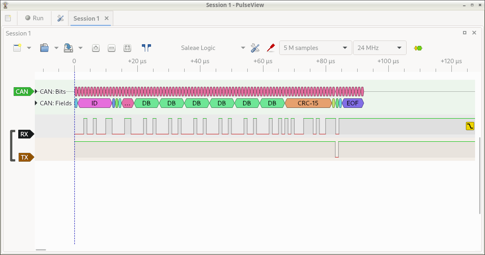

# CANBUS Troubleshooting

This document provides information on troubleshooting communication
issues when using [Klipper with CAN bus](CANBUS.md).

## Verify CAN bus wiring

The first step in troubleshooting communication issues is to verify
the CAN bus wiring.

Be sure there are exactly two 120 Ohm [terminating
resistors](CANBUS.md#terminating-resistors) on the CAN bus. If the
resistors are not properly installed then messages may not be able to
be sent at all or the connection may have sporadic instability.

The CANH and CANL bus wiring should be twisted around each other. At a
minimum, the wiring should have a twist every few centimeters. Avoid
twisting the CANH and CANL wiring around power wires and ensure that
power wires that travel parallel to the CANH and CANL wires do not
have the same amount of twists.

Verify that all plugs and wire crimps on the CAN bus wiring are fully
secured. Movement of the printer toolhead may jostle the CAN bus
wiring causing a bad wire crimp or unsecured plug to result in
intermittent communication errors.

## Check for incrementing bytes_invalid counter

The Klipper log file will report a `Stats` line once a second when the
printer is active. These "Stats" lines will have a `bytes_invalid`
counter for each micro-controller. This counter should not increment
during normal printer operation (it is normal for the counter to be
non-zero after a RESTART and it is not a concern if the counter
increments once a month or so). If this counter increments on a CAN
bus micro-controller during normal printing (it increments every few
hours or more frequently) then it is an indication of a severe
problem.

Incrementing `bytes_invalid` on a CAN bus connection is a symptom of
reordered messages on the CAN bus. There are two known causes of
reordered messages:
1. Old versions of the popular candlight_firmware for USB CAN adapters
   had a bug that could cause reordered messages. If using a USB CAN
   adapter running this firmware then make sure to update to the
   latest firmware if incrementing `bytes_invalid` is observed.
2. Some Linux kernel builds for embedded devices have been known to
   reorder CAN bus messages. It may be necessary to use an alternative
   Linux kernel or to use alternative hardware that supports
   mainstream Linux kernels that do not exhibit this problem.

Reordered messages is a severe problem that must be fixed. It will
result in unstable behavior and can lead to confusing errors at any
part of a print.

## Use an appropriate txqueuelen setting

The Klipper code uses the Linux kernel to manage CAN bus traffic. By
default, the kernel will only queue 10 CAN transmit packets. It is
recommended to [configure the can0 device](CANBUS.md#host-hardware)
with a `txqueuelen 128` to increase that size.

If Klipper transmits a packet and Linux has filled all of its transmit
queue space then Linux will drop that packet and messages like the
following will appear in the Klipper log:
```
Got error -1 in can write: (105)No buffer space available
```
Klipper will automatically retransmit the lost messages as part of its
normal application level message retransmit system. Thus, this log
message is a warning and it does not indicate an unrecoverable error.

If a complete CAN bus failure occurs (such as a CAN wire break) then
Linux will not be able to transmit any messages on the CAN bus and it
is common to find the above message in the Klipper log. In this case,
the log message is a symptom of a larger problem (the inability to
transmit any messages) and is not directly related to Linux
`txqueuelen`.

One may check the current queue size by running the Linux command `ip
link show can0`. It should report a bunch of text including the
snippet `qlen 128`. If one sees something like `qlen 10` then it
indicates the CAN device has not been properly configured.

It is not recommended to use a `txqueuelen` significantly larger
than 128. A CAN bus running at a frequency of 1000000 will typically
take around 120us to transmit a CAN packet. Thus a queue of 128
packets is likely to take around 15-20ms to drain. A substantially
larger queue could cause excessive spikes in message round-trip-time
which could lead to unrecoverable errors. Said another way, Klipper's
application retransmit system is more robust if it does not have to
wait for Linux to drain an excessively large queue of possibly stale
data. This is analogous to the problem of
[bufferbloat](https://en.wikipedia.org/wiki/Bufferbloat) on internet
routers.

Under normal circumstances Klipper may utilize ~25 queue slots per
MCU - typically only utilizing more slots during retransmits.
(Specifically, the Klipper host may transmit up to 192 bytes to each
Klipper MCU before receiving an acknowledgment from that MCU.) If a
single CAN bus has 5 or more Klipper MCUs on it, then it might be
necessary to increase the `txqueuelen` above the recommended value
of 128. However, as above, care should be taken when selecting a new
value to avoid excessive round-trip-time latency.

## Obtaining candump logs

The CAN bus messages sent to and from the micro-controller are handled
by the Linux kernel. It is possible to capture these messages from the
kernel for debugging purposes. A log of these messages may be of use
in diagnostics.

The Linux [can-utils](https://github.com/linux-can/can-utils) tool
provides the capture software. It is typically installed on a machine
by running:
```
sudo apt-get update && sudo apt-get install can-utils
```

Once installed, one may obtain a capture of all CAN bus messages on an
interface with the following command:
```
candump -tz -Ddex can0,#FFFFFFFF > mycanlog
```

One can view the resulting log file (`mycanlog` in the example above)
to see each raw CAN bus message that was sent and received by Klipper.
Understanding the content of these messages will likely require
low-level knowledge of Klipper's [CANBUS protocol](CANBUS_protocol.md)
and Klipper's [MCU commands](MCU_Commands.md).

### Parsing Klipper messages in a candump log

One may use the `parsecandump.py` tool to parse the low-level Klipper
micro-controller messages contained in a candump log. Using this tool
is an advanced topic that requires knowledge of Klipper
[MCU commands](MCU_Commands.md). For example:
```
./scripts/parsecandump.py mycanlog 108 ./out/klipper.dict
```

This tool produces output similar to the [parsedump
tool](Debugging.md#translating-gcode-files-to-micro-controller-commands). See
the documentation for that tool for information on generating the
Klipper micro-controller data dictionary.

In the above example, `108` is the [CAN bus
id](CANBUS_protocol.md#micro-controller-id-assignment). It is a
hexadecimal number. The id `108` is assigned by Klipper to the first
micro-controller. If the CAN bus has multiple micro-controllers on it,
then the second micro-controller would be `10a`, the third would be
`10c`, and so on.

The candump log must be produced using the `-tz -Ddex` command-line
arguments (for example: `candump -tz -Ddex can0,#FFFFFFFF`) in order
to use the `parsecandump.py` tool.

## Using a logic analyzer on the canbus wiring

The [Sigrok Pulseview](https://sigrok.org/wiki/PulseView) software
along with a low-cost
[logic analyzer](https://en.wikipedia.org/wiki/Logic_analyzer) can be
useful for diagnosing CAN bus signaling. This is an advanced topic
likely only of interest to experts.

One can often find "USB logic analyzers" for under $15 (US pricing as
of 2023). These devices are often listed as "Saleae logic clones" or
as "24MHz 8 channel USB logic analyzers".



The above picture was taken while using Pulseview with a "Saleae
clone" logic analyzer. The Sigrok and Pulseview software was installed
on a desktop machine (also install the "fx2lafw" firmware if that is
packaged separately). The CH0 pin on the logic analyzer was routed to
the CAN Rx line, the CH1 pin was wired to the CAN Tx pin, and GND was
wired to GND. Pulseview was configured to only display the D0 and D1
lines (red "probe" icon center top toolbar). The number of samples was
set to 5 million (top toolbar) and the sample rate was set to 24Mhz
(top toolbar). The CAN decoder was added (yellow and green "bubble
icon" right top toolbar). The D0 channel was labeled as RX and set to
trigger on a falling edge (click on black D0 label at left). The D1
channel was labeled as TX (click on brown D1 label at left). The CAN
decoder was configured for 1Mbit rate (click on green CAN label at
left). The CAN decoder was moved to the top of the display (click and
drag green CAN label). Finally, the capture was started (click "Run"
at top left) and a packet was transmitted on the CAN bus (`cansend
can0 123#121212121212`).

The logic analyzer provides an independent tool for capturing packets
and verifying bit timing.
