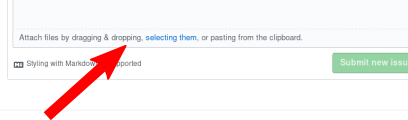

This page provides information on how to contact the Klipper
developers.

Issue reporting
===============

It is very important to attach the Klipper log file to all
reports. The log file has been engineered to answer common questions
the Klipper developers have about the software and its environment
(software version, hardware type, configuration, event timing, and
hundreds of other questions). **The developers need the Klipper log
file to provide any meaningful assistance**; only this log file
provides the necessary information.

On a problem report the first step is to **issue an M112 command** in
the OctoPrint terminal window immediately after the undesirable event
occurs. This causes Klipper to go into a "shutdown state" and it will
cause additional debugging information to be written to the log file.

Issue requests are submitted through Github. **All Github issues must
include the full /tmp/klippy.log log file from the session that
produced the event being reported.** An "scp" and/or "sftp" utility is
needed to acquire this log file. The "scp" utility comes standard with
Linux and MacOS desktops. There are freely available scp utilities for
other desktops (eg, WinSCP).

Use the scp utility to copy the `/tmp/klippy.log` file from the
Raspberry Pi to your desktop. It is a good idea to compress the
klippy.log file before posting it (eg, using zip or gzip). Open a new
issue at https://github.com/KevinOConnor/klipper/issues , provide a
description of the problem, and **attach the `klippy.log` file to the
issue**: 

Mailing list
============

There is a mailing list for general discussions on Klipper. In order
to send am email to the list, one must first subscribe:
https://www.freelists.org/list/klipper . Once subscribed, emails may
be sent to `klipper@freelists.org`.

Archives of the mailing list are available at:
https://www.freelists.org/archive/klipper/

IRC
===

One may join the #klipper channel on freenode.net (
irc://chat.freenode.net:6667 ).

To communicate in this IRC channel one will need an IRC
client. Configure it to connect to chat.freenode.net on port 6667 and
join the #klipper channel (`/join #klipper`).

If asking a question on IRC, be sure to ask the question and then stay
connected to the channel to receive responses. Due to timezone
differences, it may take several hours before receiving a response.
