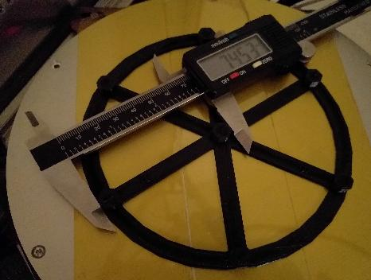
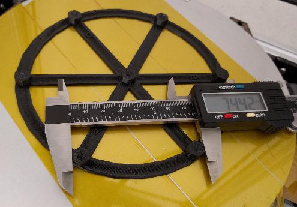
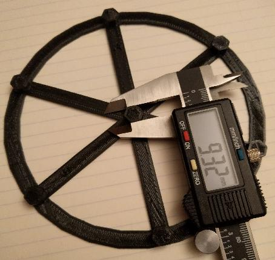
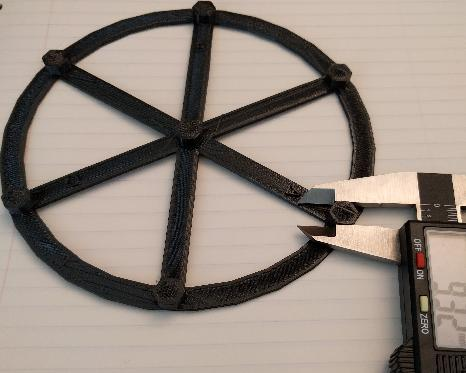

This document describes Klipper's automatic calibration system for
"delta" style printers.

Delta calibration involves finding the tower endstop positions, tower
angles, delta radius, and delta arm lengths. These settings control
printer motion on a delta printer. Each one of these parameters has a
non-obvious and non-linear impact and it is difficult to calibrate
them manually. In contrast, the software calibration code can provide
excellent results with just a few minutes of time. No special probing
hardware is necessary.

Ultimately, the delta calibration is dependent on the precision of the
tower endstop switches. If one is using Trinamic stepper motor drivers
then consider enabling [endstop phase](Endstop_Phase.md) detection to
improve the accuracy of those switches.

Automatic vs manual probing
===========================

Klipper supports calibrating the delta parameters via a manual probing
method or via an automatic Z probe.

A number of delta printer kits come with automatic Z probes that are
not sufficiently accurate (specifically, small differences in arm
length can cause effector tilt which can skew an automatic probe). If
using an automatic probe then first
[calibrate the probe](Probe_Calibrate.md) and then check for a
[probe location bias](Probe_Calibrate.md#location-bias-check). If the
automatic probe has a bias of more than 25 microns (.025mm) then use
manual probing instead. Manual probing only takes a few minutes and it
eliminates error introduced by the probe.

Basic delta calibration
=======================

Klipper has a DELTA_CALIBRATE command that can perform basic delta
calibration. This command probes seven different points on the bed and
calculates new values for the tower angles, tower endstops, and delta
radius.

In order to perform this calibration the initial delta parameters (arm
lengths, radius, and endstop positions) must be provided and they
should have an accuracy to within a few millimeters. Most delta
printer kits will provide these parameters - configure the printer
with these initial defaults and then go on to run the DELTA_CALIBRATE
command as described below. If no defaults are available then search
online for a delta calibration guide that can provide a basic starting
point.

During the delta calibration process it may be necessary for the
printer to probe below what would otherwise be considered the plane of
the bed. It is typical to permit this during calibration by updating
the config so that the printer's `minimum_z_position=-5`. (Once
calibration completes, one can remove this setting from the config.)

There are two ways to perform the probing - manual probing
(`DELTA_CALIBRATE METHOD=manual`) and automatic probing
(`DELTA_CALIBRATE`). The manual probing method will move the head near
the bed and then wait for the user to follow the steps described at
["the paper test"](Bed_Level.md#the-paper-test) to determine the
actual distance between the nozzle and bed at the given location.

To perform the basic probe, make sure the config has a
[delta_calibrate] section defined and then run the tool:
```
G28
DELTA_CALIBRATE METHOD=manual
```
After probing the seven points new delta parameters will be
calculated.  Save and apply these parameters by running:
```
SAVE_CONFIG
```

The basic calibration should provide delta parameters that are
accurate enough for basic printing. If this is a new printer, this is
a good time to print some basic objects and verify general
functionality.

Enhanced delta calibration
==========================

The basic delta calibration generally does a good job of calculating
delta parameters such that the nozzle is the correct distance from the
bed. However, it does not attempt to calibrate X and Y dimensional
accuracy. It's a good idea to perform an enhanced delta calibration to
verify dimensional accuracy.

This calibration procedure requires printing a test object and
measuring parts of that test object with digital calipers.

Prior to running an enhanced delta calibration one must run the basic
delta calibration (via the DELTA_CALIBRATE command) and save the
results (via the SAVE_CONFIG command).

Use a slicer to generate G-Code from the
[docs/prints/calibrate_size.stl](prints/calibrate_size.stl) file.
Slice the object using a slow speed (eg, 40mm/s). If possible, use a
stiff plastic (such as PLA) for the object. The object has a diameter
of 140mm. If this is too large for the printer then one can scale it
down (but be sure to uniformly scale both the X and Y axes). If the
printer supports significantly larger prints then this object can also
be increased in size. A larger size can improve the measurement
accuracy, but good print adhesion is more important than a larger
print size.

Print the test object and wait for it to fully cool. The commands
described below must be run with the same printer settings used to
print the calibration object (don't run DELTA_CALIBRATE between
printing and measuring, or do something that would otherwise change
the printer configuration).

If possible, perform the measurements described below while the object
is still attached to the print bed, but don't worry if the part
detaches from the bed - just try to avoid bending the object when
performing the measurements.

Start by measuring the distance between the center pillar and the
pillar next to the "A" label (which should also be pointing towards
the "A" tower).



Then go counterclockwise and measure the distances between the center
pillar and the other pillars (distance from center to pillar across
from C label, distance from center to pillar with B label, etc.).


Enter these parameters into Klipper with a comma separated list of
floating point numbers:
```
DELTA_ANALYZE CENTER_DISTS=<a_dist>,<far_c_dist>,<b_dist>,<far_a_dist>,<c_dist>,<far_b_dist>
```
Provide the values without spaces between them.

Then measure the distance between the A pillar and the pillar across
from the C label.



Then go counterclockwise and measure the distance between the pillar
across from C to the B pillar, the distance between the B pillar and
the pillar across from A, and so on.


Enter these parameters into Klipper:
```
DELTA_ANALYZE OUTER_DISTS=<a_to_far_c>,<far_c_to_b>,<b_to_far_a>,<far_a_to_c>,<c_to_far_b>,<far_b_to_a>
```

At this point it is okay to remove the object from the bed. The final
measurements are of the pillars themselves. Measure the size of the
center pillar along the A spoke, then the B spoke, and then the C
spoke.




Enter them into Klipper:
```
DELTA_ANALYZE CENTER_PILLAR_WIDTHS=<a>,<b>,<c>
```

The final measurements are of the outer pillars. Start by measuring
the distance of the A pillar along the line from A to the pillar
across from C.



Then go counterclockwise and measure the remaining outer pillars
(pillar across from C along the line to B, B pillar along the line to
pillar across from A, etc.).


And enter them into Klipper:
```
DELTA_ANALYZE OUTER_PILLAR_WIDTHS=<a>,<far_c>,<b>,<far_a>,<c>,<far_b>
```

If the object was scaled to a smaller or larger size then provide the
scale factor that was used when slicing the object:
```
DELTA_ANALYZE SCALE=1.0
```
(A scale value of 2.0 would mean the object is twice its original
size, 0.5 would be half its original size.)

Finally, perform the enhanced delta calibration by running:
```
DELTA_ANALYZE CALIBRATE=extended
```
This command can take several minutes to complete. After completion it
will calculate updated delta parameters (delta radius, tower angles,
endstop positions, and arm lengths). Use the SAVE_CONFIG command to
save and apply the settings:
```
SAVE_CONFIG
```

The SAVE_CONFIG command will save both the updated delta parameters
and information from the distance measurements. Future DELTA_CALIBRATE
commands will also utilize this distance information. Do not attempt
to reenter the raw distance measurements after running SAVE_CONFIG, as
this command changes the printer configuration and the raw
measurements no longer apply.

Additional notes
----------------

* If the delta printer has good dimensional accuracy then the distance
  between any two pillars should be around 74mm and the width of every
  pillar should be around 9mm. (Specifically, the goal is for the
  distance between any two pillars minus the width of one of the
  pillars to be exactly 65mm.) Should there be a dimensional
  inaccuracy in the part then the DELTA_ANALYZE routine will calculate
  new delta parameters using both the distance measurements and the
  previous height measurements from the last DELTA_CALIBRATE command.

* DELTA_ANALYZE may produce delta parameters that are surprising. For
  example, it may suggest arm lengths that do not match the printer's
  actual arm lengths. Despite this, testing has shown that
  DELTA_ANALYZE often produces superior results. It is believed that
  the calculated delta parameters are able to account for slight
  errors elsewhere in the hardware. For example, small differences in
  arm length may result in a tilt to the effector and some of that
  tilt may be accounted for by adjusting the arm length parameters.
