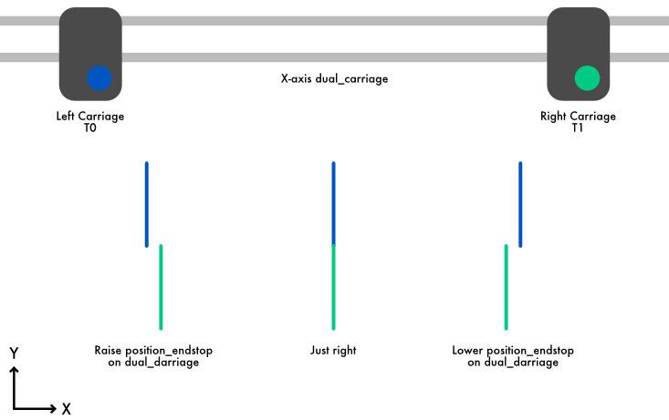
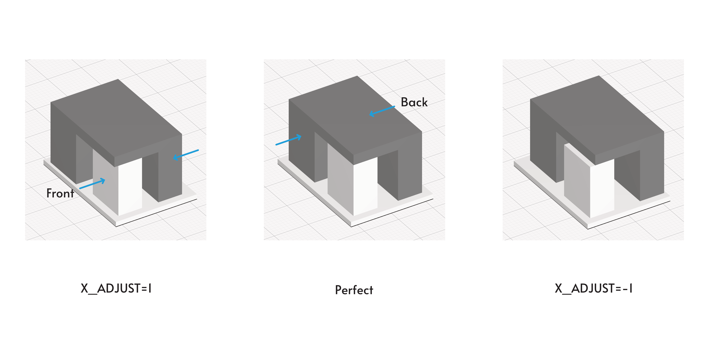

This document provides **general** information on configuring and
calibrating a standard IDEX printer. Klipper has support for very
complex IDEX configurations, with multiple hotends and extruders on a
single carriage, independent or grouped cooling fans, and much more,
which are not covered in this document.

# General configuration
Start with studying, and possibly using parts of
the sample config](../config/sample-idex.cfg) for IDEX printers.
It has some distinct items that you may or may not wish to use.

* Definition for `dual_carriage` on the X-axis, which you can change to
be on the Y axis if that is how your printer is configured.
* Sample macros for parking and switching toolheads. You should check
these to make sure they make sense for your setup and update the
position values with those that match your printer
* Sample macros for part cooling fans.
* A macro for calibrating carriage separation described later in this
document.

# Tuning

Ensure you have run `SET_SEPARATION X=0 Y=0 Z=0` at least once to ensure that
the separation variables are created.

If you want to use both extruders to print different features of a
single object, Klipper will need to know the positions of the extruders
relative to each other.

Because Klipper configures this by the endstop position, you will
need to calibrate your [rotation distance](Rotation_Distance.md) first.

For the finest accuracy, you should consider calibrating the homing
[endstop phase](endstop_phase.md) of your dual_carraige axis motors.

**Warning:** Don't use sensorless homing on the dual carriage axis.
Sensorless homing has an accuracy of ±1 full step, which would account to an
incononsistent homing position that can jump 0.2mm on a typical 40mm rotation
distance setup. Add that you would home twice, the error could accumulate to
as large as 0.4mm.
Using `[endstop_phase]` will not help as the error is too large.

**Warning:** If use use a bed probe that is attached to one of the toolheads,
it's strongly reccomended to configure `[homing_override]` and explicitly set
the tool that has the probe to be active before calling `G28 Z`.

**Important:** While the measuring process of these steps accounts for
symmetric horizontal expansion, you will likely achieve better results by
calibrating the flow and temperature for the filament you'll be using first.
You'll also do better with a filament that is known to have better
dimensional stability. Look for filaments that can be printed without a
heated bed (or a cooler bed temperature).


## Step 1: ~5mm
Start by literally eyeballing it. Put a piece of tape on your bed or use a
line or other graphic already on your bed as a reference point.

Move the first carriage to this point and note it's position. Then, park
carriage 1, and move carriage 2 to the same physical position.
Note it's position (where Klipper "thinks" it is) and calculate the
difference.

In a standard setup where the carriages home to the sides with the primary
on the left, you move the logical coordinate system for the secondary
extruder to the right by lowering it's `position_endstop` value.

Once you are within a few mm of accuracy, proceed to step 2

## Step 2: ~1mm
Configure the `CALIBRATE_SEPARATION` macro in
[the sample config](../config/sample-idex.cfg) for your bed size and
`dual_carriage` axis, and add heating commands to it for the filament you'll
be using.
The sample provided should fit comfortably in a 160x160mm bed, and coasts
back to keep the meeting points as clean as possible as you likely haven't
tuned retraction yet.

Load filament in both extruders, and run the macro.

The test with the standard axis configuration should look as follows:



Note the lines should be colinear. If they are not, adjust your
`position_endstop` setting as noted in step 1.
Once they are visually aligned, proceed to step 3.

At this point you should re-tune your mins and maxes for each axis when the
other is parked by issuing slow, small movements until they collide.

## Step 3: Z ~(.1 - 0.1mm)
From this point onwards you should use `SET_SEPARATION` for fine adjustments.

To adjust separation in X axis run `SET_SEPARATION X_ADJUST=0.1` to move the
second toolhead 0.1mm relative to the right. Negative values will adjust in
the opposite direction.

To adjust separation in Y & Z axis, call `SET_SEPARATION Y_ADJUST=0.1` and
`SET_SEPARATION Z_ADJUST=0.1` respectively.

Due to how FDM printers deposit plastic, you'll find that the error between
your nozzles in the Z axis will affect your ability to calibrate X & Y
offsets accurately.

Start with ["the paper test"](Bed_Level.md#the-paper-test) and switch between
the extruders until the pressure feels roughly the same on both extruders.
Make sure you're testing the exact same point on your bed.

If you have accurate calipers (0.01mm resolution) or a micrometer available
you can re-print the `calibrate_separation` macro in
[the sample config](../config/sample-idex.cfg) and measure the height of the
extrusions themselves, and ensure that they are the same thickness.

You can also print a single layer square on the same area of the bed and
visually check that they first layer is consistent.

## Step 4: ~(.1 - .025mm)
Use a slicer to generate g-code for the multi-part print found in
[docs/prints/idex_calibration_t0.stl](prints/idex_calibration_t0.stl)
and [docs/prints/idex_calibration_t1.stl](prints/idex_calibration_t1.stl).

Align the long direction of the print perpendicular to the axis of your
`dual_carriage` (Should be correct for X-axis). Configure your slicer to print
the upper part using the right extruder. I highly recommend using identical
filaments printed with the same temperature, etc. Use a rather coarse layer
height since you have not yet calibrated your Z offset. Print the object.

The measuring parts should be 20mm for X, 30mm for Y, and 15mm for Z.

Use calipers or better, a micrometer to measure the 2 measureing points
(refer to the image below). Complete the following table:

| Part | Measurement | Calculation |
|:--:|:--:|:--:|
| Front | (mm) | 20 - (mm) |
| Back  | (mm) | (mm) - 20 |
| Offset |  | ^ Average ^ |



You should be left with the adjustment that should be made to compensated
for any alignment error. Save this to the printer by running:
```
SET_SEPARATION X_ADJUST={your calculated value}
```

You may repeat this step with Y but instead of 20mm, it's 30mm.
Also, Z height should be a total of 15mm.

Repeat this step if nessesary until you are happy with the alignment.

## Step 5 (required for high quality printing)
Dual Extrusion calibration test prints, such as
[Dual Extruder Calibration Print](https://www.thingiverse.com/thing:533814)
are very useful to validate your results, and do very fine adjustments based
on visual and touch inspection. Ensure that the height of the sections are
identical first, otherwise it will make finding offsets in X & Y harder.

# Next steps
Configure a homing override to make sure that the inactive carriage is
fully parked in all scenarios.

If you want to use [input shaping](Resonance_compensation.md),
calibrate the input shaper for each carriage separately and add g-code
to your `T0` and `T1` etc commands to configure the input shaper when
the active carriage changes.

It's reccomended you tune
[Pressure Advance](Pressure_Advance.md#tuning-pressure-advance) for each
nozzle separately.

For support with Fluidd, SuperSlicer, consider overriding the
`ACTIVATE_EXTRUDER` command to run T0, T1.

If your printer has multiple part cooling fans, create `[fan_generic]`
sections for each of them. For support with Klipper's default LCD resdout,
consider using the `[fan]` section and macro elements in the sample.
Otherwise, write your own `M106` and `M107` macros.

Print a few objects to ensure everything is working as expected!
