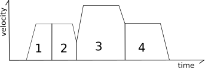
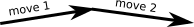
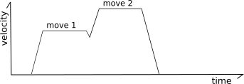
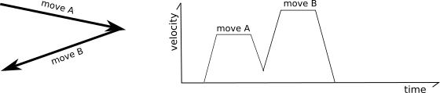
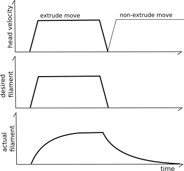

This document provides an overview of how Klipper implements robot
motion (its [kinematics](https://en.wikipedia.org/wiki/Kinematics)).
The contents may be of interest to both developers interested in
working on the Klipper software as well as users interested in better
understanding the mechanics of their machines.

Acceleration
============

Klipper implements a constant acceleration scheme whenever the print
head changes velocity - the velocity is gradually changed to the new
speed instead of suddenly jerking to it. Klipper always enforces
acceleration between the tool head and the print. The filament leaving
the extruder can be quite fragile - rapid jerks and/or extruder flow
changes lead to poor quality and poor bed adhesion. Even when not
extruding, if the print head is at the same level as the print then
rapid jerking of the head can cause disruption of recently deposited
filament. Limiting speed changes of the print head (relative to the
print) reduces risks of disrupting the print.

It is also important to limit acceleration so that the stepper motors
do not skip or put excessive stress on the machine. Klipper limits the
torque on each stepper by virtue of limiting the acceleration of the
print head. Enforcing acceleration at the print head naturally also
limits the torque of the steppers that move the print head (the
inverse is not always true).

Klipper implements constant acceleration. The key formula for constant
acceleration is:
```
velocity(time) = start_velocity + accel*time
```

Trapezoid generator
===================

Klipper uses a traditional "trapezoid generator" to model the motion
of each move - each move has a start speed, it accelerates to a
cruising speed at constant acceleration, it cruises at a constant
speed, and then decelerates to the end speed using constant
acceleration.


It's called a "trapezoid generator" because a velocity diagram of the
move looks like a trapezoid.

The cruising speed is always greater than or equal to both the start
speed and the end speed. The acceleration phase may be of zero
duration (if the start speed is equal to the cruising speed), the
cruising phase may be of zero duration (if the move immediately starts
decelerating after acceleration), and/or the deceleration phase may be
of zero duration (if the end speed is equal to the cruising speed).



Look-ahead
==========

The "look-ahead" system is used to determine cornering speeds between
moves.

Consider the following two moves contained on an XY plane:



In the above situation it is possible to fully decelerate after the
first move and then fully accelerate at the start of the next move,
but that is not ideal as all that acceleration and deceleration would
greatly increase the print time and the frequent changes in extruder
flow would result in poor print quality.

To solve this, the "look-ahead" mechanism queues multiple incoming
moves and analyzes the angles between moves to determine a reasonable
speed that can be obtained during the "junction" between two moves. If
the next move is nearly in the same direction then the head need only
slow down a little (if at all).



However, if the next move forms an acute angle (the head is going to
travel in nearly a reverse direction on the next move) then only a
small junction speed is permitted.



The junction speeds are determined using "approximated centripetal
acceleration". Best
[described by the author](https://onehossshay.wordpress.com/2011/09/24/improving_grbl_cornering_algorithm/).
However, in Klipper, junction speeds are configured by specifying the
desired speed that a 90° corner should have (the "square corner
velocity"), and the junction speeds for other angles are derived from
that.

Klipper implements look-ahead between moves that have similar extruder
flow rates. Other moves are relatively rare and implementing
look-ahead between them is unnecessary.

Key formula for look-ahead:
```
end_velocity^2 = start_velocity^2 + 2*accel*move_distance
```

Smoothed look-ahead
-------------------

Klipper also implements a mechanism for smoothing out the motions of
short "zigzag" moves. Consider the following moves:


In the above, the frequent changes from acceleration to deceleration
can cause the machine to vibrate which causes stress on the machine
and increases the noise. To reduce this, Klipper tracks both regular
move acceleration as well as a virtual "acceleration to deceleration"
rate. Using this system, the top speed of these short "zigzag" moves
are limited to smooth out the printer motion:


Specifically, the code calculates what the velocity of each move would
be if it were limited to this virtual "acceleration to deceleration"
rate (half the normal acceleration rate by default). In the above
picture the dashed gray lines represent this virtual acceleration rate
for the first move. If a move can not reach its full cruising speed
using this virtual acceleration rate then its top speed is reduced to
the maximum speed it could obtain at this virtual acceleration
rate. For most moves the limit will be at or above the move's existing
limits and no change in behavior is induced. For short zigzag moves,
however, this limit reduces the top speed. Note that it does not
change the actual acceleration within the move - the move continues to
use the normal acceleration scheme up to its adjusted top-speed.

Generating steps
================

Once the look-ahead process completes, the print head movement for the
given move is fully known (time, start position, end position,
velocity at each point) and it is possible to generate the step times
for the move. This process is done within "kinematic classes" in the
Klipper code. Outside of these kinematic classes, everything is
tracked in millimeters, seconds, and in cartesian coordinate space.
It's the task of the kinematic classes to convert from this generic
coordinate system to the hardware specifics of the particular printer.

Klipper uses an
[iterative solver](https://en.wikipedia.org/wiki/Root-finding_algorithm)
to generate the step times for each stepper. The code contains the
formulas to calculate the ideal cartesian coordinates of the head at
each moment in time, and it has the kinematic formulas to calculate
the ideal stepper positions based on those cartesian coordinates. With
these formulas, Klipper can determine the ideal time that the stepper
should be at each step position. The given steps are then scheduled at
these calculated times.

The key formula to determine how far a move should travel under
constant acceleration is:
```
move_distance = (start_velocity + .5 * accel * move_time) * move_time
```
and the key formula for movement with constant velocity is:
```
move_distance = cruise_velocity * move_time
```

The key formulas for determining the cartesian coordinate of a move
given a move distance is:
```
cartesian_x_position = start_x + move_distance * total_x_movement / total_movement
cartesian_y_position = start_y + move_distance * total_y_movement / total_movement
cartesian_z_position = start_z + move_distance * total_z_movement / total_movement
```

Cartesian Robots
----------------

Generating steps for cartesian printers is the simplest case. The
movement on each axis is directly related to the movement in cartesian
space.

Key formulas:
```
stepper_x_position = cartesian_x_position
stepper_y_position = cartesian_y_position
stepper_z_position = cartesian_z_position
```

CoreXY Robots
----------------

Generating steps on a CoreXY machine is only a little more complex
than basic cartesian robots. The key formulas are:
```
stepper_a_position = cartesian_x_position + cartesian_y_position
stepper_b_position = cartesian_x_position - cartesian_y_position
stepper_z_position = cartesian_z_position
```

Delta Robots
------------

Step generation on a delta robot is based on Pythagoras's theorem:
```
stepper_position = (sqrt(arm_length^2
                         - (cartesian_x_position - tower_x_position)^2
                         - (cartesian_y_position - tower_y_position)^2)
                    + cartesian_z_position)
```

### Stepper motor acceleration limits ###

With delta kinematics it is possible for a move that is accelerating
in cartesian space to require an acceleration on a particular stepper
motor greater than the move's acceleration. This can occur when a
stepper arm is more horizontal than vertical and the line of movement
passes near that stepper's tower. Although these moves could require a
stepper motor acceleration greater than the printer's maximum
configured move acceleration, the effective mass moved by that stepper
would be smaller. Thus the higher stepper acceleration does not result
in significantly higher stepper torque and it is therefore considered
harmless.

However, to avoid extreme cases, Klipper enforces a maximum ceiling on
stepper acceleration of three times the printer's configured maximum
move acceleration. (Similarly, the maximum velocity of the stepper is
limited to three times the maximum move velocity.) In order to enforce
this limit, moves at the extreme edge of the build envelope (where a
stepper arm may be nearly horizontal) will have a lower maximum
acceleration and velocity.

Extruder kinematics
-------------------

Klipper implements extruder motion in its own kinematic class. Since
the timing and speed of each print head movement is fully known for
each move, it's possible to calculate the step times for the extruder
independently from the step time calculations of the print head
movement.

Basic extruder movement is simple to calculate. The step time
generation uses the same formulas that cartesian robots use:
```
stepper_position = requested_e_position
```

### Pressure advance ###

Experimentation has shown that it's possible to improve the modeling
of the extruder beyond the basic extruder formula. In the ideal case,
as an extrusion move progresses, the same volume of filament should be
deposited at each point along the move and there should be no volume
extruded after the move. Unfortunately, it's common to find that the
basic extrusion formulas cause too little filament to exit the
extruder at the start of extrusion moves and for excess filament to
extrude after extrusion ends. This is often referred to as "ooze".



The "pressure advance" system attempts to account for this by using a
different model for the extruder. Instead of naively believing that
each mm^3 of filament fed into the extruder will result in that amount
of mm^3 immediately exiting the extruder, it uses a model based on
pressure. Pressure increases when filament is pushed into the extruder
(as in [Hooke's law](https://en.wikipedia.org/wiki/Hooke%27s_law)) and
the pressure necessary to extrude is dominated by the flow rate
through the nozzle orifice (as in
[Poiseuille's law](https://en.wikipedia.org/wiki/Poiseuille_law)). The
key idea is that the relationship between filament, pressure, and flow
rate can be modeled using a linear coefficient:
```
stepper_position = requested_e_position + pressure_advance_coefficient * nominal_extruder_velocity
```

See the [pressure advance](Pressure_Advance.md) document for
information on how to find this pressure advance coefficient.

Once configured, Klipper will push in an additional amount of filament
during acceleration. The higher the desired filament flow rate, the
more filament must be pushed in during acceleration to account for
pressure. During head deceleration the extra filament is retracted
(the extruder will have a negative velocity).


One may notice that the pressure advance algorithm can cause the
extruder motor to make sudden velocity changes. This is tolerated
based on the idea that the majority of the inertia in the system is in
changing the extruder pressure. As long as the extruder pressure does
not change rapidly the sudden changes in extruder motor velocity are
tolerated.

One area where sudden velocity changes become problematic is during
small changes in head speed due to cornering.


To prevent this, the Klipper pressure advance code utilizes the move
look-ahead queue to detect intermittent speed changes. During a
deceleration event the code finds the maximum upcoming head speed
within a configurable time window. The pressure is then only adjusted
to this found maximum. This can greatly reduce (or even completely
eliminate) pressure changes during cornering.
