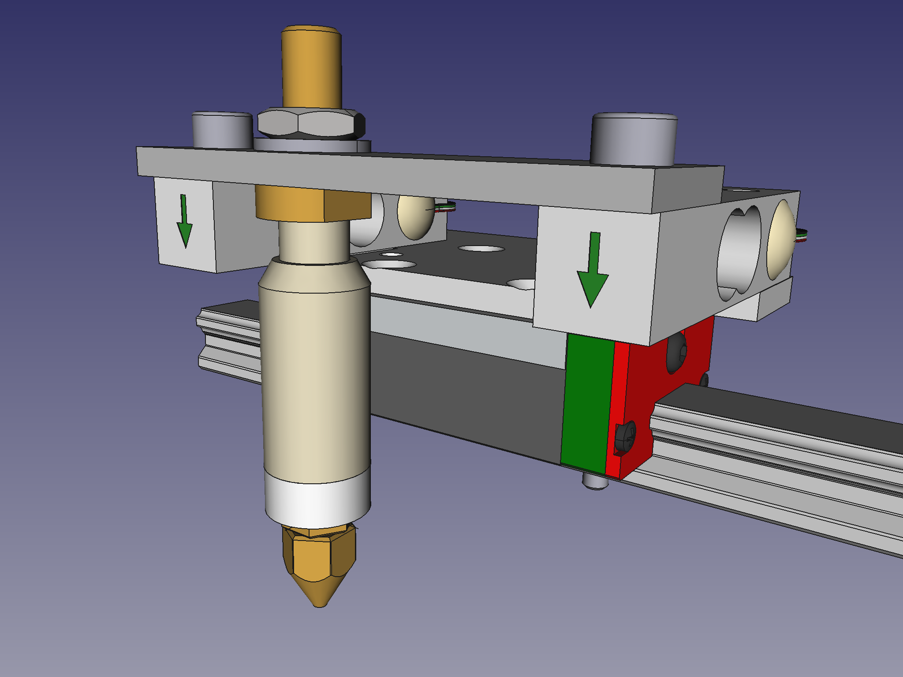
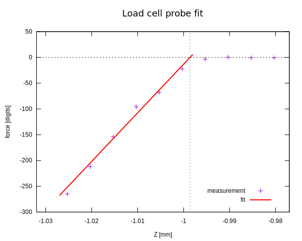

# Load-cell based probe

A load-cell based probe offers an offset-free measurement of the precise
Z coordinate of the contact position between nozzle and print bed. Under certain
mechanical conditions, a sensitivity can be even achieved in X and Y directions,
which can be useful for CNC routers. Downside of a load-cell probe compared to
other probe types is the slower speed and higher complexity.

Please also read the
[reference of the config section](Config_Reference.md#load_cell_probe), and the
[reference of the g-code commands](G-Codes.md#load_cell_probe).

## Mechanical and electrical setup

<p align="center">
  
</p>

There may be many possibilities how to realise a probe based on load cells. The
setup used for testing and developing this algorithm is as follows:

- The hotend is suspended on a pair of load cells such that any force applied
  on the nozzle by the bed can be measured. This is shown in the picture above:
  The two load cells are the bars on left and right with the green arrow.

- The two load cells form a rectangle, together with the guiding carriage
  (shown in red/green/gray in the above image) and a traverse carrying the
  hotend (the grey bar on top of the load cells).

- The two load cells are connected in parallel to a measurment amplifier and
  an ADC.

- When the nozzle is not in contact with the bed, the load cells will measure
  the weight of the hotend and other mechanical parts attached to the cells.

- Since the cells are designed for weighing, the measured signal will change
  into the negative direction when the nozzle touches the bed (less weight or
  even upwards pointing force).

- In the picture, the extruder motor is not shown, but it is attached to the
  carriage directly, not to the load cells. This has the advantage that the
  load cells can measure the extrusion force, which can be used to optimise
  print settings manually, or for some advanced algorithms to optimise the
  print automatically. This presents a major advantage over other probes. The
  disadvantage is though that high extrusion forces will cause the hotend to
  move closer to the bed as the load cells bend. This effect does not play a big
  role, since high extrusion forces usually anyway indicate other issues.

## Working principle of the probe algorithm

A very basic approach is to move the nozzle in small steps towards the bed and
measure the force after each step. If the force exceeds a certain threshold, a
contact between nozzle and bed is assumed. This simple approach leads to very
coarse results, hence a more sophisticated algorithm is used.

The load cell measurement is subject to certain drifts and hysteresis-like
effects for several reasons: The rectangle formed by the two load cells, the
carriage and the traverse will have some internal tension, which may change
slightly if forces are applied (e.g. when the nozzle makes contact with the
bed), or sometimes even if the carriage is just moved. Also thermal effects can
lead to drifts of the measurement. For this reason, it is important to make the
algorithm insensitive against changes of the baseline.

### The phases of a probe approach

To safe time while still achieving a hight precision, the following phases
starting with a low-precision fast approach are implemented. The several
parameters used by the algorithm can be semi-automatically determined by
following a procedure described at the end of this document.

#### Fast approach

To get fast close to the surface, a simple scan using a relative big step size
and threshold is performed. Once the threshold is exceeded, the nozzle is moved
away from the bed a bit to measure the baseline to exclude it has drifted. Only
if the bed contact is confirmed, the next phase is started. Otherwise the fast
approach is continued.

#### Find fit start position

Due to the possible hysteresis-like effects, it has been found to be more
reliable to perform the series of measurements for the fit into the negative z
direction. For maximum precision, the series should start at a position with a
low or zero force. Since the fast approach has already moved a bit too far, the
nozzle now needs to be moved away from the bed again. In the interest of saving
time, it is important not to move too far away - ideally the nozzle should be
right above the bed without touching it after this second phase. This is
achieved by extrapolating the measured force linearily and finding the z
position with zero force. To avoid overshooting, several iterations of at most
half the step size of the fast approach are performed until the force is below
the threshold used for the fit.

#### The fit

This final phase will determine the z position of the contact position
precisely. Starting from the position determined in the last phase, the force
is measured in dependence of the z position in regular intervals, while moving
into the negative z direction. Each measurement is dift-compensated by lifting
the nozzle right after the measurement and re-measuring the baseline. The result
of this scan is shown in the following figure:

<p align="center">
  
</p>

The scan is done while moving into the negative z direction, hence the data
points on the right side are measured first. Since the start position determiend
in the last phase is intentionally slightly above the bed, the first few
measurement points will have measured forces very close to 0 (in the image,
these are the rightmost 4 measurement points). Once the force exceeds a small
threshold, 5 measurement points are recorded. Then, a linear fit is applied
(red line in the image) to determine the z position at which the nozzle touches
the bed but the force is still zero (intersection of the dashed lines).

Finally, the printer will move to the determined z position, such that
additional commands like `G92` can be used easily. Also the last measured z
position can be obtained in g-code macros through
`printer["load_cell_probe"].last_z_result`.

#### Accessing the load cell measured force in other modules

Other modules can subscribe to the continuous read out of the load cell to
receive the current force even while no probe command is executed. Any number of
modules can subscribe by registering a callback function as follows:

```
  self.printer.lookup_object('load_cell').subscribe_force(self.force_callback)
```

The callback function must expect a single argument (besides `self`) which is
the current force. It will be called periodically whenever the ADC sends its
data. This mechanism is necessary, since ADCs normally allow only one single
subscriber. The force will be already corrected with the last known compensation
offset, e.g. from a compensated measurement.

Also the last measured force can be accessed in g-code macros and display_data
config sections trough `printer["load_cell_probe"].last_force`. This value will
be compensated with the last known offset, too.

This feature can be used to implement advanced features, especially if also the
extrusion force can be measured, in case the extruder motor is *not* suspended
on the load cells.

## Setup for new printer models

A semi-automatic procedure has been developed to determine good parameters for
the algorithm on new printer models. The following parameters need to be
determined:

- `force_calibration`: Conversion factor to convert ADC readings into physical
  units. All other parameters are based on the chosen physical unit.
- `max_abs_force`: Maximum acceptable force.
- `stiffness`: Stiffness/"spring constant" of the mechanical system, i.e. force
  per distance.
- `noise_level`: Noise level of force measurements (standard deviation, in
  physical units).

The `max_abs_force` has to be provided by the user. All other parameters are
determined by the following procedure. The precision of the parameter values is
not particularly important - big safety margins will prevent exceeding the
`max_abs_force` and the precision of the probe measurements in the end does not
depend much on the parameters.

The physical unit can be chosen freely. It is recommended to chose it such that
typical values will be in the range 1 to 1000 or 10000 or so. The unit gram is
a good choice, since extrusion forces are often around 1000 grams while the
maximum acceptable force might be around a few 1000 grams. This keeps the
numbers readable and understandable. Ounces may also be a good choice when being
more familiar with imperial units, although you may want to display it with one
digit after the decimal point then.


1. Make sure the load cell reading is sane. Ideally, place the force readout
   (`printer["load_cell_probe"].last_force`) on the display, so it can be
   monitored throughout the process. Alternatively, the `LCP_READ` can be
   used. Absolute values do not matter, also the direction of the changes (sign
   of the differences) should not play any role, but make sure that the dynamic
   range of the ADC is used well enough: if the maximum value of the ADC is
   1.0 (which should be the case if the driver follows the Klipper standards),
   the `max_abs_force` should ideally be in the range of 0.5 to 1.0.
2. Eliminate external forces to the hotend and load cells as much as possible,
   i.e. unload the filament and detach the bowden lining (if applicable).
3. Determine the noise level by executing the `LCP_CALIB_NOISE` command. Do not
   yet execute `SAVE_CONFIG`.
   Note: In some setups, the measured noise level might be 0. In this case, the
   variable `noise_level` needs to be set manually in the config file to the
   equivalent of the least significant bit: If the ADC has 16 bit resolution and
   the value range is -1 to +1, set `noise_level` to
   `(+1-(-1))/(2^16)=2/65536=3.051757e-5`.
4. Run `LCP_COMPENSATE` to make sure the "tare" offset compensation is correct.
5. Calibrate the readings to physical values: Attach a known weight to the
   hotend to apply a known force. The weight should weigh a few 100 grams or so
   and can be attached e.g. with tape to the heater block. Precision is not
   super important here, the calibration is just needed to get a rough idea of
   the forces. Execute the command `LCP_CALIB_WEIGHT WEIGHT=<known_weight>`
   while replacing `<known_weight>` with the known weight in the chosen physical
   unit (just the number, without unit).
   Once the command is complete, execute `SAVE_CONFIG`. Note that this will
   convert the previously configured/determined values `max_abs_force` and
   `noise_level` automatically into the new unit.
6. Make sure that the chosen `max_abs_force` can actually be measured with the
   found calibration. This is the case if the maximum possible raw ADC reading
   (usually 1.0) multiplied with the just determined `force_calibration` value
   is bigger than `max_abs_force`. If this is not the case, reduce
   `max_abs_force` before continuing.
7. Determine the maximum stiffness of the system: Move the nozzle to a position
   right above the bed where you expect the printer to be strongest, i.e. where
   you expect the printer components to move and bend the least when the nozzle
   moves "into" the bed. If the bed is e.g. mounted to the Z axis on a single
   side only, move the hotend as close as possible to the Z axis. Lower the
   nozzle in small steps carefully, until the measured force starts to increase
   (very slightly only!). Execute the command `LCP_CALIB_STIFFNESS`. Then lower
   the nozzle a bit furhter such that the force increases to some significant
   fraction of `max_abs_force` but still safely below (say 30%). Execute
   `LCP_CALIB_STIFFNESS` again, then move away from the bed and execute
   `SAVE_CONFIG`.
8. The parameters of the algorithm are now calibrated and the `PROBE` command
   can be used in principle. Still it is important to verify the proper
   functioning before relying on it blindly. Hence, to protect your bed and
   hotend in the following step, it is recommended to place some softer but not
   too soft cover on the bed, e.g. a sheet of plywood.
9. Move the nozzle to a position around the center of the bed and place it in
   a short distance over the bed (e.g. 1mm). Execute the `PROBE` command.
   Observe both the printer movements and the log output carefully. Keep an
   eye on the force readings (as printed to the log) and be ready to turn of
   the printer in case they exceed sane levels.
10. When you are confident that the `PROBE` command does not cause excessive
   forces, remove the plywood cover (or whatever you used) and repeat the
   `PROBE` command. Finally, verify the result is reliable by using the
   `PROBE_ACCURACY` command.


## Best practises

The probe can be used with the bed_mesh plugin to map the surface of the bed.
Due to the slowness of the load cell probe, a bed mesh calibration takes
considerable amount of time. Hence, it is recommended to use a probe measurement
at a single point to compensate for any changes which do not alter the surface
of the bed, e.g. when changing the hotend nozzle. For this, the following
approach is recommended:

* Perform probe measurement at a fixed, known position (e.g. X=Y=100mm).
* Calibate Z endstop position such that the probe result position is Z=0 (at the
  chosen X/Y coordinate).
* Perform bed mesh calibration and store result to configuration
* When needed (e.g. after swapping the nozzle), repeat the first 2 points to
  correct for the changed gloal z offset. It is important to use the same
  X/Y coordinates as before.
* When a new bed mesh calibration is required, repeat all 3 points. Never
  execute a bed mesh calibration without calibrating the Z endstop position as
  described in the first two points.

The following g-code macros implement this:

```
[gcode_macro z_offset_from_probe_result]
gcode:
    SET_GCODE_OFFSET Z={printer["load_cell_probe"].last_z_result}

[gcode_macro bed_calibrate]
gcode:
    G0 Z10
    G0 X100 Y100
    G0 Z2
    PROBE
    Z_OFFSET_FROM_PROBE_RESULT
    Z_OFFSET_APPLY_ENDSTOP
    SET_KINEMATIC_POSITION Z=0
    G0 Z2
    BED_MESH_CALIBRATE
    SAVE_CONFIG

[gcode_macro z_calibrate]
gcode:
    G0 Z10
    G0 X100 Y100
    G0 Z2
    PROBE
    Z_OFFSET_FROM_PROBE_RESULT
    Z_OFFSET_APPLY_ENDSTOP
    G0 Z2
```

Execute `bed_calibrate` to perform a full calibration of the endstop and the
bed mesh. Later, e.g. after nozzle change, just execute `z_calibrate` to only
calibrate the endstop position while keeping the bed mesh unchanged. Note: if
you need to choose a different X/Y position for the scan, make sure to use the
same position in both macros.
