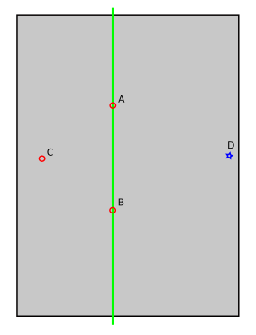

# Manual leveling

This document describes tools for calibrating a Z endstop and for
performing adjustments to bed leveling screws.

## Calibrating a Z endstop

An accurate Z endstop position is critical to obtaining high quality
prints.

Note, though, the accuracy of the Z endstop switch itself can be a
limiting factor. If one is using Trinamic stepper motor drivers then
consider enabling [endstop phase](Endstop_Phase.md) detection to
improve the accuracy of the switch.

To perform a Z endstop calibration, home the printer, command the head
to move to a Z position that is at least five millimeters above the
bed (if it is not already), command the head to move to an XY position
near the center of the bed, then navigate to the OctoPrint terminal
tab and run:
```
Z_ENDSTOP_CALIBRATE
```
Then follow the steps described at
["the paper test"](Bed_Level.md#the-paper-test) to determine the
actual distance between the nozzle and bed at the given location. Once
those steps are complete one can `ACCEPT` the position and save the
results to the config file with:
```
SAVE_CONFIG
```

It's preferable to use a Z endstop switch on the opposite end of the Z
axis from the bed. (Homing away from the bed is more robust as then it
is generally always safe to home the Z.) However, if one must home
towards the bed it is recommended to adjust the endstop so that it
triggers a small distance (eg, .5mm) above the bed. Almost all endstop
switches can safely be depressed a small distance beyond their trigger
point. When this is done, one should find that the
`Z_ENDSTOP_CALIBRATE` command reports a small positive value (eg,
.5mm) for the Z position_endstop. Triggering the endstop while it is
still some distance from the bed reduces the risk of inadvertent bed
crashes.

Some printers have the ability to manually adjust the location of the
physical endstop switch. However, it's recommended to perform Z
endstop positioning in software with Klipper - once the physical
location of the endstop is in a convenient location, one can make any
further adjustments by running Z_ENDSTOP_CALIBRATE or by manually
updating the Z position_endstop in the configuration file.

## Adjusting bed leveling screws

The secret to getting good bed leveling with bed leveling screws is to
utilize the printer's high precision motion system during the bed
leveling process itself. This is done by commanding the nozzle to a
position near each bed screw and then adjusting that screw until the
bed is a set distance from the nozzle. Klipper has a tool to assist
with this. In order to use the tool it is necessary to specify each
screw XY location.

This is done by creating a `[bed_screws]` config section. For example,
it might look something similar to:
```
[bed_screws]
screw1: 100, 50
screw2: 100, 150
screw3: 150, 100
```

If a bed screw is under the bed, then specify the XY position directly
above the screw. If the screw is outside the bed then specify an XY
position closest to the screw that is still within the range of the
bed.

Once the config file is ready, run `RESTART` to load that config, and
then one can start the tool by running:
```
BED_SCREWS_ADJUST
```

This tool will move the printer's nozzle to each screw XY location
and then move the nozzle to a Z=0 height. At this point one can use the
"paper test" to adjust the bed screw directly under the nozzle. See
the information described in
["the paper test"](Bed_Level.md#the-paper-test), but adjust the bed
screw instead of commanding the nozzle to different heights. Adjust
the bed screw until there is a small amount of friction when pushing
the paper back and forth.

Once the screw is adjusted so that a small amount of friction is felt,
run either the `ACCEPT` or `ADJUSTED` command. Use the `ADJUSTED`
command if the bed screw needed an adjustment (typically anything more
than about 1/8th of a turn of the screw). Use the `ACCEPT` command if
no significant adjustment is necessary. Both commands will cause the
tool to proceed to the next screw. (When an `ADJUSTED` command is
used, the tool will schedule an additional cycle of bed screw
adjustments; the tool completes successfully when all bed screws are
verified to not require any significant adjustments.) One can use the
`ABORT` command to exit the tool early.

This system works best when the printer has a flat printing surface
(such as glass) and has straight rails. Upon successful completion of
the bed leveling tool the bed should be ready for printing.

### Fine grained bed screw adjustments

If the printer uses three bed screws and all three screws are under
the bed, then it may be possible to perform a second "high precision"
bed leveling step. This is done by commanding the nozzle to locations
where the bed moves a larger distance with each bed screw adjustment.

For example, consider a bed with screws at locations A, B, and C:



For each adjustment made to the bed screw at location C, the bed will
swing along a pendulum defined by the remaining two bed screws (shown
here as a green line). In this situation, each adjustment to the bed
screw at C will move the bed at position D a further amount than
directly at C. It is thus possible to make an improved C screw
adjustment when the nozzle is at position D.

To enable this feature, one would determine the additional nozzle
coordinates and add them to the config file. For example, it might
look like:
```
[bed_screws]
screw1: 100, 50
screw1_fine_adjust: 0, 0
screw2: 100, 150
screw2_fine_adjust: 300, 300
screw3: 150, 100
screw3_fine_adjust: 0, 100
```

When this feature is enabled, the `BED_SCREWS_ADJUST` tool will first
prompt for coarse adjustments directly above each screw position, and
once those are accepted, it will prompt for fine adjustments at the
additional locations. Continue to use `ACCEPT` and `ADJUSTED` at each
position.

## Adjusting bed leveling screws using the bed probe

This is another way to calibrate the bed level using the bed probe. To
use it you must have a Z probe (BL Touch, Inductive sensor, etc).

To enable this feature, one would determine the nozzle coordinates
such that the Z probe is above the screws, and then add them to the
config file. For example, it might look like:

```
[screws_tilt_adjust]
screw1: -5, 30
screw1_name: front left screw
screw2: 155, 30
screw2_name: front right screw
screw3: 155, 190
screw3_name: rear right screw
screw4: -5, 190
screw4_name: rear left screw
horizontal_move_z: 10.
speed: 50.
screw_thread: CW-M3
```

The screw1 is always the reference point for the others, so the system
assumes that screw1 is at the correct height. Always run `G28` first
and then run `SCREWS_TILT_CALCULATE` - it should produce output
similar to:
```
Send: G28
Recv: ok
Send: SCREWS_TILT_CALCULATE
Recv: // 01:20 means 1 full turn and 20 minutes, CW=clockwise, CCW=counter-clockwise
Recv: // front left screw (base) : x=-5.0, y=30.0, z=2.48750
Recv: // front right screw : x=155.0, y=30.0, z=2.36000 : adjust CW 01:15
Recv: // rear right screw : y=155.0, y=190.0, z=2.71500 : adjust CCW 00:50
Recv: // read left screw : x=-5.0, y=190.0, z=2.47250 : adjust CW 00:02
Recv: ok
```
This means that:

- front left screw is the reference point you must not change it.
- front right screw must be turned clockwise 1 full turn and a quarter turn
- rear right screw must be turned counter-clockwise 50 minutes
- read left screw must be turned clockwise 2 minutes (not need it's ok)

Repeat the process several times until you get a good level bed -
normally when all adjustments are below 6 minutes.

If using a probe that is mounted on the side of the hotend (that is,
it has an X or Y offset) then note that adjusting the bed tilt will
invalidate any previous probe calibration that was performed with a
tilted bed. Be sure to run [probe calibration](Probe_Calibrate.md)
after the bed screws have been adjusted.

The `MAX_DEVIATION` parameter is useful when a saved bed mesh is used,
to ensure that the bed level has not drifted too far from where it was when
the mesh was created. For example, `SCREWS_TILT_CALCULATE MAX_DEVIATION=0.01`
can be added to the custom start gcode of the slicer before the mesh is loaded.
It will abort the print if the configured limit is exceeded (0.01mm in this
example), giving the user a chance to adjust the screws and restart the print.

The `DIRECTION` parameter is useful if you can turn your bed adjustment
screws in one direction only. For example, you might have screws that start
tightened in their lowest (or highest) possible position, which can only be
turned in a single direction, to raise (or lower) the bed. If you can only
turn the screws clockwise, run `SCREWS_TILT_CALCULATE DIRECTION=CW`. If you can
only turn them counter-clockwise, run `SCREWS_TILT_CALCULATE DIRECTION=CCW`.
A suitable reference point will be chosen such that the bed can be leveled
by turning all the screws in the given direction.
