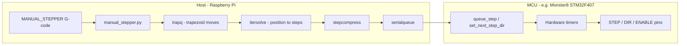

# MANUAL_STEPPER pipeline reference

This document describes how the `MANUAL_STEPPER` G-code command flows through
Klipper: host-side processing, data sent to the MCU, and MCU execution (including
boards such as the MKS Monster8). It also covers what runs on the host while a
move is in progress and where interrupt-like behavior occurs.

For user-facing command syntax, see [G-Codes](G-Codes.md#manual_stepper) and
[Config_Reference](Config_Reference.md#manual_stepper).

## Big picture

`MANUAL_STEPPER` is handled entirely on the **host** (`klippy`). The MCU never
sees that G-code name. At connect time the host registers each manual stepper's
pins and motion objects; at runtime it turns your command into **trap-queue
motion**, then **compressed step commands**, sent over serial/USB. The MCU only
runs generic Klipper stepper, endstop, and GPIO scheduling.



---

## 1. Host setup (config + startup)

A `[manual_stepper name]` section creates a `ManualStepper` object in
`klippy/extras/manual_stepper.py`. From config it keeps:

| Source | Used for |
|--------|----------|
| `step_pin`, `dir_pin`, `enable_pin`, `microsteps`, `rotation_distance` | Building an `MCU_stepper` (same as normal steppers) |
| `velocity`, `accel` | Defaults when G-code omits `SPEED` / `ACCEL` |
| `endstop_pin` (optional) | `LookupRail` + homing; enables `STOP_ON_ENDSTOP` |
| `position_min` / `position_max` | Host-side move limits |

Important structural choices:

- **Dedicated `trapq`** — motion is **not** on the main toolhead XYZ trapq; it is isolated.
- **`cartesian_stepper_alloc(b'x')`** — the manual axis is treated as a 1D "X-like" axis: trapq position along X maps 1:1 to stepper position via `step_dist = rotation_distance / (full_steps × microsteps × gear_ratio)`.
- **Mux G-code** — `MANUAL_STEPPER STEPPER=<config_name>` routes to the right instance.

At **MCU connect** (once per boot), the host sends static config for that stepper, for example:

- `config_stepper oid=N step_pin=... dir_pin=... invert_step=... step_pulse_ticks=...`
- `config_digital_out` for the enable pin (if present)
- `config_endstop` if homing is configured

Those come from `MCU_stepper._build_config()` and pin setup — not from each
`MANUAL_STEPPER` line.

Manual steppers are **not** connected to normal printer kinematics unless you
register `GCODE_AXIS`.

---

## 2. G-code entry: `cmd_MANUAL_STEPPER`

Implementation: `klippy/extras/manual_stepper.py`.

Branches:

### A. `ENABLE=0|1`

- Flushes step generation via toolhead.
- `stepper_enable.set_motors_enable()` schedules **`queue_digital_out`** on the enable GPIO at a **print time** (same clock domain as steps).

### B. `SET_POSITION=<pos>`

- `flush_step_generation()` so host and MCU step state match.
- Updates `commanded_pos` and `rail.set_position([pos, 0, 0])` → `itersolve_set_position()` on the host.
- Does **not** move the motor; only resets logical position for future moves.

### C. `MOVE=<pos>` (normal move)

Core path in `do_move()`:

1. **`sync_print_time()`** — aligns this stepper's `next_cmd_time` with the global toolhead print clock (may `dwell` if this stepper is ahead).
2. **`_submit_move()`** — builds a trapezoid in the manual stepper's `trapq` using `force_move.calc_move_time()`. `ACCEL=0` means constant speed.
3. **`note_mcu_movequeue_activity(next_cmd_time)`** — tells `motion_queuing` to flush step generation up to that print time.
4. If `SYNC=1` (default), syncs again so later G-code waits until the move finishes. `SYNC=0` allows overlapping commands.

`trapq_append()` receives: print_time, accel_t, cruise_t, decel_t, start position, axis direction ratio, start_v, cruise_v, accel.

### D. `MOVE` + `STOP_ON_ENDSTOP=...`

Uses homing infrastructure with **this** manual stepper acting as a fake toolhead (`get_kinematics()` returns `self`):

- `homing.manual_home()` → `HomingMove.homing_move()`
- Arms MCU endstop + **trsync** (`endstop_home`, `trsync_start`, `stepper_stop_on_trigger`)
- Runs **`drip_move()`** — steps flushed in small time slices (~50 ms) until the endstop fires or the move ends
- On trigger, host recomputes position so the stop location matches the `MOVE` target for `home` mode

`STOP_ON_ENDSTOP` values: `probe`, `home`, `inverted_*`, `try_*` (no error if move completes without trigger).

### E. `GCODE_AXIS=...`

Registers the stepper as a **toolhead extra axis** (`G1 X… R…`). Moves then go through normal toolhead planning (`process_move` / `check_move`), not direct `do_move()`. Unregister with `GCODE_AXIS=` (empty).

---

## 3. Host: from trapq to serial

Background **`motion_queuing`** flush handler calls `steppersyncmgr_gen_steps()`:

1. **Read trapq** for the manual stepper's time window.
2. **itersolve** (`cartesian_stepper_alloc`) — sample trapq position vs time → ideal step times.
3. **stepcompress** — pack steps into MCU commands:

| MCU command | Meaning |
|-------------|---------|
| `set_next_step_dir oid=… dir=…` | Direction for upcoming steps |
| `queue_step oid=… interval=… count=… add=…` | `count` steps; first interval in MCU ticks; `add` changes interval each step (trapezoidal accel on MCU) |
| `reset_step_clock oid=… clock=…` | After homing, resync step clock |

`interval` and `add` are in **MCU clock ticks**, not mm/s. The host converts print time → clock using calibrated `offset` and `freq` from `steppersync_set_time()`.

Nothing in this stream identifies a "manual stepper" — only **oid** (assigned at config) and timing parameters.

Flush timing (approximate):

- Actively stepping: aggressive flush ~450–700 ms ahead of estimated print time.
- Idle: relaxed flush ~400 ms ahead.

---

## 4. MCU execution (e.g. MKS Monster8)

The Monster8 runs standard Klipper firmware for **STM32F407** (see
`config/generic-mks-monster8.cfg`). There is **no** `MANUAL_STEPPER`-specific
firmware.

### Per-stepper object (`config_stepper`)

- Allocates `struct stepper`, maps `step_pin` / `dir_pin` via `gpio_out_setup`.
- Sets `step_pulse_ticks` for minimum pulse width.
- Sets up an internal move queue for `queue_step` segments.

### On each `queue_step`

- Enqueues a `struct stepper_move` (interval, count, add).
- Schedules `stepper_event` on the software timer list.
- Timer handler toggles **STEP** at computed times, flips **DIR** when needed, maintains internal step position.

### Enable pin

Separate from stepping: `queue_digital_out` fires at a scheduled clock time.

### Homing / `STOP_ON_ENDSTOP`

1. Host sends `endstop_home` to sample the configured pin on a schedule.
2. `stepper_stop_on_trigger` links the stepper to a **trsync** object.
3. When the endstop hits, `trsync_do_trigger` → `stepper_stop()` clears the move queue and stops the stepper timer immediately (on MCU).
4. Host reads `trsync_state` / endstop timing and updates logical position.

---

## 5. End-to-end example

`MANUAL_STEPPER STEPPER=gear_stepper MOVE=10 SPEED=30 ACCEL=80`:

| Stage | What happens |
|-------|----------------|
| Host parse | `movepos=10`, `speed=30`, `accel=80` (or config defaults) |
| Host motion | Append accel/cruise/decel segments to that stepper's trapq at `next_cmd_time` |
| Host kinematics | itersolve: 10 mm → N steps using `rotation_distance` / microsteps |
| Host → MCU | Stream of `queue_step` / `set_next_step_dir` on USB |
| MCU | Timer ISR pulses step pin, sets dir pin, holds enable if already enabled |
| Completion | With `SYNC=1`, G-code blocks until print time elapses; flush may still be slightly ahead of real time |

---

## 6. Host architecture during a move

Klipper on the Pi is **mostly one cooperative event loop** plus C background threads for serial I/O. Motion is **not** driven by Linux signals or GPIO interrupts on the host.

| Component | Role during a move |
|-----------|-------------------|
| **Reactor** (`SelectReactor`) | Main loop: `select()` on fds + timer callbacks (greenlet-based) |
| **G-code handler** | Runs `cmd_MANUAL_STEPPER`; holds `gcode_mutex` |
| **`motion_queuing` flush timer** | Periodically: trapq → steps → serial commands |
| **`serialqueue` pthread** | Sends messages at scheduled MCU clock times; ACKs/retransmit |
| **`serialhdl` pthread** | Parses inbound messages; wakes reactor for `trsync_state`, etc. |

There is **no host ISR** per step. Steps are precomputed in batches and queued ahead of real time.

### Timeline of `MOVE` with default `SYNC=1`

1. **`sync_print_time()` (start)** — if manual stepper was ahead, `toolhead.dwell()` catches up global print clock.
2. **`_submit_move()`** — `trapq_append()` only; no MCU traffic yet.
3. **`note_mcu_movequeue_activity()`** — kicks flush timer for step generation.
4. **`sync_print_time()` (end)** — if `next_cmd_time > toolhead.print_time`, `toolhead.dwell()` until move end.

`toolhead.dwell()` advances **toolhead `print_time`** (shared schedule) even though XYZ trapq did not get this move, then **`_check_pause()`** loops: `reactor.pause()` until `mcu.estimated_print_time()` catches up.

With `SYNC=1`, the **`MANUAL_STEPPER` handler blocks** until schedule time elapses; `ok` is delayed. Other G-code on the same channel waits on **`gcode_mutex`**.

### While the handler is waiting

The reactor still runs:

- **`motion_queuing._flush_handler`** — `steppersyncmgr_gen_steps()` inside `assert_no_pause()`.
- **`serialqueue` pthread** — TX independent of Python GIL.
- **`serialhdl` pthread** — RX; homing completions via `async_complete`.
- **Other reactor timers** — statistics, verify_heater, fans, etc.
- **Heaters** — mostly MCU-scheduled (`queue_pwm_out`), not per-step host polling.

Main toolhead XYZ trapq is **not** updated unless something else moves the carriage in parallel.

### After `ok`

MCU may still be executing the last milliseconds of queued steps (host buffers ~0.2–0.7 s ahead). All steps up to `next_cmd_time` are already scheduled.

### `SYNC=0`

- Handler returns after `note_mcu_movequeue_activity()` — no final `dwell()`.
- Next G-code can run while steps still stream.
- Can overlap manual stepper motion with toolhead `G1` (separate trapqs, same print clock).

### What is not running on the host for this move

- No per-step Python callback.
- No Linux real-time stepping thread.
- No Pi GPIO bit-banging for Monster8 step pins.
- No toolhead lookahead / junction planning unless `GCODE_AXIS` is registered.

---

## 7. Interrupt-like behavior

### On the host: no hardware interrupts

| Mechanism | Acts like… |
|-----------|------------|
| **`reactor.pause()` in `_check_pause()`** | Wait until MCU clock estimate catches up without blocking the whole process |
| **`motion_queuing` flush timer** | Periodic "generate more steps now" |
| **`serialqueue` pthread** | Async TX when MCU clock allows |
| **`serialhdl` + `async_complete`** | Async notification on `trsync_state` / responses |
| **`assert_no_pause()` during `_advance_flush_time`** | Critical section for step generation |
| **`gcode_mutex`** | Serializes G-code; `M112` can preempt |

### On the MCU: timer IRQs (e.g. STM32F407 / Monster8)

- **`TIMx_IRQHandler`** → `timer_dispatch_many()` → `sched_timer_dispatch()` → often **`stepper_event`** for step pulses.
- **`queue_step`** processing uses **`irq_disable()` / `irq_enable()`** around move-queue updates.
- **Endstop homing**: `endstop_home` schedules timers that poll GPIO; on trigger **`trsync_do_trigger()`** → **`stepper_stop()`** clears the step queue immediately. Host learns via serial later.

Physical stop on endstop is **MCU-local and fast**; host position adjustment is **milliseconds later** over USB.

---

## 8. Mental model

```text
[G-code thread]  trapq_append → note activity → dwell/pause until print_time
       │                                      ↑
       │         [reactor timers]           estimated_print_time from MCU
       └────────► flush → itersolve → stepcompress ──► [serialqueue thread] ──USB──► MCU
                                                                              TIM IRQ → STEP pin
```

While `MANUAL_STEPPER` with `SYNC=1` is "running":

1. The **command is blocked** in `dwell` / `_check_pause` until schedule time elapses.
2. **Step generation and USB TX** continue via flush timer + serialqueue thread.
3. The **MCU** moves the motor under **timer IRQs**, independent of Python.
4. **Endstop stops** use **trsync + stepper_stop** on the MCU, not host interrupts.

---

## 9. Key source files

| Area | Path |
|------|------|
| G-code / manual stepper logic | `klippy/extras/manual_stepper.py` |
| Move time math | `klippy/extras/force_move.py` |
| Motion flush / drip | `klippy/extras/motion_queuing.py` |
| Stepper / MCU config | `klippy/stepper.py` |
| Toolhead / dwell / pause | `klippy/toolhead.py` |
| Homing | `klippy/extras/homing.py` |
| MCU endstop / trsync | `klippy/mcu.py` |
| Trapq (C) | `klippy/chelper/trapq.c` |
| Serial TX thread (C) | `klippy/chelper/serialqueue.c` |
| MCU stepper | `src/stepper.c` |
| MCU endstop | `src/endstop.c` |
| MCU scheduler / IRQ dispatch | `src/sched.c`, `src/stm32/stm32f0_timer.c` |
| Monster8 sample config | `config/generic-mks-monster8.cfg` |

---

## 10. Related documentation

- [G-Codes: MANUAL_STEPPER](G-Codes.md#manual_stepper)
- [Manual_Stepper_Retarget.md](Manual_Stepper_Retarget.md) — `RETARGET=` flywheel
  velocity/direction changes and all delays
- [Manual_Stepper_Trapq.md](Manual_Stepper_Trapq.md) — trapq read/write and splice
- [Cancel_Step_Lifecycle.md](Cancel_Step_Lifecycle.md) — `CANCEL_STEP` hard stop
- [Config_Reference: manual_stepper](Config_Reference.md#manual_stepper)
- [Code overview](Code_Overview.md)
- [MCU commands](MCU_Commands.md)
- [Protocol](Protocol.md)
