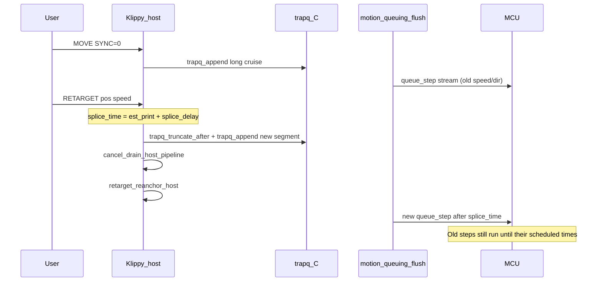

# `MANUAL_STEPPER RETARGET=` — continuous velocity / direction changes

This document describes how `MANUAL_STEPPER RETARGET=` works on the host and MCU,
every intentional **delay** in the system, and how that differs from `CANCEL_STEP`
and normal `MOVE`.

Related docs:

- [Manual_Stepper_Pipeline.md](Manual_Stepper_Pipeline.md) — G-code → trapq → steps → MCU
- [Manual_Stepper_Trapq.md](Manual_Stepper_Trapq.md) — trapq read/write and splice mechanics
- [Cancel_Step_Lifecycle.md](Cancel_Step_Lifecycle.md) — hard stop (`CANCEL_STEP`)
- [Flywheel_Retarget_Plan.md](Flywheel_Retarget_Plan.md) — design requirements
- [G-Codes.md](G-Codes.md#manual_stepper) — user-facing syntax

Test script: [`scripts/test_retarget_step_moonraker.py`](../scripts/test_retarget_step_moonraker.py)

---

## Purpose

`RETARGET` is for **flywheel-style** drives: a long `MOVE … SYNC=0` keeps the motor
spinning, and periodic `RETARGET` commands change **speed** and **direction** without
calling `CANCEL_STEP` (which stops the MCU stepper).

| Command | Motor stops? | Use case |
|---------|--------------|----------|
| `MOVE … SYNC=0` | No | Start / extend async spin |
| `RETARGET=<pos> SPEED=…` | **No** | Change velocity / direction while spinning |
| `CANCEL_STEP` | **Yes** | Hard stop, position reconcile |
| `MOVE … SYNC=1` | Blocks G-code until done | Steer positioning |

---

## G-code rules

### Valid flywheel sequence

```gcode
MANUAL_STEPPER STEPPER=flywheel ENABLE=1
MANUAL_STEPPER STEPPER=flywheel MOVE=99999 SPEED=30 ACCEL=0 SYNC=0
MANUAL_STEPPER STEPPER=flywheel RETARGET=99999 SPEED=45 ACCEL=0
MANUAL_STEPPER STEPPER=flywheel RETARGET=-99999 SPEED=40 ACCEL=0
```

- **`RETARGET` must be on its own line** (no `ENABLE`, `MOVE`, `SET_POSITION`, or
  `STOP_ON_ENDSTOP` in the same command).
- Requires an active **`MOVE … SYNC=0`** session (`active_move_id` set). If the
  planned async move has already finished, you get
  `RETARGET requires active MOVE SYNC=0`.
- **`SPEED`** is a positive magnitude; **direction** comes from
  `RETARGET` position vs current position at splice time (same as `MOVE`).
- **`ACCEL=0`** is recommended for flywheels so the new trapq segment starts at
  cruise speed immediately.

### Moonraker batching

Send multiple lines in one `gcode/script` body (newlines), not combined parameters:

```gcode
MANUAL_STEPPER STEPPER=flywheel MOVE=8000 SPEED=30 ACCEL=0 SYNC=0
MANUAL_STEPPER STEPPER=flywheel RETARGET=-800 SPEED=20 ACCEL=0
```

---

## End-to-end flow



Implementation entry points:

| Step | Code |
|------|------|
| G-code | `cmd_MANUAL_STEPPER` → `do_retarget()` in [`manual_stepper.py`](../klippy/extras/manual_stepper.py) |
| Trapq splice | `trapq_truncate_after()` in [`trapq.c`](../klippy/chelper/trapq.c) |
| Host re-anchor | `retarget_reanchor_host()` in [`stepper.py`](../klippy/stepper.py) |
| Step generation | `motion_queuing` background flush → `itersolve_generate_steps` |

---

## `do_retarget()` step by step

When `MANUAL_STEPPER STEPPER=x RETARGET=<pos> SPEED=<v> [ACCEL=…]` runs:

1. **`_await_cancel_complete`** — if a `CANCEL_STEP` is in progress, block until
   idle (same as any `MANUAL_STEPPER` command).

2. **`_refresh_cancel_activity`** — if the original `SYNC=0` move’s planned end
   (`cancel_deadline` / `next_cmd_time`) is already in the past, clear
   `active_move_id` and error with `RETARGET requires active MOVE SYNC=0`.

3. **Compute `splice_time`**
   ```text
   splice_time = est_print_time + splice_delay
   ```
   `est_print_time` = MCU’s estimate of “where the print clock is now”.
   `splice_delay` = config `splice_delay` or `motion_queuing.get_kin_flush_delay()`.

4. **`trapq_truncate_after(trapq, splice_time)`** — shorten or remove future trapq
   segments; return `splice_pos` (planned position at splice from trapq math).

5. **`cancel_drain_host_pipeline()`** — discard host stepcompress + syncemitter
   messages not yet sent to the MCU (see [Host drain](#host-drain-delay)).

6. **`retarget_reanchor_host(splice_time)`** — `stepcompress_reset`, MCU position
   query, `stepcompress_set_last_position`, `itersolve_set_position`,
   `itersolve_reset_flush_time` (see [Host re-anchor](#host-re-anchor-delay)).
   **Does not** send `reset_step_clock` or `stepper_cancel_*` to the MCU.

7. **`_submit_move(splice_time, retarget_pos, speed, accel)`** — append new
   accel/cruise/decel to trapq from `physical_pos` toward `retarget_pos`.

8. **`_reset_retarget_movequeue_horizon`** — point flush horizons at the new move
   end (not the old far-future `MOVE` end).

9. **`note_mcu_movequeue_activity(next_cmd_time)`** — kick the background flush
   timer to generate and send new steps.

10. **Log** `manual_stepper_retarget` with `splice_time`, `splice_pos`,
    `physical_pos`, `retarget_pos`, `speed`, `move_id`.

---

## All delays and why they exist

Delays fall into three categories:

- **A. Intentional host scheduling** — required for correctness (splice in the future).
- **B. Pipeline / buffering** — Klipper always runs steps ahead of real time.
- **C. External** — Moonraker, USB, your control loop (not Klipper bugs).

### Summary table

| Delay | Typical size | Applied on RETARGET? | Motor stops? | Reason |
|-------|----------------|----------------------|--------------|--------|
| [splice_delay](#1-splice_delay-splice_time) | ~0.001–0.1 s (config) | Yes | No | Schedule trapq change slightly ahead of “now” |
| [kin_flush_delay](#2-kin_flush_delay) | ≥ 0.001 s | Yes (default splice_delay) | No | Step-generation scan window |
| [MCU step pipeline](#3-mcu-step-pipeline-buffer) | ~0.1–0.7 s | Yes | **No** | Steps already queued on MCU still execute |
| [BG flush lookahead](#4-background-flush-lookahead) | ~0.2–0.7 s | Continuous | No | Host generates steps ahead of `est_print_time` |
| [Host drain + re-anchor](#5-host-drain-and-re-anchor) | Immediate at command | Yes | No | Drop stale host buffers; reset stepcompress epoch |
| [note_mcu_movequeue_activity](#6-flush-horizon-kick) | +kin_flush on end | Yes | No | Ensure new trapq is converted to steps |
| [CANCEL_RESYNC_GUARD](#7-not-used-on-retarget) | 0.25 s | **No** (cancel only) | **Yes** on cancel | MCU stop + clock guard |
| [G-code / HTTP latency](#8-external-command-latency) | User-dependent | External | No | Moonraker, serial, control period |
| [Velocity blend window](#9-velocity-blend-window) | splice_delay + pipeline | Yes | No | Old speed until splice_time, then new trapq |

---

### 1. splice_delay (`splice_time`)

**Definition:**

```text
splice_time = est_print_time + splice_delay
```

**Default:** `motion_queuing.get_kin_flush_delay()` (at least `SDS_CHECK_TIME` = 1 ms,
often ~1 ms unless input shaping or similar raises it).

**Override:** `[manual_stepper name]` config option `splice_delay:` (seconds, > 0).

**Why it exists:**

- RETARGET must not cut the trapq at “now” (`est_print_time` exactly). The host
  still has **in-flight** state: steps being compressed, messages in syncemitter,
  and steps already handed to `serialqueue`.
- Cutting at `est_print_time` would race the background flush and can produce
  `Invalid sequence` in stepcompress or inconsistent position.
- Cutting at `est_print_time + splice_delay` schedules the new motion plan to start
  at a print time that is **in the future** relative to the estimate, giving the
  flush path time to switch from old trapq to new trapq cleanly.

**What you feel on the motor:** velocity / direction change begins taking effect
around **`splice_time`**, not when the G-code arrives.

**Tuning:**

- **Lower** `splice_delay` → faster response, higher risk of stepcompress / timing issues.
- **Higher** (e.g. 0.05–0.1 s) → softer handoff, more “wrong speed” time before splice.

---

### 2. kin_flush_delay

**Source:** [`motion_queuing.py`](../klippy/extras/motion_queuing.py) —
`check_step_generation_scan_windows()` takes the max of per-stepper
`gen_steps_pre_active` / `gen_steps_post_active` (minimum `SDS_CHECK_TIME`).

**Used as:** default `splice_delay` when config does not set `splice_delay`.

**Why it exists:**

- `itersolve_generate_steps` does not only look at an instant; it needs a small
  time **window** around each flush interval to find step boundaries (and to
  support filters such as step+dir+step in stepcompress).
- `note_mcu_movequeue_activity` adds `kin_flush_delay` to the requested flush end
  so generation runs far enough ahead.

**On RETARGET:** same value is the minimum sensible splice horizon.

---

### 3. MCU step pipeline buffer

**Typical size:** ~100–700 ms of motion already encoded in `queue_step` commands
the MCU has received but not yet executed (see
[Manual_Stepper_Pipeline.md](Manual_Stepper_Pipeline.md) §3 flush timing:
BGFLUSH ~450–700 ms ahead when stepping).

**On RETARGET:** **not drained.** The MCU keeps executing those steps.

**Why:**

- Draining the MCU queue requires `stepper_stop` / cancel — that **stops** the
  motor, which flywheels cannot use.
- RETARGET only discards **host-side** data not yet committed to the MCU.

**What you feel:**

- From command receipt until roughly **`splice_time`**, the wheel may still
  accelerate/decelerate according to the **old** trapq (and already-queued steps).
- After `splice_time`, **new** steps from the retargeted trapq take over.
- There is a **blend** period, not a gap — STEP pulses continue.

**This is the main difference vs `CANCEL_STEP`:** cancel clears the MCU queue and
creates a visible stop; retarget does not.

---

### 4. Background flush lookahead

**Constants** ([`motion_queuing.py`](../klippy/extras/motion_queuing.py)):

| Constant | Value | Role |
|----------|-------|------|
| `BGFLUSH_LOW_TIME` | 0.200 s | Flush when buffer drops below this ahead of `est` |
| `BGFLUSH_HIGH_TIME` | 0.400 s | Target high-water mark |
| `BGFLUSH_SG_LOW_TIME` | 0.450 s | Step-gen scheduling |
| `BGFLUSH_SG_HIGH_TIME` | 0.700 s | Step-gen high water |
| `BGFLUSH_EXTRA_TIME` | 0.250 s | Extra margin |
| `MIN_KIN_TIME` | 0.100 s | Minimum kinematic lead time |
| `STEPCOMPRESS_FLUSH_TIME` | 0.050 s | Compress flush offset |

**Why they exist:**

- Klipper intentionally runs the print clock **ahead** of real time so USB/serial
  jitter does not starve the MCU stepper timer.
- Manual steppers share the same `motion_queuing` flush timer as the rest of the
  printer.

**On RETARGET:** after `note_mcu_movequeue_activity`, the flush handler generates
steps for the new trapq segment and sends them into the existing pipeline. New
`queue_step` commands are scheduled at print times ≥ `splice_time` (via
stepcompress after re-anchor).

**Not a motor stop** — it only affects how far ahead new steps are packed.

---

### 5. Host drain and re-anchor

**When:** synchronously inside `do_retarget()`, before the G-code handler returns.

**Operations:**

1. `stepcompress_discard_pending` — drop pending compressed steps.
2. `syncemitter_drop_pending_msgs` — drop encoded `queue_step` not yet in
   serialqueue.
3. `stepcompress_reset(splice_clock)` — reset host step clock epoch to splice.
4. `stepper_get_position` + `stepcompress_set_last_position` — match MCU step count.
5. `itersolve_set_position` + `itersolve_reset_flush_time(splice_time)` — solver
   regenerates from splice forward.

**Delay:** negligible wall time (milliseconds on the Pi) — but **required** after
the first retarget bug (only draining without `stepcompress_reset` caused
`Invalid sequence` on direction change).

**Why it exists:**

- After `trapq_truncate_after`, old trapq is gone but host buffers still described
  the old motion. Without drain + reset, the next flush emits steps inconsistent
  with the new trapq (wrong intervals / direction), and stepcompress shuts down.

**MCU:** not stopped; in-flight MCU steps are untouched.

---

### 6. Flush horizon kick

**`_reset_retarget_movequeue_horizon(end_time)`** sets:

```text
need_step_gen_time = max(end_time, est_print_time) + kin_flush_delay
need_flush_time    = max(end_time, est_print_time)
```

**Why:**

- A long `MOVE SYNC=0` sets `need_step_gen_time` to the **far** planned end
  (e.g. thousands of seconds ahead).
- Without reset, the flush handler would keep scanning/generating for the old
  horizon even after truncate.
- Replacing the horizon limits work to the retargeted move’s end.

**Then** `note_mcu_movequeue_activity(next_cmd_time)` may **increase** those times
again (it only ever raises them).

---

### 7. Not used on RETARGET: `CANCEL_RESYNC_GUARD`

**Value:** 0.25 s in [`manual_stepper.py`](../klippy/extras/manual_stepper.py).

**Used by:** `CANCEL_STEP` only (`_calc_post_cancel_time`, `cancel_finish`,
`reanchor_step_clock`).

**Why cancel needs it:**

- MCU `stepper_stop` clears the queue; next `queue_step` must be ≥
  `safe_clock = est + guard` or the firmware errors with `Timer too close`.

**Why RETARGET does not:**

- RETARGET never calls `stepper_stop`. No mandatory “dead time” with zero steps.
- Demanding 250 ms guard per retarget would limit flywheel update rate (~4 Hz max).

---

### 8. External command latency

Not implemented in Klipper; affects when `splice_time` is computed.

| Source | Effect |
|--------|--------|
| Moonraker HTTP | Time between your controller sending script and Klippy parsing it |
| `gcode_mutex` | Other G-code serializes with RETARGET |
| `_await_cancel_complete` | If cancel running, RETARGET waits (up to 4 s timeout) |
| Control loop period | 20 ms commands are fine; benefit is coalescing, not synchronous motion |

**Relationship to `splice_time`:**

```text
splice_time = est_print_time_at_retarget_handler + splice_delay
```

`est_print_time` advances in real time while your command is in flight, so a late
RETARGET still splices ~`splice_delay` ahead of **handler** “now”, not ahead of
when you clicked “send”.

**Rule of thumb:** expect **~splice_delay + MCU pipeline + network** before the
new speed dominates — often **~100–300 ms** with defaults, not 20 ms.

---

### 9. Velocity blend window

**Not a single constant** — overlap of [splice_delay](#1-splice_delay-splice_time)
and [MCU pipeline](#3-mcu-step-pipeline-buffer).

**Timeline (conceptual):**

```text
t_cmd     G-code RETARGET received
t_handler do_retarget: truncate at t_splice = est + splice_delay
          host drain + re-anchor; trapq has new segment from t_splice
t_mcu_old MCU still runs pre-splice queue_step until those times expire
t_splice  New steps from retarget trapq begin scheduling (after flush)
t_feel    Wheel speed/direction mostly match new RETARGET
```

**Direction reversal** (e.g. `MOVE=+8000` then `RETARGET=-800`):

- DIR pin flips when **new** steps are generated after re-anchor, not at `t_cmd`.
- Brief period may still run old-direction steps from MCU buffer — expected.

**Flywheel requirement “must not stop”:** satisfied if STEP pulses never gap;
**not** satisfied if you require instant speed change at command receipt.

---

## Timing diagram (print time vs wall time)

```text
print_time -->
                 est        splice_time              new_move_end
                  |              |                        |
MCU steps:  [==== old queue_step ======][==== new queue_step ======>...
                  ^              ^
                  |              +-- trapq says "new motion from here"
                  +-- est_print_time when RETARGET runs

Wall time -->
                  [HTTP][do_retarget][flush batches][serial][MCU executes]
```

---

## Logging and diagnosis

Successful retarget:

```text
manual_stepper_retarget stepper=manual_stepper <name> splice_time=... splice_pos=... physical_pos=... retarget_pos=... speed=... move_id=...
```

Common failures:

| Log / error | Meaning |
|-------------|---------|
| `RETARGET cannot be combined with ...` | `ENABLE`/`MOVE`/etc. on same line |
| `RETARGET requires active MOVE SYNC=0` | No async move, or move finished |
| `RETARGET failed to truncate trapq` | Empty trapq |
| `Invalid sequence` / `Internal error in stepcompress` | Host re-anchor missing or old klippy (fixed by `retarget_reanchor_host`) |
| `Timer too close` | Rare on retarget; investigate splice_delay too low or MCU conflict |

Commands:

```bash
grep manual_stepper_retarget ~/printer_data/logs/klippy.log
grep -E 'RETARGET|Invalid sequence|stepcompress' ~/printer_data/logs/klippy.log | tail -40
./scripts/test_retarget_step_moonraker.py --stepper <name> --enable-before-move
```

---

## RETARGET vs `CANCEL_STEP` vs second `MOVE`

| | RETARGET | CANCEL_STEP + MOVE | Second MOVE (no cancel) |
|--|----------|-------------------|-------------------------|
| MCU stop | No | Yes | No |
| trapq | Truncate + append at splice | Wipe + new move | Append at **end** of first move |
| Host drain | Yes | Yes | No |
| MCU queue | Keeps old steps until consumed | Cleared | Keeps old steps |
| Guard delay | splice_delay (~1 ms+) | CANCEL_RESYNC_GUARD (250 ms) | N/A |
| Update rate | ~few Hz–10 Hz practical | ~3–4 Hz max | N/A until first move ends |

---

## Configuration

```ini
[manual_stepper flywheel]
step_pin: ...
dir_pin: ...
# ...
velocity: 30
accel: 0
# Optional: override default splice horizon (seconds)
# splice_delay: 0.050
```

See [Config_Reference.md](Config_Reference.md#manual_stepper).

---

## Implementation file index

| File | Role |
|------|------|
| [`klippy/extras/manual_stepper.py`](../klippy/extras/manual_stepper.py) | `do_retarget`, G-code, `splice_delay` |
| [`klippy/stepper.py`](../klippy/stepper.py) | `retarget_reanchor_host`, `cancel_drain_host_pipeline` |
| [`klippy/chelper/trapq.c`](../klippy/chelper/trapq.c) | `trapq_truncate_after` |
| [`klippy/extras/motion_queuing.py`](../klippy/extras/motion_queuing.py) | Flush timer, `kin_flush_delay`, `note_mcu_movequeue_activity` |
| [`klippy/extras/force_move.py`](../klippy/extras/force_move.py) | `calc_move_time` / direction |

---

## Practical guidance for robot controllers

1. Start with **`MOVE … SYNC=0 ACCEL=0`** once.
2. Stream **`RETARGET=… SPEED=… ACCEL=0`** on separate lines (batched script OK).
3. Expect **~100–300 ms** before new speed dominates; motor should **not** stop.
4. Do **not** use `CANCEL_STEP` between routine retargets.
5. Use **`CANCEL_STEP`** only for estop / full stop.
6. Tune **`splice_delay`** only if you see `Invalid sequence` or need snappier response.
7. Steer motors: use normal **`MOVE SYNC=1`**, not `RETARGET`.
