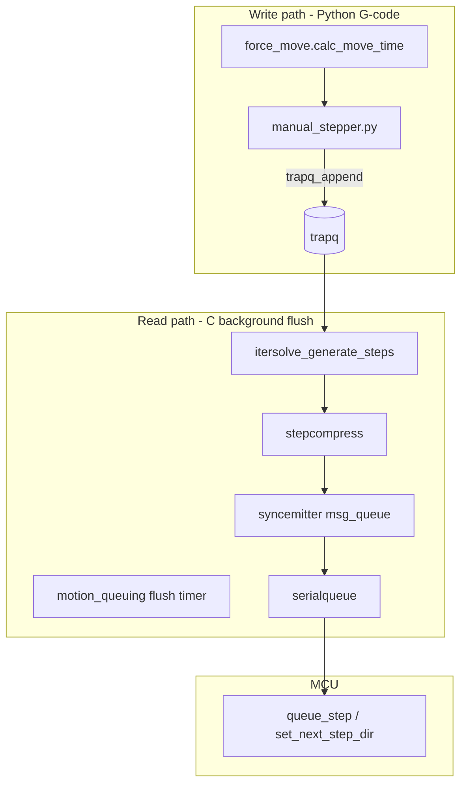

# Manual stepper and the trapq

This document explains how Klipper’s **trapq** (trapezoid velocity queue) drives a
`[manual_stepper]`, where data is written and read, and how you can modify it safely
—for example when implementing `MANUAL_STEPPER RETARGET=` (see
[Flywheel_Retarget_Plan.md](Flywheel_Retarget_Plan.md)). For RETARGET timing and
all delays, see [Manual_Stepper_Retarget.md](Manual_Stepper_Retarget.md).

For the full G-code → serial → MCU path, see [Manual_Stepper_Pipeline.md](Manual_Stepper_Pipeline.md).
For cancel (hard stop), see [Cancel_Step_Lifecycle.md](Cancel_Step_Lifecycle.md).

---

## What trapq is

The trapq is a **time-ordered list of trapezoidal velocity segments** on the host
(Raspberry Pi). Each segment is a `struct move`:

| Field | Meaning |
|-------|---------|
| `print_time` | Host print clock when this segment starts |
| `move_t` | Duration of the segment (seconds) |
| `start_v` | Speed at segment start (mm/s along the move axis) |
| `half_accel` | Half of acceleration (`accel/2`; 0 in cruise) |
| `start_pos` | XYZ start (manual stepper uses **X only**) |
| `axes_r` | Unit direction vector (manual stepper: ±1 on X) |

Position along a segment at local time `t` is computed in C:

```c
// klippy/chelper/trapq.c
move_get_coord(m, t)  // start_pos + axes_r * move_get_distance(m, t)
```

The trapq does **not** pulse STEP pins. It only describes **where the axis should
be as a function of print time**. Step pulses are derived later.

---

## One manual stepper’s data path

Each `ManualStepper` owns a **dedicated** trapq, separate from the toolhead XYZ
trapq:



At config time ([`manual_stepper.py`](../klippy/extras/manual_stepper.py)):

1. `motion_queuing.allocate_trapq()` → new `struct trapq *`
2. `rail.setup_itersolve('cartesian_stepper_alloc', b'x')` → stepper reads **X** from trapq
3. `rail.set_trapq(self.trapq)` → links that trapq to the stepper’s iterative solver

---

## Where trapq is written

### Primary writer: `ManualStepper._submit_move()`

Called from `do_move()`, `drip_move()`, and (for `GCODE_AXIS`) `process_move()`:

```python
# klippy/extras/manual_stepper.py
self.trapq_append(self.trapq, movetime,
                  accel_t, cruise_t, accel_t,
                  cp, 0., 0., axis_r, 0., 0.,
                  0., cruise_v, accel)
```

- `movetime` is usually `self.next_cmd_time` (end of the previous segment).
- `cp` is `self.commanded_pos` (logical start).
- `axis_r`, `accel_t`, `cruise_t`, `cruise_v` come from
  [`force_move.calc_move_time(dist, speed, accel)`](../klippy/extras/force_move.py).
- Negative `dist` → `axis_r = -1` (reverse direction).

`trapq_append` (C) may create up to three linked `struct move` nodes: accel, cruise,
decel.

### Other writers (manual stepper context)

| API | When | Effect |
|-----|------|--------|
| `motion_queuing.wipe_trapq(trapq)` | Cancel **DRAINING**, homing drip end | `trapq_finalize_moves(..., NEVER)` — moves all live segments to **history** |
| `trapq_set_position` | Toolhead position set; **planned for RETARGET** | Flush live list; prune history; insert position marker |
| `trapq_finalize_moves` | Every background flush | Move **expired** segments (print_time + move_t ≤ free_time) to history |

**`trapq_truncate_after(tq, print_time, &pos_x, &pos_y, &pos_z)`** (in
[`trapq.c`](../klippy/chelper/trapq.c)) truncates the active move at `print_time`,
deletes all later segments on the `moves` list, and returns the interpolated
position. Returns `-1` if the trapq has no moves. Used by `RETARGET` (planned).

### Logical position vs trapq

| Variable | Role |
|----------|------|
| `self.commanded_pos` | Python “we intend to be here at end of last submitted move” |
| `rail.set_position()` / `itersolve_set_position()` | Host solver + offset for step generation |
| MCU `stepper_get_position` | Physical step count after cancel reconcile (not used on RETARGET path) |

After `_submit_move`, `commanded_pos` is set to the **target** `movepos`, even
though physically the motor is still catching up through the pipeline.

---

## Where trapq is read

### 1. Background flush: `motion_queuing`

[`PrinterMotionQueuing`](../klippy/extras/motion_queuing.py) runs a reactor timer
(`_flush_handler`) that calls:

```python
steppersyncmgr_gen_steps(steppersyncmgr, flush_time, step_gen_time, clear_history_time)
```

For each syncemitter (including each manual stepper):

1. [`syncemitter_flush`](../klippy/chelper/steppersync.c) →
   `itersolve_generate_steps(sk, sc, gen_steps_time)`
2. [`itersolve_generate_steps`](../klippy/chelper/itersolve.c) walks the trapq
   **moves** list from `sk->last_flush_time` to `flush_time`
3. For each step boundary, `stepcompress_append` → later `queue_step` on the MCU

Before generation, `trapq_check_sentinels()` updates the tail sentinel’s
`print_time` to the end of the last real move.

After generation, `trapq_finalize_moves(trapq, trapq_free_time, ...)` moves
completed segments to **history** (used for logging / `trapq_extract_old`).

### 2. Iterative solver state (must stay consistent)

Each `stepper_kinematics` (`sk`) caches:

| Field | Meaning |
|-------|---------|
| `last_flush_time` | Print time already converted to steps |
| `last_move_time` | Last trapq segment time seen |
| `commanded_pos` | Solver’s idea of current axis position |

If you change trapq **without** updating these, the next flush can **skip** motion
or emit wrong steps. That is why cancel uses `itersolve_reset_flush_time()` after
`wipe_trapq`, and why RETARGET will reset to `splice_time`.

### 3. Cartesian X for manual stepper

[`kin_cartesian.c`](../klippy/chelper/kin_cartesian.c) `cartesian_stepper_alloc('x')`
returns position = `move_get_coord(m, t).x`.

---

## Two lists inside each trapq

```
moves:   [head_sentinel] → accel → cruise → decel → [tail_sentinel]
history: expired / interrupted segments (for diagnostics)
```

- **Active planning** only uses `moves`.
- **`wipe_trapq`** empties `moves` into history (cancel path).
- **`trapq_finalize_moves`** slides old tail of `moves` into history as time advances.

---

## Time coordinates: `print_time`, `next_cmd_time`, MCU clock

| Clock | Used for |
|-------|----------|
| **print_time** | Trapq segment starts; stepcompress schedules in print time |
| **`next_cmd_time`** | Next `trapq_append` start; end of last submitted move |
| **MCU clock** | `queue_step` intervals; `estimated_print_time()` bridges host ↔ MCU |

`sync_print_time()` ties manual stepper scheduling to the toolhead print clock
(`dwell` when `next_cmd_time` is ahead).

Important for flywheels: a long `MOVE … SYNC=0` sets `next_cmd_time` to the **far
future** (end of the move). A normal second `MOVE` without retarget would append
**after** that, not “now”. RETARGET splices at `est_print_time + splice_delay`
instead.

---

## Buffers below trapq (why retarget drains host only)

Even after you edit trapq, motion is also stored in:

1. **stepcompress** — compressed step intervals not yet sent
2. **syncemitter `msg_queue`** — encoded `queue_step` / `set_next_step_dir`
3. **MCU move queue** — steps already transmitted

| Action | trapq | Host stepcompress/syncemitter | MCU queue |
|--------|-------|------------------------------|-----------|
| `CANCEL_STEP` | `wipe_trapq` | drain + cancel_finish | **stopped** (`stepper_stop`) |
| **`RETARGET`** | truncate + append | drain + `retarget_reanchor_host` | **keeps running** |

RETARGET must discard **host** state that still reflects the old trapq, while
allowing in-flight MCU steps to finish so the motor does not stop.

---

## How to modify trapq safely

### A. Normal move (steer) — append only

Use existing `MANUAL_STEPPER MOVE=…` / `do_move()`. No trapq surgery.

### B. Hard stop — cancel path

Use `CANCEL_STEP` → `wipe_trapq` + MCU cancel. Motor stops; do **not** use for
flywheel streaming.

### C. Flywheel retarget (planned) — splice

1. **`trapq_truncate_after(tq, splice_time, &x, &y, &z)`**  
   - Find segment containing `splice_time` (or delete from first move at/after splice)  
   - Shorten or remove later segments  
   - Returns interpolated splice position via output pointers

2. **`_submit_move(splice_time, retarget_pos, speed, accel)`**  
   - Append new accel/cruise/decel toward `retarget_pos`  
   - Direction from `retarget_pos - splice_pos`

4. **`cancel_drain_host_pipeline()`** then **`retarget_reanchor_host(splice_time)`**  
   - Drop stale host steps; re-anchor stepcompress/itersolve (no MCU stop)

5. **`_submit_move`** from MCU-aligned physical position  

6. **`note_mcu_movequeue_activity(new_end_time)`**  
   - Kick the flush timer

### D. What not to do

- **`wipe_trapq` alone** then append without reset → `last_flush_time` may be past
  the new segment start → missing steps.
- **Append at `next_cmd_time`** during a long move → new motion queued at the
  old planned end, not at “now”.
- **Only change Python `commanded_pos`** → trapq and itersolve still plan the old
  trajectory.

---

## Example: long move then RETARGET

```text
t=0     MOVE=10000 SPEED=30 SYNC=0
        trapq: [0, 333s cruise toward 10000]   (example duration)

t=5     RETARGET=10000 SPEED=50
        splice_time ≈ est_print + kin_flush_delay (~5.1s)
        truncate at 5.1s → splice_pos ≈ 153mm
        append [5.1s, …] cruise toward 10000 at 50mm/s
        drain host pending steps; MCU still executes pre-5.1s steps

t=5.2   flush generates steps from new trapq tail
        velocity blends up; STEP pin never idle
```

Reverse:

```text
RETARGET=-10000 SPEED=40
dist = -10000 - splice_pos < 0  →  axis_r = -1 in new segment
```

---

## Key source files

| Role | Path |
|------|------|
| Trapq implementation | [`klippy/chelper/trapq.c`](../klippy/chelper/trapq.c), [`trapq.h`](../klippy/chelper/trapq.h) |
| FFI exports | [`klippy/chelper/__init__.py`](../klippy/chelper/__init__.py) |
| Move time math | [`klippy/extras/force_move.py`](../klippy/extras/force_move.py) |
| Manual stepper G-code | [`klippy/extras/manual_stepper.py`](../klippy/extras/manual_stepper.py) |
| Flush orchestration | [`klippy/extras/motion_queuing.py`](../klippy/extras/motion_queuing.py) |
| Trapq → steps | [`klippy/chelper/itersolve.c`](../klippy/chelper/itersolve.c) |
| Steps → MCU messages | [`klippy/chelper/stepcompress.c`](../klippy/chelper/stepcompress.c), [`steppersync.c`](../klippy/chelper/steppersync.c) |
| Stepper link to trapq | [`klippy/stepper.py`](../klippy/stepper.py) (`set_trapq`, `setup_itersolve`) |
| MCU execution | [`src/stepper.c`](../src/stepper.c) |

---

## Related docs

- [Manual_Stepper_Pipeline.md](Manual_Stepper_Pipeline.md) — end-to-end pipeline
- [Manual_Stepper_Retarget.md](Manual_Stepper_Retarget.md) — RETARGET behavior and delays
- [Flywheel_Retarget_Plan.md](Flywheel_Retarget_Plan.md) — design plan
- [Cancel_Step_Lifecycle.md](Cancel_Step_Lifecycle.md) — hard stop (wipe + MCU cancel)
