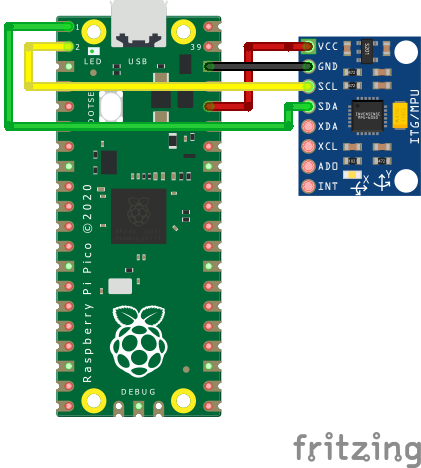
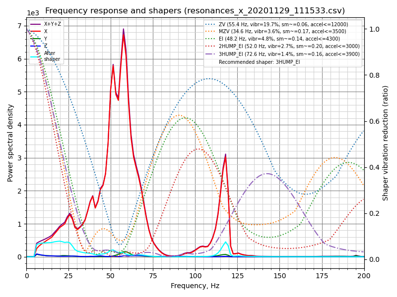

# Measuring Resonances

Klipper has built-in support for ADXL345 accelerometer, which can be used to
measure resonance frequencies of the printer for different axes, and auto-tune
[input shapers](Resonance_Compensation.md) to compensate for resonances.
Note that using ADXL345 requires some soldering and crimping. ADXL345 can be
connected to a Raspberry Pi directly, or to an SPI interface of an MCU
board (it needs to be reasonably fast).

When sourcing ADXL345, be aware that there is a variety of different PCB
board designs and different clones of them. Make sure that the board supports
SPI mode (small number of boards appear to be hard-configured for I2C by
pulling SDO to GND), and, if it is going to be connected to a 5V printer MCU,
that it has a voltage regulator and a level shifter.


## Installation instructions

### Wiring

An ethernet cable with shielded twisted pairs (cat5e or better) is recommended
for signal integrity over a long distance. If you still experience signal integrity
issues (SPI/I2C errors), shorten the cable.

Connect ethernet cable shielding to the controller board/RPI ground.

***Double-check your wiring before powering up to prevent
damaging your MCU/Raspberry Pi or the accelerometer.***

#### SPI Accelerometers

Suggested twisted pair order:

```
GND+MISO
3.3V+MOSI
SCLK+CS
```

##### ADXL345


**Note: Many MCUs will work with an ADXL345 in SPI mode(eg Pi Pico), wiring and
configuration will vary according to your specific board and available pins.**

You need to connect ADXL345 to your Raspberry Pi via SPI. Note that the I2C
connection, which is suggested by ADXL345 documentation, has too low throughput
and **will not work**. The recommended connection scheme:

| ADXL345 pin | RPi pin | RPi pin name |
|:--:|:--:|:--:|
| 3V3 (or VCC) | 01 | 3.3V DC power |
| GND | 06 | Ground |
| CS | 24 | GPIO08 (SPI0_CE0_N) |
| SDO | 21 | GPIO09 (SPI0_MISO) |
| SDA | 19 | GPIO10 (SPI0_MOSI) |
| SCL | 23 | GPIO11 (SPI0_SCLK) |

Fritzing wiring diagrams for some of the ADXL345 boards:


#### I2C Accelerometers

Suggested twisted pair order:

```
3.3V+SDA
GND+SCL
```

##### MPU-9250/MPU-9255/MPU-6515/MPU-6050/MPU-6500

Alternatives to the ADXL345 are MPU-9250/MPU-9255/MPU-6515/MPU-6050/MPU-6500.
These accelerometers have been tested to work over I2C on the RPi or RP2040(pico)
at 400kbaud.

Recommended connection scheme for I2C on the Raspberry Pi:

| MPU-9250 pin | RPi pin | RPi pin name |
|:--:|:--:|:--:|
| VCC | 01 | 3.3v DC power |
| GND | 09 | Ground |
| SDA | 03 | GPIO02 (SDA1) |
| SCL | 05 | GPIO03 (SCL1) |


Recommended connection scheme for I2C(i2c0a) on the RP2040:

| MPU-9250 pin | RP2040 pin | RPi pin name |
|:--:|:--:|:--:|
| VCC | 39 | 3v3 |
| GND | 38 | Ground |
| SDA | 01 | GP0 (I2C0 SDA) |
| SCL | 02 | GP1 (I2C0 SCL) |



### Mounting the accelerometer

The accelerometer must be attached to the toolhead. One needs to design a proper
mount that fits their own 3D printer. It is better to align the axes of the
accelerometer with the printer's axes (but if it makes it more convenient,
axes can be swapped - i.e. no need to align X axis with X and so forth - it
should be fine even if Z axis of accelerometer is X axis of the printer, etc.).

An example of mounting ADXL345 on the SmartEffector:


Note that on a bed slinger printer one must design 2 mounts: one for the
toolhead and one for the bed, and run the measurements twice. See the
corresponding [section](#bed-slinger-printers) for more details.

**Attention:** make sure the accelerometer and any screws that hold it in
place do not touch any metal parts of the printer. Basically, the mount must
be designed such as to ensure the electrical isolation of the accelerometer
from the printer frame. Failing to ensure that can create a ground loop in
the system that may damage the electronics.

### Software installation

Note that resonance measurements and shaper auto-calibration require additional
software dependencies not installed by default. First, run on your Raspberry Pi
the following commands:
```
sudo apt update
sudo apt install python3-numpy python3-matplotlib libatlas-base-dev
```

Next, in order to install NumPy in the Klipper environment, run the command:
```
~/klippy-env/bin/pip install -v numpy
```
Note that, depending on the performance of the CPU, it may take *a lot*
of time, up to 10-20 minutes. Be patient and wait for the completion of
the installation. On some occasions, if the board has too little RAM
the installation may fail and you will need to enable swap.

Afterwards, check and follow the instructions in the
[RPi Microcontroller document](RPi_microcontroller.md) to setup the
"linux mcu" on the Raspberry Pi.

#### Configure ADXL345 With RPi

Make sure the Linux SPI driver is enabled by running `sudo
raspi-config` and enabling SPI under the "Interfacing options" menu.

Add the following to the printer.cfg file:

```
[mcu rpi]
serial: /tmp/klipper_host_mcu

[adxl345]
cs_pin: rpi:None

[resonance_tester]
accel_chip: adxl345
probe_points:
    100, 100, 20  # an example
```
It is advised to start with 1 probe point, in the middle of the print bed,
slightly above it.

#### Configure MPU-6000/9000 series With RPi

Make sure the Linux I2C driver is enabled and the baud rate is
set to 400000 (see [Enabling I2C](RPi_microcontroller.md#optional-enabling-i2c)
section for more details). Then, add the following to the printer.cfg:

```
[mcu rpi]
serial: /tmp/klipper_host_mcu

[mpu9250]
i2c_mcu: rpi
i2c_bus: i2c.1

[resonance_tester]
accel_chip: mpu9250
probe_points:
    100, 100, 20  # an example
```

#### Configure MPU-6000/9000 series With PICO

PICO I2C is set to 400000 on default. Simply add the following to the
printer.cfg:

```
[mcu pico]
serial: /dev/serial/by-id/<your PICO's serial ID>

[mpu9250]
i2c_mcu: pico
i2c_bus: i2c0a

[resonance_tester]
accel_chip: mpu9250
probe_points:
    100, 100, 20  # an example

[static_digital_output pico_3V3pwm] # Improve power stability
pin: pico:gpio23
```

Restart Klipper via the `RESTART` command.

## Measuring the resonances

### Checking the setup

Now you can test a connection.

- For "non bed-slingers" (e.g. one accelerometer), in Octoprint,
  enter `ACCELEROMETER_QUERY`
- For "bed-slingers" (e.g. more than one accelerometer), enter
  `ACCELEROMETER_QUERY CHIP=<chip>` where `<chip>` is the name of the chip
  as-entered, e.g. `CHIP=bed` (see: [bed-slinger](#bed-slinger-printers))
  for all installed accelerometer chips.

You should see the current measurements from the accelerometer, including the
free-fall acceleration, e.g.
```
Recv: // adxl345 values (x, y, z): 470.719200, 941.438400, 9728.196800
```

If you get an error like `Invalid adxl345 id (got xx vs e5)`, where `xx`
is some other ID, it is indicative of the connection problem with ADXL345,
or the faulty sensor. Double-check the power, the wiring (that it matches
the schematics, no wire is broken or loose, etc.), and soldering quality.

**If you are using MPU-6000/9000 series accelerometer and it show up as `mpu-unknown`, use with
caution! They are probably refurbished chips!**

Next, try running `MEASURE_AXES_NOISE` in Octoprint, you should get some
baseline numbers for the noise of accelerometer on the axes (should be
somewhere in the range of ~1-100). Too high axes noise (e.g. 1000 and more)
can be indicative of the sensor issues, problems with its power, or too
noisy imbalanced fans on a 3D printer.

### Measuring the resonances

Now you can run some real-life tests. Run the following command:
```
TEST_RESONANCES AXIS=X
```
Note that it will create vibrations on X axis. It will also disable input
shaping if it was enabled previously, as it is not valid to run the resonance
testing with the input shaper enabled.

**Attention!** Be sure to observe the printer for the first time, to make sure
the vibrations do not become too violent (`M112` command can be used to abort
the test in case of emergency; hopefully it will not come to this though).
If the vibrations do get too strong, you can attempt to specify a lower than the
default value for `accel_per_hz` parameter in `[resonance_tester]` section, e.g.
```
[resonance_tester]
accel_chip: adxl345
accel_per_hz: 50  # default is 75
probe_points: ...
```

If it works for X axis, run for Y axis as well:
```
TEST_RESONANCES AXIS=Y
```
This will generate 2 CSV files (`/tmp/resonances_x_*.csv` and
`/tmp/resonances_y_*.csv`). These files can be processed with the stand-alone
script on a Raspberry Pi. To do that, run the following commands:
```
~/klipper/scripts/calibrate_shaper.py /tmp/resonances_x_*.csv -o /tmp/shaper_calibrate_x.png
~/klipper/scripts/calibrate_shaper.py /tmp/resonances_y_*.csv -o /tmp/shaper_calibrate_y.png
```
This script will generate the charts `/tmp/shaper_calibrate_x.png` and
`/tmp/shaper_calibrate_y.png` with frequency responses. You will also get the
suggested frequencies for each input shaper, as well as which input shaper is
recommended for your setup. For example:


```
Fitted shaper 'zv' frequency = 34.4 Hz (vibrations = 4.0%, smoothing ~= 0.132)
To avoid too much smoothing with 'zv', suggested max_accel <= 4500 mm/sec^2
Fitted shaper 'mzv' frequency = 34.6 Hz (vibrations = 0.0%, smoothing ~= 0.170)
To avoid too much smoothing with 'mzv', suggested max_accel <= 3500 mm/sec^2
Fitted shaper 'ei' frequency = 41.4 Hz (vibrations = 0.0%, smoothing ~= 0.188)
To avoid too much smoothing with 'ei', suggested max_accel <= 3200 mm/sec^2
Fitted shaper '2hump_ei' frequency = 51.8 Hz (vibrations = 0.0%, smoothing ~= 0.201)
To avoid too much smoothing with '2hump_ei', suggested max_accel <= 3000 mm/sec^2
Fitted shaper '3hump_ei' frequency = 61.8 Hz (vibrations = 0.0%, smoothing ~= 0.215)
To avoid too much smoothing with '3hump_ei', suggested max_accel <= 2800 mm/sec^2
Recommended shaper is mzv @ 34.6 Hz
```

The suggested configuration can be added to `[input_shaper]` section of
`printer.cfg`, e.g.:
```
[input_shaper]
shaper_freq_x: ...
shaper_type_x: ...
shaper_freq_y: 34.6
shaper_type_y: mzv

[printer]
max_accel: 3000  # should not exceed the estimated max_accel for X and Y axes
```
or you can choose some other configuration yourself based on the generated
charts: peaks in the power spectral density on the charts correspond to
the resonance frequencies of the printer.

Note that alternatively you can run the input shaper auto-calibration
from Klipper [directly](#input-shaper-auto-calibration), which can be
convenient, for example, for the input shaper
[re-calibration](#input-shaper-re-calibration).

### Bed-slinger printers

If your printer is a bed slinger printer, you will need to change the location
of the accelerometer between the measurements for X and Y axes: measure the
resonances of X axis with the accelerometer attached to the toolhead and the
resonances of Y axis - to the bed (the usual bed slinger setup).

However, you can also connect two accelerometers simultaneously, though they
must be connected to different boards (say, to an RPi and printer MCU board), or
to two different physical SPI interfaces on the same board (rarely available).
Then they can be configured in the following manner:
```
[adxl345 hotend]
# Assuming `hotend` chip is connected to an RPi
cs_pin: rpi:None

[adxl345 bed]
# Assuming `bed` chip is connected to a printer MCU board
cs_pin: ...  # Printer board SPI chip select (CS) pin

[resonance_tester]
# Assuming the typical setup of the bed slinger printer
accel_chip_x: adxl345 hotend
accel_chip_y: adxl345 bed
probe_points: ...
```

Then the commands `TEST_RESONANCES AXIS=X` and `TEST_RESONANCES AXIS=Y`
will use the correct accelerometer for each axis.

### Max smoothing

Keep in mind that the input shaper can create some smoothing in parts.
Automatic tuning of the input shaper performed by `calibrate_shaper.py`
script or `SHAPER_CALIBRATE` command tries not to exacerbate the smoothing,
but at the same time they try to minimize the resulting vibrations.
Sometimes they can make a sub-optimal choice of the shaper frequency, or
maybe you simply prefer to have less smoothing in parts at the expense of
a larger remaining vibrations. In these cases, you can request to limit
the maximum smoothing from the input shaper.

Let's consider the following results from the automatic tuning:


```
Fitted shaper 'zv' frequency = 57.8 Hz (vibrations = 20.3%, smoothing ~= 0.053)
To avoid too much smoothing with 'zv', suggested max_accel <= 13000 mm/sec^2
Fitted shaper 'mzv' frequency = 34.8 Hz (vibrations = 3.6%, smoothing ~= 0.168)
To avoid too much smoothing with 'mzv', suggested max_accel <= 3600 mm/sec^2
Fitted shaper 'ei' frequency = 48.8 Hz (vibrations = 4.9%, smoothing ~= 0.135)
To avoid too much smoothing with 'ei', suggested max_accel <= 4400 mm/sec^2
Fitted shaper '2hump_ei' frequency = 45.2 Hz (vibrations = 0.1%, smoothing ~= 0.264)
To avoid too much smoothing with '2hump_ei', suggested max_accel <= 2200 mm/sec^2
Fitted shaper '3hump_ei' frequency = 48.0 Hz (vibrations = 0.0%, smoothing ~= 0.356)
To avoid too much smoothing with '3hump_ei', suggested max_accel <= 1500 mm/sec^2
Recommended shaper is 2hump_ei @ 45.2 Hz
```
Note that the reported `smoothing` values are some abstract projected values.
These values can be used to compare different configurations: the higher the
value, the more smoothing a shaper will create. However, these smoothing scores
do not represent any real measure of smoothing, because the actual smoothing
depends on [`max_accel`](#selecting-max-accel) and `square_corner_velocity`
parameters. Therefore, you should print some test prints to see how much
smoothing exactly a chosen configuration creates.

In the example above the suggested shaper parameters are not bad, but what if
you want to get less smoothing on the X axis? You can try to limit the maximum
shaper smoothing using the following command:
```
~/klipper/scripts/calibrate_shaper.py /tmp/resonances_x_*.csv -o /tmp/shaper_calibrate_x.png --max_smoothing=0.2
```
which limits the smoothing to 0.2 score. Now you can get the following result:


```
Fitted shaper 'zv' frequency = 55.4 Hz (vibrations = 19.7%, smoothing ~= 0.057)
To avoid too much smoothing with 'zv', suggested max_accel <= 12000 mm/sec^2
Fitted shaper 'mzv' frequency = 34.6 Hz (vibrations = 3.6%, smoothing ~= 0.170)
To avoid too much smoothing with 'mzv', suggested max_accel <= 3500 mm/sec^2
Fitted shaper 'ei' frequency = 48.2 Hz (vibrations = 4.8%, smoothing ~= 0.139)
To avoid too much smoothing with 'ei', suggested max_accel <= 4300 mm/sec^2
Fitted shaper '2hump_ei' frequency = 52.0 Hz (vibrations = 2.7%, smoothing ~= 0.200)
To avoid too much smoothing with '2hump_ei', suggested max_accel <= 3000 mm/sec^2
Fitted shaper '3hump_ei' frequency = 72.6 Hz (vibrations = 1.4%, smoothing ~= 0.155)
To avoid too much smoothing with '3hump_ei', suggested max_accel <= 3900 mm/sec^2
Recommended shaper is 3hump_ei @ 72.6 Hz
```

If you compare to the previously suggested parameters, the vibrations are a bit
larger, but the smoothing is significantly smaller than previously, allowing
larger maximum acceleration.

When deciding which `max_smoothing` parameter to choose, you can use a
trial-and-error approach. Try a few different values and see which results
you get. Note that the actual smoothing produced by the input shaper depends,
primarily, on the lowest resonance frequency of the printer: the higher
the frequency of the lowest resonance - the smaller the smoothing. Therefore,
if you request the script to find a configuration of the input shaper with the
unrealistically small smoothing, it will be at the expense of increased ringing
at the lowest resonance frequencies (which are, typically, also more prominently
visible in prints). So, always double-check the projected remaining vibrations
reported by the script and make sure they are not too high.

Note that if you chose a good `max_smoothing` value for both of your axes, you
can store it in the `printer.cfg` as
```
[resonance_tester]
accel_chip: ...
probe_points: ...
max_smoothing: 0.25  # an example
```
Then, if you [rerun](#input-shaper-re-calibration) the input shaper auto-tuning
using `SHAPER_CALIBRATE` Klipper command in the future, it will use the stored
`max_smoothing` value as a reference.

### Selecting max_accel

Since the input shaper can create some smoothing in parts, especially at high
accelerations, you will still need to choose the `max_accel` value that
does not create too much smoothing in the printed parts. A calibration script
provides an estimate for `max_accel` parameter that should not create too much
smoothing. Note that the `max_accel` as displayed by the calibration script is
only a theoretical maximum at which the respective shaper is still able to work
without producing too much smoothing. It is by no means a recommendation to set
this acceleration for printing. The maximum acceleration your printer is able to
sustain depends on its mechanical properties and the maximum torque of the used
stepper motors. Therefore, it is suggested to set `max_accel` in `[printer]`
section that does not exceed the estimated values for X and Y axes, likely with
some conservative safety margin.

Alternatively, follow
[this](Resonance_Compensation.md#selecting-max_accel) part of
the input shaper tuning guide and print the test model to choose `max_accel`
parameter experimentally.

The same notice applies to the input shaper
[auto-calibration](#input-shaper-auto-calibration) with
`SHAPER_CALIBRATE` command: it is still necessary to choose the right
`max_accel` value after the auto-calibration, and the suggested acceleration
limits will not be applied automatically.

If you are doing a shaper re-calibration and the reported smoothing for the
suggested shaper configuration is almost the same as what you got during the
previous calibration, this step can be skipped.

### Testing custom axes

`TEST_RESONANCES` command supports custom axes. While this is not really
useful for input shaper calibration, it can be used to study printer
resonances in-depth and to check, for example, belt tension.

To check the belt tension on CoreXY printers, execute
```
TEST_RESONANCES AXIS=1,1 OUTPUT=raw_data
TEST_RESONANCES AXIS=1,-1 OUTPUT=raw_data
```
and use `graph_accelerometer.py` to process the generated files, e.g.
```
~/klipper/scripts/graph_accelerometer.py -c /tmp/raw_data_axis*.csv -o /tmp/resonances.png
```
which will generate `/tmp/resonances.png` comparing the resonances.

For Delta printers with the default tower placement
(tower A ~= 210 degrees, B ~= 330 degrees, and C ~= 90 degrees), execute
```
TEST_RESONANCES AXIS=0,1 OUTPUT=raw_data
TEST_RESONANCES AXIS=-0.866025404,-0.5 OUTPUT=raw_data
TEST_RESONANCES AXIS=0.866025404,-0.5 OUTPUT=raw_data
```
and then use the same command
```
~/klipper/scripts/graph_accelerometer.py -c /tmp/raw_data_axis*.csv -o /tmp/resonances.png
```
to generate `/tmp/resonances.png` comparing the resonances.

## Input Shaper auto-calibration

Besides manually choosing the appropriate parameters for the input shaper
feature, it is also possible to run the auto-tuning for the input shaper
directly from Klipper. Run the following command via Octoprint terminal:
```
SHAPER_CALIBRATE
```

This will run the full test for both axes and generate the csv output
(`/tmp/calibration_data_*.csv` by default) for the frequency response
and the suggested input shapers. You will also get the suggested
frequencies for each input shaper, as well as which input shaper is
recommended for your setup, on Octoprint console. For example:

```
Calculating the best input shaper parameters for y axis
Fitted shaper 'zv' frequency = 39.0 Hz (vibrations = 13.2%, smoothing ~= 0.105)
To avoid too much smoothing with 'zv', suggested max_accel <= 5900 mm/sec^2
Fitted shaper 'mzv' frequency = 36.8 Hz (vibrations = 1.7%, smoothing ~= 0.150)
To avoid too much smoothing with 'mzv', suggested max_accel <= 4000 mm/sec^2
Fitted shaper 'ei' frequency = 36.6 Hz (vibrations = 2.2%, smoothing ~= 0.240)
To avoid too much smoothing with 'ei', suggested max_accel <= 2500 mm/sec^2
Fitted shaper '2hump_ei' frequency = 48.0 Hz (vibrations = 0.0%, smoothing ~= 0.234)
To avoid too much smoothing with '2hump_ei', suggested max_accel <= 2500 mm/sec^2
Fitted shaper '3hump_ei' frequency = 59.0 Hz (vibrations = 0.0%, smoothing ~= 0.235)
To avoid too much smoothing with '3hump_ei', suggested max_accel <= 2500 mm/sec^2
Recommended shaper_type_y = mzv, shaper_freq_y = 36.8 Hz
```
If you agree with the suggested parameters, you can execute `SAVE_CONFIG`
now to save them and restart the Klipper. Note that this will not update
`max_accel` value in `[printer]` section. You should update it manually
following the considerations in [Selecting max_accel](#selecting-max_accel)
section.


If your printer is a bed slinger printer, you can specify which axis
to test, so that you can change the accelerometer mounting point between
the tests (by default the test is performed for both axes):
```
SHAPER_CALIBRATE AXIS=Y
```

You can execute `SAVE_CONFIG` twice - after calibrating each axis.

However, if you connected two accelerometers simultaneously, you simply run
`SHAPER_CALIBRATE` without specifying an axis to calibrate the input shaper
for both axes in one go.

### Input Shaper re-calibration

`SHAPER_CALIBRATE` command can be also used to re-calibrate the input shaper in
the future, especially if some changes to the printer that can affect its
kinematics are made. One can either re-run the full calibration using
`SHAPER_CALIBRATE` command, or restrict the auto-calibration to a single axis by
supplying `AXIS=` parameter, like
```
SHAPER_CALIBRATE AXIS=X
```

**Warning!** It is not advisable to run the shaper auto-calibration very
frequently (e.g. before every print, or every day). In order to determine
resonance frequencies, auto-calibration creates intensive vibrations on each of
the axes. Generally, 3D printers are not designed to withstand a prolonged
exposure to vibrations near the resonance frequencies. Doing so may increase
wear of the printer components and reduce their lifespan. There is also an
increased risk of some parts unscrewing or becoming loose. Always check that
all parts of the printer (including the ones that may normally not move) are
securely fixed in place after each auto-tuning.

Also, due to some noise in measurements, it is possible that the tuning results
will be slightly different from one calibration run to another one. Still, it
is not expected that the noise will affect the print quality too much.
However, it is still advised to double-check the suggested parameters, and
print some test prints before using them to confirm they are good.

## Offline processing of the accelerometer data

It is possible to generate the raw accelerometer data and process it offline
(e.g. on a host machine), for example to find resonances. In order to do so,
run the following commands via Octoprint terminal:
```
SET_INPUT_SHAPER SHAPER_FREQ_X=0 SHAPER_FREQ_Y=0
TEST_RESONANCES AXIS=X OUTPUT=raw_data
```
ignoring any errors for `SET_INPUT_SHAPER` command. For `TEST_RESONANCES`
command, specify the desired test axis. The raw data will be written into
`/tmp` directory on the RPi.

The raw data can also be obtained by running the command
`ACCELEROMETER_MEASURE` command twice during some normal printer
activity - first to start the measurements, and then to stop them and
write the output file. Refer to [G-Codes](G-Codes.md#adxl345) for more
details.

The data can be processed later by the following scripts:
`scripts/graph_accelerometer.py` and `scripts/calibrate_shaper.py`. Both
of them accept one or several raw csv files as the input depending on the
mode. The graph_accelerometer.py script supports several modes of operation:

* plotting raw accelerometer data (use `-r` parameter), only 1 input is
  supported;
* plotting a frequency response (no extra parameters required), if multiple
  inputs are specified, the average frequency response is computed;
* comparison of the frequency response between several inputs (use `-c`
  parameter); you can additionally specify which accelerometer axis to
    consider via `-a x`, `-a y` or `-a z` parameter (if none specified,
    the sum of vibrations for all axes is used);
* plotting the spectrogram (use `-s` parameter), only 1 input is supported;
  you can additionally specify which accelerometer axis to consider via
  `-a x`, `-a y` or `-a z` parameter (if none specified, the sum of vibrations
  for all axes is used).

Note that graph_accelerometer.py script supports only the raw_data\*.csv files
and not resonances\*.csv or calibration_data\*.csv files.

For example,
```
~/klipper/scripts/graph_accelerometer.py /tmp/raw_data_x_*.csv -o /tmp/resonances_x.png -c -a z
```
will plot the comparison of several `/tmp/raw_data_x_*.csv` files for Z axis to
`/tmp/resonances_x.png` file.

The shaper_calibrate.py script accepts 1 or several inputs and can run automatic
tuning of the input shaper and suggest the best parameters that work well for
all provided inputs. It prints the suggested parameters to the console, and can
additionally generate the chart if `-o output.png` parameter is provided, or
the CSV file if `-c output.csv` parameter is specified.

Providing several inputs to shaper_calibrate.py script can be useful if running
some advanced tuning of the input shapers, for example:

* Running `TEST_RESONANCES AXIS=X OUTPUT=raw_data` (and `Y` axis) for a single
  axis twice on a bed slinger printer with the accelerometer attached to the
  toolhead the first time, and the accelerometer attached to the bed the
  second time in order to detect axes cross-resonances and attempt to cancel
  them with input shapers.
* Running `TEST_RESONANCES AXIS=Y OUTPUT=raw_data` twice on a bed slinger with
  a glass bed and a magnetic surfaces (which is lighter) to find the input
  shaper parameters that work well for any print surface configuration.
* Combining the resonance data from multiple test points.
* Combining the resonance data from 2 axis (e.g. on a bed slinger printer
  to configure X-axis input_shaper from both X and Y axes resonances to
  cancel vibrations of the *bed* in case the nozzle 'catches' a print when
  moving in X axis direction).
