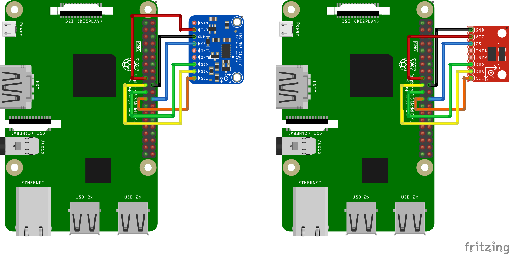
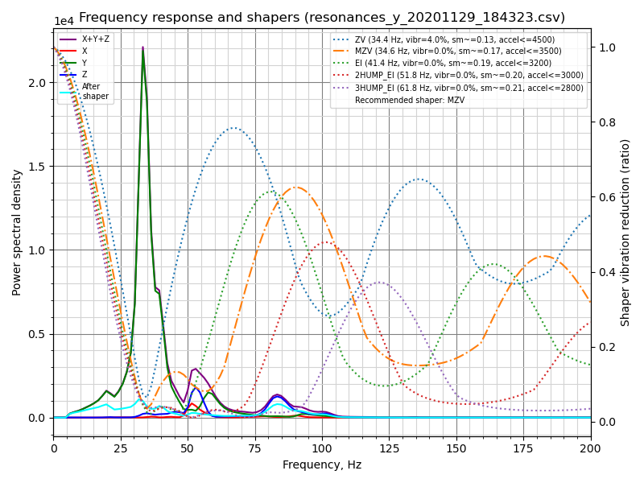

Measuring Resonances
====================

Klipper has built-in support for ADXL345 accelerometer, which can be used to
measure resonance frequencies of the printer for different axes, and auto-tune
[input shapers](Resonance_Compensation.md) to compensate for resonances.
Note that using ADXL345 requires some soldering and crimping. ADXL345 can be
connected to a Raspberry Pi directly, or to an SPI interface of an MCU
board (it needs to be reasonably fast).


Installation instructions
===========================

## Wiring

You need to connect ADXL345 to your Raspberry Pi via SPI. Note that the I2C
connection, which is suggested by ADXL345 documentation, has too low throughput
and **will not work**. The recommended connection scheme:

| ADXL345 pin | RPi pin | RPi pin name |
|:--:|:--:|:--:|
| 3V3 (or VCC) | 01 | 3.3v DC power |
| GND | 06 | Ground |
| CS | 24 | GPIO08 (SPI0_CE0_N) |
| SDO | 21 | GPIO09 (SPI0_MISO) |
| SDA | 19 | GPIO10 (SPI0_MOSI) |
| SCL | 23 | GPIO11 (SPI0_SCLK) |

Fritzing wiring diagrams for some of the ADXL345 boards:




Double-check your wiring before powering up the Raspberry Pi to prevent
damaging it or the accelerometer.

## Mounting the accelerometer

The accelerometer must be attached to the toolhead. One needs to design a proper
mount that fits their own 3D printer. It is better to align the axes of the
accelerometer with the printer's axes (but if it makes it more convenient,
axes can be swapped - i.e. no need to align X axis with X and so forth - it
should be fine even if Z axis of accelerometer is X axis of the printer, etc.).

An example of mounting ADXL345 on the SmartEffector:


Note that on a bed slinger printer one must design 2 mounts: one for the
toolhead and one for the bed, and run the measurements twice.

## Software installation

Note that resonance measurements and shaper auto-calibration require additional
software dependencies not installed by default. You will have to run on your
Raspberry Pi
```
$ ~/klippy-env/bin/pip install -v numpy
```
to install `numpy` package. Note that, depending on the performance of the
CPU, it may take *a lot* of time, up to 10-20 minutes. Be patient and wait
for the completion of the installation. On some occasions, if the board has
too little RAM, the installation may fail and you will need to enable swap.

If installing prerequisites takes too much time or fail for whatever reason,
there is, in principle, another possibility to run a stand-alone script to
automatically tune the input shapers (will be covered later in the guide).

In order to run stand-alone scripts, one must run the following command to
install the required dependencies (either on Raspberry Pi, or on host,
depending on where the scripts will be executed):
```
$ sudo apt install python-numpy python-matplotlib
```

Afterwards, follow the instructions in the
[RPi Microcontroller document](RPi_microcontroller.md) to setup the
"linux mcu" on the Raspberry Pi.

Make sure the Linux SPI driver is enabled by running `sudo
raspi-config` and enabling SPI under the "Interfacing options" menu.

Add the following to the printer.cfg file:
```
[mcu rpi]
serial: /tmp/klipper_host_mcu

[adxl345]
cs_pin: rpi:None

[resonance_tester]
accel_chip: adxl345
probe_points:
    100,100,20  # an example
```
It is advised to start with 1 probe point, in the middle of the print bed,
slightly above it.

Restart Klipper via the `RESTART` command.

Measuring the resonances
===========================

## Checking the setup

Now you can test a connection. In Octoprint, run `ACCELEROMETER_QUERY`. You
should see the current measurements from the accelerometer, including the
free-fall acceleration, e.g.
```
Recv: // adxl345 values (x, y, z): 470.719200, 941.438400, 9728.196800
```

Try running `MEASURE_AXES_NOISE` in Octoprint, you should get some baseline
numbers for the noise of accelerometer on the axes (should be somewhere
in the range of ~1-100). Note that this feature will not be available if
`numpy` package was not installed (see
[Software installation](#software-installation) for more details).

## Measuring the resonances

Now you can run some real-life tests. In `printer.cfg` add or replace the
following values:
```
[printer]
max_accel: 7000
max_accel_to_decel: 7000
```
(after you are done with the measurements, revert these values to their old,
or the newly suggested values). Also, if you have enabled input shaper already,
you will need to disable it prior to this test as follows:
```
SET_INPUT_SHAPER SHAPER_FREQ_X=0 SHAPER_FREQ_Y=0
```
as it is not valid to run the resonance testing with the input shaper enabled.

Run the following command:
```
TEST_RESONANCES AXIS=X
```
Note that it will create vibrations on X axis. If that works, run for Y axis
as well:
```
TEST_RESONANCES AXIS=Y
```
This will generate 2 CSV files (`/tmp/resonances_x_*.csv` and
`/tmp/resonances_y_*.csv`).

Note that the commands above require `numpy` to be installed installed. If you
haven't installed it, you can instead pass `OUTPUT=raw_data` argument to the
above commands (2 files `/tmp/raw_data_x_*.csv` and `/tmp/raw_data_y_*.csv`
will be written). One can then run stand-alone scripts on Raspberry Pi
(specify the correct file name on the command line):
```
$ ~/klipper/scripts/graph_accelerometer.py /tmp/raw_data_x_*.csv -o /tmp/resonances_x.png
$ ~/klipper/scripts/calibrate_shaper.py /tmp/raw_data_x_*.csv -o /tmp/shaper_calibrate_x.png
```
or copy the data to the host and run the scripts there. See
[Offline processing of the accelerometer data](#offline-processing-of-the-accelerometer-data)
section for more details.

**Attention!** Be sure to observe the printer for the first time, to make sure
the vibrations do not become too violent (`M112` command can be used to abort
the test in case of emergency; hopefully it will not come to this though).
If the vibrations do get too strong, you can attempt to specify a lower than the
default value for `accel_per_hz` parameter in `[resonance_tester]` section, e.g.
```
[resonance_tester]
accel_chip: adxl345
accel_per_hz: 50  # default is 75
probe_points: ...
```

Generated CSV files show power spectral density of the vibrations depending on the
frequency. Usually, the charts generated from these CSV files are relatively easy
to read, with the peaks corresponding to the resonance frequencies:


The chart above shows the resonances for X axis at approx. 50 Hz, 56 Hz, 63 Hz,
80 Hz and 104 Hz and one cross-resonance for Y axis at ~ 56 Hz. From this, one
can derive that a good input shaper config in this case could be `2hump_ei` at
around `shaper_freq_y = 45` (Hz):

||
|:--:|
|Input Shaper response to vibrations, lower is better.|

Note that the smaller resonance at 104 Hz requires less of vibration suppression
(if at all).

## Input Shaper auto-calibration

Besides manually choosing the appropriate parameters for the input shaper
feature, it is also possible to run an experimental auto-tuning for the
input shaper.

In order to attempt to measure the resonance frequencies and automatically
determine the best parameters for `[input_shaper]`, run the following command
via Octoprint terminal:
```
SHAPER_CALIBRATE
```

This will test all frequencies in range 5 Hz - 120 Hz and generate
the csv output (`/tmp/calibration_data_*.csv` by default) for the frequency
response and the suggested input shapers. You will also get the suggested
frequencies for each input shaper, as well as which input shaper is recommended
for your setup, on Octoprint console. For example:


```
Fitted shaper 'zv' frequency = 56.7 Hz (vibrations = 23.2%)
Fitted shaper 'mzv' frequency = 52.9 Hz (vibrations = 10.9%)
Fitted shaper 'ei' frequency = 62.0 Hz (vibrations = 8.9%)
Fitted shaper '2hump_ei' frequency = 59.0 Hz (vibrations = 4.9%)
Fitted shaper '3hump_ei' frequency = 65.0 Hz (vibrations = 3.3%)
Recommended shaper_type_y = 2hump_ei, shaper_freq_y = 59.0 Hz
```
If you agree with the suggested parameters, you can execute `SAVE_CONFIG`
now to save them and restart the Klipper.


If your printer is a bed slinger printer, you will need to repeat the
measurements twice: measure the resonances of X axis with the accelerometer
attached to the toolhead and the resonances of Y axis - to the bed (the usual
bed slinger setup). In this case, you can specify the axis you want to run the
test for (by default the test is performed for both axes):
```
SHAPER_CALIBRATE AXIS=Y
```

You can execute `SAVE_CONFIG` twice - after calibrating each axis.

However, you can connect two accelerometers simultaneously, though they must be
connected to different boards (say, to an RPi and printer MCU board), or to two
different physical SPI interfaces on the same board (rarely available).
Then they can be configured in the following manner:
```
[adxl345 adxl345_x]
# Assuming adxl345_x is connected to an RPi
cs_pin: rpi:None

[adxl345 adxl345_y]
# Assuming adxl345_y is connected to a printer MCU board
cs_pin: ...  # Printer board SPI chip select (CS) pin

[resonance_tester]
accel_chip_x: adxl345_x
accel_chip_y: adxl345_y
probe_points: ...
```
then one can simply run `SHAPER_CALIBRATE` without specifying an axis to
calibrate the input shaper for both axes in one go.

After the autocalibration is finished, you will still need to choose the
`max_accel` value that does not create too much smoothing in the printed
parts. Follow [this](Resonance_Compensation.md#selecting-max_accel) part of
the input shaper tuning guide and print the test model.

## Input Shaper re-calibration

`SHAPER_CALIBRATE` command can be also used to re-calibrate the input shaper in
the future, especially if some changes to the printer that can affect its
kinematics are made. One can either re-run the full calibration using
`SHAPER_CALIBRATE` command, or restrict the auto-calibration to a single axis by
supplying `AXIS=` parameter, like
```
SHAPER_CALIBRATE AXIS=X
```

**Warning!** It is not advisable to run the shaper autocalibration very
frequently (e.g. before every print, or every day). In order to determine
resonance frequencies, autocalibration creates intensive vibrations on each of
the axes. Generally, 3D printers are not designed to withstand a prolonged
exposure to vibrations near the resonance frequencies. Doing so may increase
wear of the printer components and reduce their lifespan. There is also an
increased risk of some parts unscrewing or becoming loose. Always check that
all parts of the printer (including the ones that may normally not move) are
securely fixed in place after each auto-tuning.

Also, due to some noise in measurements, it is possible the the tuning results
will be slightly different from one calibration run to another one. Still, it
is not expected that the resulting print quality will be affected too much.
However, it is still advised to double-check the suggested parameters, and
print some test prints before using them to confirm they are good.

## Offline processing of the accelerometer data

It is possible to generate the raw accelerometer data and process it offline
(e.g. on a host machine), for example to find resonances. In order to do so,
run the following command via Octoprint terminal:
```
TEST_RESONANCES AXIS=X OUTPUT=raw_data
```
(specify the desired test axis and the desired template for the raw
accelerometer output, the data will be written into `/tmp` directory).

The raw data can also be obtained by running the command `ACCELEROMETER_MEASURE`
command twice during some normal printer activity - first to start the
measurements, and then to stop them and write the output file. Refer to
[G-Codes](G-Codes.md#adxl345-accelerometer-commands) for more details.

The data can be processed later by the following scripts:
`scripts/graph_accelerometer.py` and `scripts/calibrate_shaper.py`. Both
of them accept one or several raw csv files as the input depending on the
mode. The graph_accelerometer.py script supports several modes of operation:
  * plotting raw accelerometer data (use `-r` parameter), only 1 input is
    supported;
  * plotting a frequency response (no extra parameters required), if multiple
    inputs are specified, the average frequency response is computed;
  * comparison of the frequency response between several inputs (use `-c`
    parameter); you can additionally specify which accelerometer axis to
    consider via `-a x`, `-a y` or `-a z` parameter (if none specified,
    the sum of vibrations for all axes is used);
  * plotting the spectrogram (use `-s` parameter), only 1 input is supported;
    you can additionally specify which accelerometer axis to consider via
    `-a x`, `-a y` or `-a z` parameter (if none specified, the sum of vibrations
    for all axes is used).

For example,
```
$ ~/klipper/scripts/graph_accelerometer.py /tmp/raw_data_x_*.csv -o /tmp/resonances_x.png -c -a z
```
will plot the comparison of several `/tmp/raw_data_x_*.csv` files for Z axis to
`/tmp/resonances_x.png` file.

The shaper_calibrate.py script accepts 1 or several inputs and can run automatic
tuning of the input shaper and suggest the best parameters that work well for
all provided inputs. It prints the suggested parameters to the console, and can
additionally generate the chart if `-o output.png` parameter is provided, or
the CSV file if `-c output.csv` parameter is specified.

Providing several inputs to shaper_calibrate.py script can be useful if running
some advanced tuning of the input shapers, for example:
  * Running `TEST_RESONANCES AXIS=X OUTPUT=raw_data` (and `Y` axis) for a single
    axis twice on a bed slinger printer with the accelerometer attached to the
    toolhead the first time, and the accelerometer attached to the bed the
    second time in order to detect axes cross-resonances and attempt to cancel
    them with input shapers.
  * Running `TEST_RESONANCES AXIS=Y OUTPUT=raw_data` twice on a bed slinger with
    a glass bed and a magnetic surfaces (which is lighter) to find the input
    shaper parameters that work well for any print surface configuration.
  * Combining the resonance data from multiple test points.
  * Combining the resonance data from 2 axis (e.g. on a bed slinger printer
    to configure X-axis input_shaper from both X and Y axes resonances to
    cancel vibrations of the *bed* in case the nozzle 'catches' a print when
    moving in X axis direction).
