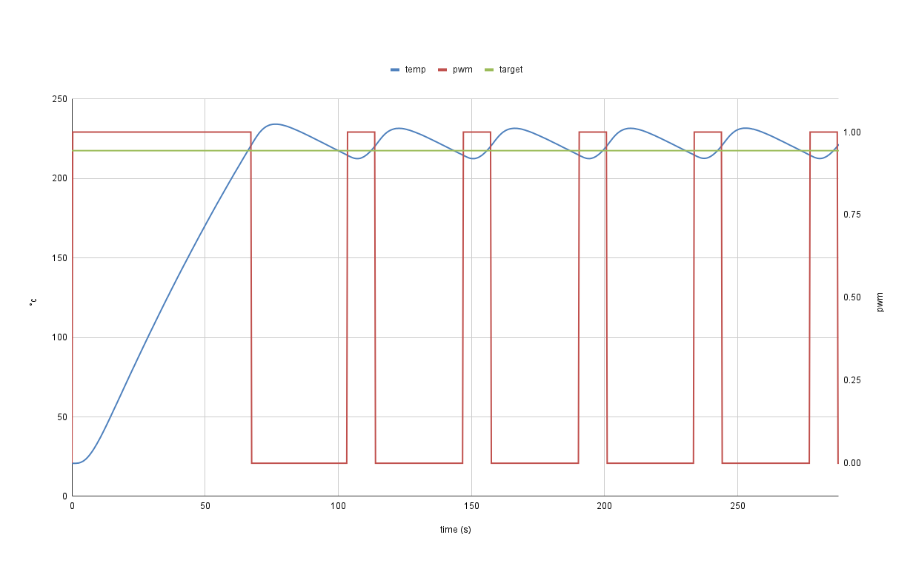
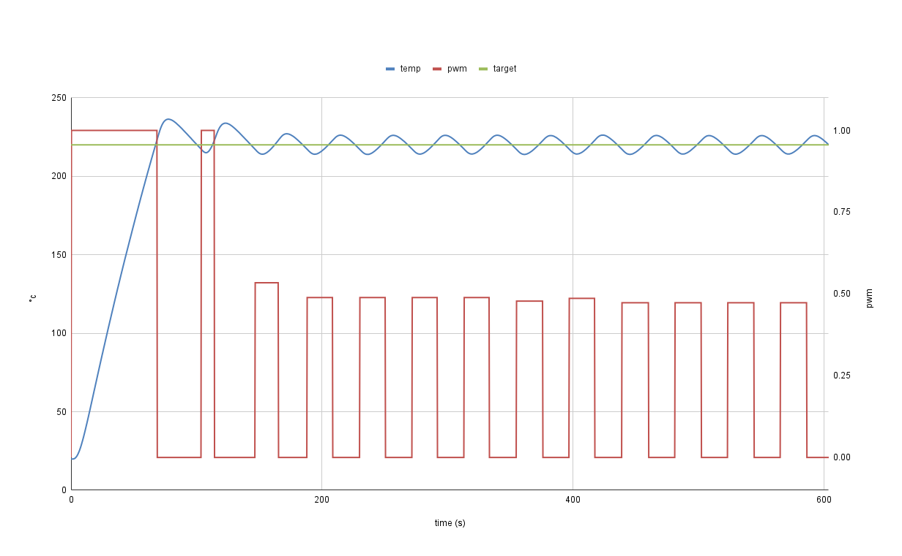
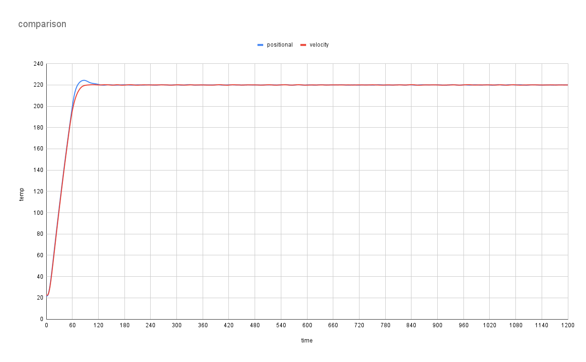
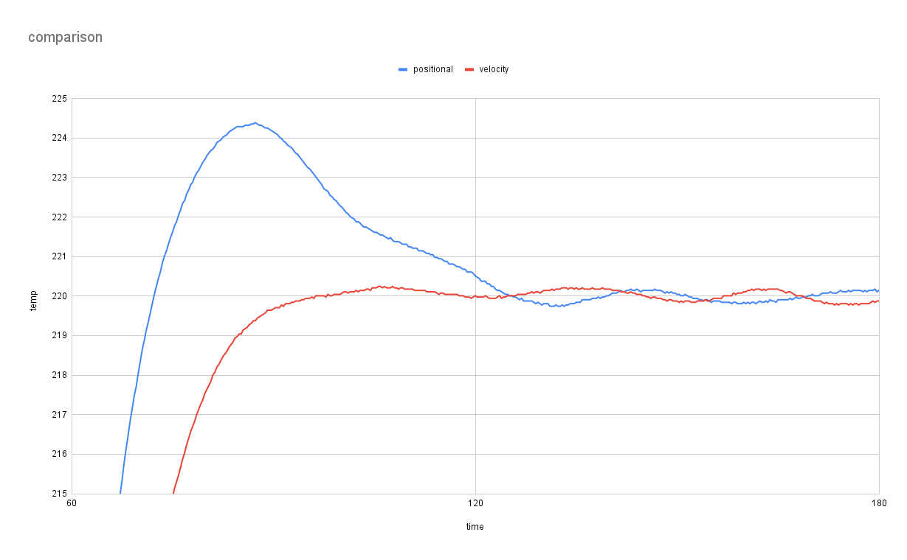

# PID

PID control is a widely used control method in the 3D printing world. It's
ubiquitous when it comes to temperature control, be it with heaters to generate
heat or fans to remove it. The goal of this document is to provide a high-level
overview of what PID is and how to best utilize it in Klipper. PID History

## History

The first rudimentary PID controller was developed by Elmer Sperry in 1911 to
automate the control of a ship's rudder. Engineer Nicolas Minorsky published the
first mathematical analysis of a PID controller in 1922. In 1942, John Ziegler &
Nathaniel Nichols published their seminal paper, "Optimum Settings for Automatic
Controllers," which described a trial-and-error method for tuning a PID
controller, now commonly referred to as the "Ziegler-Nichols method.

In 1984, Karl Astrom and Tore Hagglund published their paper "Automatic Tuning
of Simple Regulators with Specifications on Phase and Amplitude Margins". In the
paper they introduced an automatic tuning method commonly referred to as the
"Astrom-Hagglund method" or the "relay method".

In 2019, Brandon Taysom & Carl Sorensen published their paper "Adaptive Relay
Autotuning under Static and Non-static Disturbances with Application to Friction
Stir Welding", which introduced a method to produce more accurate results from a
relay test. This is the PID calibration method currently used by Klipper.

## PID Calibration

As mentioned earlier, Klipper uses a relay test for calibration purposes. A
standard relay test is conceptually simple. You turn the power to the heater on
and off to make it oscillate around the target temperature, as shown in the
following diagram.



The above graph illustrates a common problem with a standard relay test. If the
system being calibrated has too much or too little power for the selected target
temperature, it will produce biased and asymmetrical results. As the plot above
shows, the system spends more time with the power off and has a greater
amplitude above the target temperature than below it.

In an ideal system, both the on and off time and the amplitude above and below
the target temperature would be equal. 3D printers don't actively cool the hot
end or bed, so they can never achieve the ideal.

The following graph is a relay test using the methodology outlined by Taysom &
Sorensen. After each iteration, the data is analyzed and a new maximum power
setting is calculated. As you can see from the plot, the system starts the test
asymmetrically, but ends it very symmetrically.



A topic that isn't often discussed in the 3D printer community is the conditions
under which calibration should be performed. When performing a calibration test,
external variables should be minimized as much as possible, since the goal of
the test is to model the system in steady state conditions, free of external
disturbances. For example, if you are calibrating a hot end, you do not want a
bed or chamber heater actively heating or cooling. You want them to turn off or
stay at their target temperature. Component cooling and chamber fans can also be
problematic because they can cause temperature fluctuations in the hot end.

## Pid Control Parameters

Many methods exist for calculating control parameters, such as Ziegler-Nichols,
Cohen-Coon, Kappa-Tau, Lambda, and many more. By default, classical
Ziegler-Nichols parameters are generated. If A user wants to experiment with
other flavors of Ziegler-Nichols, or Cohen-Coon parameters, they can extract the
constants from the log as seen below and feed them into this
[spreadsheet](resources/pid_params.xls).

```text
Ziegler-Nichols constants: Ku=0.103092 Tu=41.800000
Cohen-Coon constants: Km=-17.734845 Theta=6.600000 Tau=-10.182680
```

Classic Ziegler-Nichols parameters work in all scenarios. Cohen-Coon parameters
work better with systems that have a large amount of dead time/delay. For
example, if a printer has a large thermal mass bed that takes a long time to
heat up and stabilize, Cohen-Coon parameters will generally do a better job of
controlling it.

## Pid Control Algorithms

Klipper currently supports two control algorithms: Positional and Velocity
control. The fundamental difference between the two algorithms is as follows.
The positional algorithm calculates what the PWM value should be for the current
time interval. The velocity algorithm calculates how much the previous PWM
setting should be changed by, to get the PWM value for the current time
interval.

Positional is the default algorithm, as it will work in every scenario. The
Velocity algorithm can provide superior results to the Positional algorithm, but
requires lower noise sensor readings, or a larger smoothing time setting.

The most noticeable difference between the 2 algorithms is that given the same
configuration parameters velocity control will eliminate or drastically reduce
overshoot as seen in the plots below, because it is not susceptible to integral
wind-up.





In some scenarios Velocity control will also be better at holding the heater at
its target temperature, and rejecting disturbances. The primary reason for this
is that velocity control is more like a standard second order differential
equation. It takes into account position, velocity, and acceleration.
