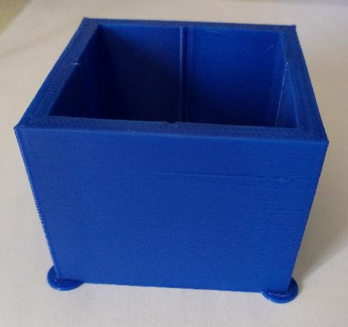

This document provides information on tuning the "pressure advance"
configuration variable for a particular nozzle and filament. The
pressure advance feature can be helpful in reducing ooze. For more
information on how pressure advance is implemented see the
[kinematics](Kinematics.md) document.

Tuning pressure advance
=======================

Pressure advance does two useful things - it reduces ooze during
non-extrude moves and it reduces blobbing during cornering. This guide
uses the second feature (reducing blobbing during cornering) as a
mechanism for tuning.

In order to calibrate pressure advance the printer must be configured
and operational as the tuning test involves printing and inspecting a
test object. It is a good idea to read this document in full prior to
running the test.

Use a slicer to generate g-code for the large hollow square found in
[docs/prints/square_tower.stl](prints/square_tower.stl). Use a high
speed (eg, 100mm/s), zero infill, and a coarse layer height (the layer
height should be around 75% of the nozzle diameter). Make sure any
"dynamic acceleration control" is disabled in the slicer.

Prepare for the test by issuing the following G-Code command:
```
SET_VELOCITY_LIMIT SQUARE_CORNER_VELOCITY=1 ACCEL=500
```
This command makes the nozzle travel slower through corners to
emphasize the effects of extruder pressure. Then for printers with a
direct drive extruder run the command:
```
TUNING_TOWER COMMAND=SET_PRESSURE_ADVANCE PARAMETER=ADVANCE START=0 FACTOR=.005
```
For long bowden extruders use:
```
TUNING_TOWER COMMAND=SET_PRESSURE_ADVANCE PARAMETER=ADVANCE START=0 FACTOR=.020
```
Then print the object. When fully printed the test print looks like:



The above TUNING_TOWER command instructs Klipper to alter the
pressure_advance setting on each layer of the print. Higher layers in
the print will have a larger pressure advance value set. Layers below
the ideal pressure_advance setting will have blobbing at the corners,
and layers above the ideal setting can lead to rounded corners and
poor extrusion leading up to the corner.

One can cancel the print early if one observes that the corners are no
longer printing well (and thus one can avoid printing layers that are
known to be above the ideal pressure_advance value).

Inspect the print and then use a digital calipers to find the height
that has the best quality corners. When in doubt, prefer a lower
height.


The pressure_advance value can then be calculated as `pressure_advance
= <start> + <measured_height> * <factor>`. (For example, `0 + 12.90 *
.020` would be `.258`.)

It is possible to choose custom settings for START and FACTOR if that
helps identify the best pressure advance setting. When doing this, be
sure to issue the TUNING_TOWER command at the start of each test
print.

Typical pressure advance values are between 0.050 and 1.000 (the high
end usually only with bowden extruders). If there is no significant
improvement with a pressure advance up to 1.000, then pressure advance
is unlikely to improve the quality of prints. Return to a default
configuration with pressure advance disabled.

Although this tuning exercise directly improves the quality of
corners, it's worth remembering that a good pressure advance
configuration also reduces ooze throughout the print.

At the completion of this test, set
`pressure_advance = <calculated_value>` in the `[extruder]` section of
the configuration file and issue a RESTART command. The RESTART
command will clear the test state and return the acceleration and
cornering speeds to their normal values.

Important Notes
===============

* The pressure advance value is dependent on the extruder, the nozzle,
  and the filament. It is common for filament from different
  manufactures or with different pigments to require significantly
  different pressure advance values. Therefore, one should calibrate
  pressure advance on each printer and with each spool of filament.

* Printing temperature and extrusion rates can impact pressure
  advance. Be sure to tune the
  [extruder rotation_distance](Rotation_Distance.md#calibrating-rotation_distance-on-extruders)
  and
  [nozzle temperature](http://reprap.org/wiki/Triffid_Hunter%27s_Calibration_Guide#Nozzle_Temperature)
  prior to tuning pressure advance.

* The test print is designed to run with a high extruder flow rate,
  but otherwise "normal" slicer settings. A high flow rate is obtained
  by using a high printing speed (eg, 100mm/s) and a coarse layer
  height (typically around 75% of the nozzle diameter). Other slicer
  settings should be similar to their defaults (eg, perimeters of 2 or
  3 lines, normal retraction amount). It can be useful to set the
  external perimeter speed to be the same speed as the rest of the
  print, but it is not a requirement.

* It is common for the test print to show different behavior on each
  corner. Often the slicer will arrange to change layers at one corner
  which can result in that corner being significantly different from
  the remaining three corners. If this occurs, then ignore that corner
  and tune pressure advance using the other three corners. It is also
  common for the remaining corners to vary slightly. (This can occur
  due to small differences in how the printer's frame reacts to
  cornering in certain directions.) Try to choose a value that works
  well for all the remaining corners. If in doubt, prefer a lower
  pressure advance value.

* If a high pressure advance value (eg, over 0.200) is used then one
  may find that the extruder skips when returning to the printer's
  normal acceleration. The pressure advance system accounts for
  pressure by pushing in extra filament during acceleration and
  retracting that filament during deceleration. With a high
  acceleration and high pressure advance the extruder may not have
  enough torque to push the required filament. If this occurs, either
  use a lower acceleration value or disable pressure advance.

* Once pressure advance is tuned in Klipper, it may still be useful to
  configure a small retract value in the slicer (eg, 0.75mm) and to
  utilize the slicer's "wipe on retract option" if available. These
  slicer settings may help counteract ooze caused by filament cohesion
  (filament pulled out of the nozzle due to the stickiness of the
  plastic). It is recommended to disable the slicer's "z-lift on
  retract" option.

* The pressure advance system does not change the timing or path of
  the toolhead. A print with pressure advance enabled will take the
  same amount of time as a print without pressure advance. Pressure
  advance also does not change the total amount of filament extruded
  during a print. Pressure advance results in extra extruder movement
  during move acceleration and deceleration. A very high pressure
  advance setting will result in a very large amount of extruder
  movement during acceleration and deceleration, and no configuration
  setting places a limit on the amount of that movement.
