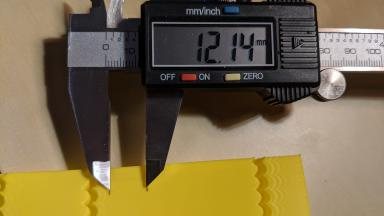

# Resonance Compensation

Klipper supports Input Shaping - a technique that can be used to reduce ringing
(also known as echoing, ghosting or rippling) in prints. Ringing is a surface
printing defect when, typically, elements like edges repeat themselves on a
printed surface as a subtle 'echo':

|||

Ringing is caused by mechanical vibrations in the printer due to quick changes
of the printing direction. Note that ringing usually has mechanical origins:
insufficiently rigid printer frame, non-tight or too springy belts, alignment
issues of mechanical parts, heavy moving mass, etc. Those should be checked
and fixed first, if possible.


[Input shaping](https://en.wikipedia.org/wiki/Input_shaping) is an open-loop
control technique which creates a commanding signal that cancels its
own vibrations. Input shaping requires some tuning and measurements before it
can be enabled. Besides ringing, Input Shaping typically reduces the vibrations
and shaking of the printer in general, and may also improve the reliability
of the stealthChop mode of Trinamic stepper drivers.

## Tuning

Basic tuning requires measuring the ringing frequencies of the printer
by printing a test model.

Slice the ringing test model, which can be found in
[docs/prints/ringing_tower.stl](prints/ringing_tower.stl), in the slicer:

* Suggested layer height is 0.2 or 0.25 mm.
* Infill and top layers can be set to 0.
* Use 1-2 perimeters, or even better the smooth vase mode with 1-2 mm base.
* Use sufficiently high speed, around 80-100 mm/sec, for **external** perimeters.
* Make sure that the minimum layer time is **at most** 3 seconds.
* Make sure any "dynamic acceleration control" is disabled in the slicer.
* Do not turn the model. The model has X and Y marks at the back of the model.
 Note the unusual location of the marks vs. the axes of the printer - it is
 not a mistake. The marks can be used later in the tuning process as a
 reference, because they show which axis the measurements correspond to.

### Ringing frequency

First, measure the **ringing frequency**.

1. If `square_corner_velocity` parameter was changed, revert it back
   to 5.0. It is not advised to increase it when using input shaper
   because it can cause more smoothing in parts - it is better to use
   higher acceleration value instead.
2. Increase `max_accel_to_decel` by issuing the following command:
   `SET_VELOCITY_LIMIT ACCEL_TO_DECEL=7000`
3. Disable Pressure Advance: `SET_PRESSURE_ADVANCE ADVANCE=0`
4. If you have already added `[input_shaper]` section to the printer.cfg,
   execute `SET_INPUT_SHAPER SHAPER_FREQ_X=0 SHAPER_FREQ_Y=0` command. If you
   get "Unknown command" error, you can safely ignore it at this point and
   continue with the measurements.
5. Execute the command:
   `TUNING_TOWER COMMAND=SET_VELOCITY_LIMIT PARAMETER=ACCEL START=1500 STEP_DELTA=500 STEP_HEIGHT=5`
   Basically, we try to make ringing more pronounced by setting different large
   values for acceleration. This command will increase the acceleration every
   5 mm starting from 1500 mm/sec^2: 1500 mm/sec^2, 2000 mm/sec^2, 2500 mm/sec^2
   and so forth up until 7000 mm/sec^2 at the last band.
6. Print the test model sliced with the suggested parameters.
7. You can stop the print earlier if the ringing is clearly visible and you see
   that acceleration gets too high for your printer (e.g. printer shakes too
   much or starts skipping steps).
8. Use X and Y marks at the back of the model for reference. The measurements
   from the side with X mark should be used for X axis *configuration*, and
   Y mark - for Y axis configuration. Measure the distance *D* (in mm) between
   several oscillations on the part with X mark, near the notches, preferably
   skipping the first oscillation or two. To measure the distance between
   oscillations more easily, mark the oscillations first, then measure the
   distance between the marks with a ruler or calipers:

    |||

9. Count how many oscillations *N* the measured distance *D* corresponds to.
   If you are unsure how to count the oscillations, refer to the picture
   above, which shows *N* = 6 oscillations.
10. Compute the ringing frequency of X axis as *V* &middot; *N* / *D* (Hz),
    where *V* is the velocity for outer perimeters (mm/sec). For the example
    above, we marked 6 oscillations, and the test was printed at 100 mm/sec
    velocity, so the frequency is 100 * 6 / 12.14 ≈ 49.4 Hz.
11. Do (8) - (10) for Y mark as well.

Note that ringing on the test print should follow the pattern of the curved
notches, as in the picture above. If it doesn't, then this defect is not really
a ringing and has a different origin - either mechanical, or an extruder issue.
It should be fixed first before enabling and tuning input shapers.

If the measurements are not reliable because, say, the distance
between the oscillations is not stable, it might mean that the printer has
several resonance frequencies on the same axis. One may try to follow the
tuning process described in
[Unreliable measurements of ringing frequencies](#unreliable-measurements-of-ringing-frequencies)
section instead and still get something out of the input shaping technique.

Ringing frequency can depend on the position of the model within the buildplate
and Z height, *especially on delta printers*; you can check if you see the
differences in frequencies at different positions along the sides of the test
model and at different heights. You can calculate the average ringing
frequencies over X and Y axes if that is the case.

If the measured ringing frequency is very low (below approx 20-25 Hz), it might
be a good idea to invest into stiffening the printer or decreasing the moving
mass - depending on what is applicable in your case - before proceeding with
further input shaping tuning, and re-measuring the frequencies afterwards. For
many popular printer models there are often some solutions available already.

Note that the ringing frequencies can change if the changes are made to the
printer that affect the moving mass or change the stiffness of the system,
for example:

* Some tools are installed, removed or replaced on the toolhead that change
 its mass, e.g. a new (heavier or lighter) stepper motor for direct extruder
 or a new hotend is installed, heavy fan with a duct is added, etc.
* Belts are tightened.
* Some addons to increase frame rigidity are installed.
* Different bed is installed on a bed-slinger printer, or glass added, etc.

If such changes are made, it is a good idea to at least measure the ringing
frequencies to see if they have changed.

### Input shaper configuration

After the ringing frequencies for X and Y axes are measured, you can add the
following section to your `printer.cfg`:
```
[input_shaper]
shaper_freq_x: ...  # frequency for the X mark of the test model
shaper_freq_y: ...  # frequency for the Y mark of the test model
```

For the example above, we get shaper_freq_x/y = 49.4.

### Choosing input shaper

Klipper supports several input shapers. They differ in their sensitivity to
errors determining the resonance frequency and how much smoothing they cause
in the printed parts. Also, some of the shapers like 2HUMP_EI and 3HUMP_EI
should usually not be used with shaper_freq = resonance frequency - they are
configured from different considerations to reduce several resonances at once.

For most of the printers, either MZV or EI shapers can be recommended. This
section describes a testing process to choose between them, and figure out
a few other related parameters.

Print the ringing test model as follows:

1. Restart the firmware: `RESTART`
2. Prepare for test: `SET_VELOCITY_LIMIT ACCEL_TO_DECEL=7000`
3. Disable Pressure Advance: `SET_PRESSURE_ADVANCE ADVANCE=0`
4. Execute: `SET_INPUT_SHAPER SHAPER_TYPE=MZV`
5. Execute the command:
   `TUNING_TOWER COMMAND=SET_VELOCITY_LIMIT PARAMETER=ACCEL START=1500 STEP_DELTA=500 STEP_HEIGHT=5`
6. Print the test model sliced with the suggested parameters.

If you see no ringing at this point, then MZV shaper can be recommended for use.

If you do see some ringing, re-measure the frequencies using steps (8)-(10)
described in [Ringing frequency](#ringing-frequency) section. If the frequencies
differ significantly from the values you obtained earlier, a more complex input
shaper configuration is needed. You can refer to Technical details of
[Input shapers](#input-shapers) section. Otherwise, proceed to the next step.

Now try EI input shaper. To try it, repeat steps (1)-(6) from above, but
executing at step 4 the following command instead:
`SET_INPUT_SHAPER SHAPER_TYPE=EI`.

Compare two prints with MZV and EI input shaper. If EI shows noticeably better
results than MZV, use EI shaper, otherwise prefer MZV. Note that EI shaper will
cause more smoothing in printed parts (see the next section for further
details). Add `shaper_type: mzv` (or ei) parameter to [input_shaper] section,
e.g.:
```
[input_shaper]
shaper_freq_x: ...
shaper_freq_y: ...
shaper_type: mzv
```

A few notes on shaper selection:

* EI shaper may be more suited for bed slinger printers (if the resonance
 frequency and resulting smoothing allows): as more filament is deposited
 on the moving bed, the mass of the bed increases and the resonance frequency
 will decrease. Since EI shaper is more robust to resonance frequency
 changes, it may work better when printing large parts.
* Due to the nature of delta kinematics, resonance frequencies can differ a
 lot in different parts of the build volume. Therefore, EI shaper can be a
 better fit for delta printers rather than MZV or ZV, and should be
 considered for the use. If the resonance frequency is sufficiently large
 (more than 50-60 Hz), then one can even attempt to test 2HUMP_EI shaper
 (by running the suggested test above with
 `SET_INPUT_SHAPER SHAPER_TYPE=2HUMP_EI`), but check the considerations in
 the [section below](#selecting-max_accel) before enabling it.

### Selecting max_accel

You should have a printed test for the shaper you chose from the previous step
(if you don't, print the test model sliced with the
[suggested parameters](#tuning) with the pressure advance disabled
`SET_PRESSURE_ADVANCE ADVANCE=0` and with the tuning tower enabled as
`TUNING_TOWER COMMAND=SET_VELOCITY_LIMIT PARAMETER=ACCEL START=1500 STEP_DELTA=500 STEP_HEIGHT=5`).
Note that at very high accelerations, depending on the resonance frequency and
the input shaper you chose (e.g. EI shaper creates more smoothing than MZV),
input shaping may cause too much smoothing and rounding of the parts. So,
max_accel should be chosen such as to prevent that. Another parameter that can
impact smoothing is `square_corner_velocity`, so it is not advisable to increase
it above the default 5 mm/sec to prevent increased smoothing.

In order to select a suitable max_accel value, inspect the model for the chosen
input shaper. First, take a note at which acceleration ringing is still small -
that you are comfortable with it.

Next, check the smoothing. To help with that, the test model has a small gap
in the wall (0.15 mm):


As the acceleration increases, so does the smoothing, and the actual gap in
the print widens:


In this picture, the acceleration increases left to right, and the gap starts
to grow starting from 3500 mm/sec^2 (5-th band from the left). So the good
value for max_accel = 3000 (mm/sec^2) in this case to avoid the excessive
smoothing.

Note the acceleration when the gap is still very small in your test print.
If you see bulges, but no gap in the wall at all, even at high accelerations,
it may be due to disabled Pressure Advance, especially on Bowden extruders.
If that is the case, you may need to repeat the print with the PA enabled.
It may also be a result of a miscalibrated (too high) filament flow, so it is
a good idea to check that too.

Choose the minimum out of the two acceleration values (from ringing and
smoothing), and put it as `max_accel` into printer.cfg.


As a note, it may happen - especially at low ringing frequencies - that EI
shaper will cause too much smoothing even at lower accelerations. In this case,
MZV may be a better choice, because it may allow higher acceleration values.

At very low ringing frequencies (~25 Hz and below) even MZV shaper may create
too much smoothing. If that is the case, you can also try to repeat the
steps in [Choosing input shaper](#choosing-input-shaper) section with ZV shaper,
by using `SET_INPUT_SHAPER SHAPER_TYPE=ZV` command instead. ZV shaper should
show even less smoothing than MZV, but is more sensitive to errors in measuring
the ringing frequencies.

Another consideration is that if a resonance frequency is too low (below 20-25
Hz), it might be a good idea to increase the printer stiffness or reduce the
moving mass. Otherwise, acceleration and printing speed may be limited due too
much smoothing now instead of ringing.


### Fine-tuning resonance frequencies

Note that the precision of the resonance frequencies measurements using the
ringing test model is sufficient for most purposes, so further tuning is not
advised. If you still want to try to double-check your results (e.g. if you
still see some ringing after printing a test model with an input shaper of
your choice with the same frequencies as you have measured earlier), you can
follow the steps in this section. Note that if you see ringing at different
frequencies after enabling [input_shaper], this section will not help with that.

Assuming that you have sliced the ringing model with suggested
parameters, complete the following steps for each of the axes X and Y:

1. Prepare for test: `SET_VELOCITY_LIMIT ACCEL_TO_DECEL=7000`
2. Make sure Pressure Advance is disabled: `SET_PRESSURE_ADVANCE ADVANCE=0`
3. Execute: `SET_INPUT_SHAPER SHAPER_TYPE=ZV`
4. From the existing ringing test model with your chosen input shaper select
   the acceleration that shows ringing sufficiently well, and set it with:
   `SET_VELOCITY_LIMIT ACCEL=...`
5. Calculate the necessary parameters for the `TUNING_TOWER` command to tune
   `shaper_freq_x` parameter as follows: start = shaper_freq_x * 83 / 132 and
   factor = shaper_freq_x / 66, where `shaper_freq_x` here is the current value
   in `printer.cfg`.
6. Execute the command:
   `TUNING_TOWER COMMAND=SET_INPUT_SHAPER PARAMETER=SHAPER_FREQ_X START=start FACTOR=factor BAND=5`
   using `start` and `factor` values calculated at step (5).
7. Print the test model.
8. Reset the original frequency value:
   `SET_INPUT_SHAPER SHAPER_FREQ_X=...`.
9. Find the band which shows ringing the least and count its number from the
   bottom starting at 1.
10. Calculate the new shaper_freq_x value via old
    shaper_freq_x * (39 + 5 * #band-number) / 66.

Repeat these steps for the Y axis in the same manner, replacing references to X
axis with the axis Y (e.g. replace `shaper_freq_x` with `shaper_freq_y` in
the formulae and in the `TUNING_TOWER` command).

As an example, let's assume you have had measured the ringing frequency for one
of the axis equal to 45 Hz. This gives start = 45 * 83 / 132 = 28.30
and factor = 45 / 66 = 0.6818 values for `TUNING_TOWER` command.
Now let's assume that after printing the test model, the fourth band from the
bottom gives the least ringing. This gives the updated shaper_freq_? value
equal to 45 * (39 + 5 * 4) / 66 ≈ 40.23.

After both new `shaper_freq_x` and `shaper_freq_y` parameters have been
calculated, you can update `[input_shaper]` section in `printer.cfg` with the
new `shaper_freq_x` and `shaper_freq_y` values.

### Pressure Advance

If you use Pressure Advance, it may need to be re-tuned. Follow the
[instructions](Pressure_Advance.md#tuning-pressure-advance) to find
the new value, if it differs from the previous one. Make sure to
restart Klipper before tuning Pressure Advance.

### Unreliable measurements of ringing frequencies

If you are unable to measure the ringing frequencies, e.g. if the distance
between the oscillations is not stable, you may still be able to take advantage
of input shaping techniques, but the results may not be as good as with proper
measurements of the frequencies, and will require a bit more tuning and printing
the test model. Note that another possibility is to purchase and install an
accelerometer and measure the resonances with it (refer to the
[docs](Measuring_Resonances.md) describing the required hardware and the setup
process) - but this option requires some crimping and soldering.


For tuning, add empty `[input_shaper]` section to your
`printer.cfg`. Then, assuming that you have sliced the ringing model
with suggested parameters, print the test model 3 times as
follows. First time, prior to printing, run

1. `RESTART`
2. `SET_VELOCITY_LIMIT ACCEL_TO_DECEL=7000`
3. `SET_PRESSURE_ADVANCE ADVANCE=0`
4. `SET_INPUT_SHAPER SHAPER_TYPE=2HUMP_EI SHAPER_FREQ_X=60 SHAPER_FREQ_Y=60`
5. `TUNING_TOWER COMMAND=SET_VELOCITY_LIMIT PARAMETER=ACCEL START=1500 STEP_DELTA=500 STEP_HEIGHT=5`

and print the model. Then print the model again, but before printing run instead

1. `SET_INPUT_SHAPER SHAPER_TYPE=2HUMP_EI SHAPER_FREQ_X=50 SHAPER_FREQ_Y=50`
2. `TUNING_TOWER COMMAND=SET_VELOCITY_LIMIT PARAMETER=ACCEL START=1500 STEP_DELTA=500 STEP_HEIGHT=5`

Then print the model for the 3rd time, but now run

1. `SET_INPUT_SHAPER SHAPER_TYPE=2HUMP_EI SHAPER_FREQ_X=40 SHAPER_FREQ_Y=40`
2. `TUNING_TOWER COMMAND=SET_VELOCITY_LIMIT PARAMETER=ACCEL START=1500 STEP_DELTA=500 STEP_HEIGHT=5`

Essentially, we are printing the ringing test model with TUNING_TOWER using
2HUMP_EI shaper with shaper_freq = 60 Hz, 50 Hz, and 40 Hz.

If none of the models demonstrate improvements in ringing, then, unfortunately,
it does not look like the input shaping techniques can help with your case.

Otherwise, it may be that all models show no ringing, or some show the ringing
and some - not so much. Choose the test model with the highest frequency that
still shows good improvements in ringing. For example, if 40 Hz and 50 Hz models
show almost no ringing, and 60 Hz model already shows some more ringing, stick
with 50 Hz.

Now check if EI shaper would be good enough in your case. Choose EI shaper
frequency based on the frequency of 2HUMP_EI shaper you chose:

* For 2HUMP_EI 60 Hz shaper, use EI shaper with shaper_freq = 50 Hz.
* For 2HUMP_EI 50 Hz shaper, use EI shaper with shaper_freq = 40 Hz.
* For 2HUMP_EI 40 Hz shaper, use EI shaper with shaper_freq = 33 Hz.

Now print the test model one more time, running

1. `SET_INPUT_SHAPER SHAPER_TYPE=EI SHAPER_FREQ_X=... SHAPER_FREQ_Y=...`
2. `TUNING_TOWER COMMAND=SET_VELOCITY_LIMIT PARAMETER=ACCEL START=1500 STEP_DELTA=500 STEP_HEIGHT=5`

providing the shaper_freq_x=... and shaper_freq_y=... as determined previously.

If EI shaper shows very comparable good results as 2HUMP_EI shaper, stick with
EI shaper and the frequency determined earlier, otherwise use 2HUMP_EI shaper
with the corresponding frequency. Add the results to `printer.cfg` as, e.g.
```
[input_shaper]
shaper_freq_x: 50
shaper_freq_y: 50
shaper_type: 2hump_ei
```

Continue the tuning with [Selecting max_accel](#selecting-max_accel) section.


## Troubleshooting and FAQ

### I cannot get reliable measurements of resonance frequencies

First, make sure it is not some other problem with the printer instead of
ringing. If the measurements are not reliable because, say, the distance
between the oscillations is not stable, it might mean that the printer has
several resonance frequencies on the same axis. One may try to follow the
tuning process described in
[Unreliable measurements of ringing frequencies](#unreliable-measurements-of-ringing-frequencies)
section and still get something out of the input shaping technique. Another
possibility is to install an accelerometer, [measure](Measuring_Resonances.md)
the resonances with it, and auto-tune the input shaper using the results of
those measurements.

### After enabling [input_shaper], I get too smoothed printed parts and fine details are lost

Check the considerations in [Selecting max_accel](#selecting-max_accel) section.
If the resonance frequency is low, one should not set too high max_accel or
increase square_corner_velocity parameters. It might also be better to choose
MZV or even ZV input shapers over EI (or 2HUMP_EI and 3HUMP_EI shapers).


### After successfully printing for some time without ringing, it appears to come back

It is possible that after some time the resonance frequencies have changed.
E.g. maybe the belts tension has changed (belts got more loose), etc. It is a
good idea to check and re-measure the ringing frequencies as described in
[Ringing frequency](#ringing-frequency) section and update your config file
if necessary.

### Is dual carriage setup supported with input shapers?

There is no dedicated support for dual carriages with input shapers, but it does
not mean this setup will not work. One should run the tuning twice for each
of the carriages, and calculate the ringing frequencies for X and Y axes for
each of the carriages independently. Then put the values for carriage 0 into
[input_shaper] section, and change the values on the fly when changing
carriages, e.g. as a part of some macro:
```
SET_DUAL_CARRIAGE CARRIAGE=1
SET_INPUT_SHAPER SHAPER_FREQ_X=... SHAPER_FREQ_Y=...
```

And similarly when switching back to carriage 0.

### Does input_shaper affect print time?

No, `input_shaper` feature has pretty much no impact on the print times by
itself. However, the value of `max_accel` certainly does (tuning of this
parameter described in [this section](#selecting-max_accel)).

## Technical details

### Input shapers

Input shapers used in Klipper are rather standard, and one can find more
in-depth overview in the articles describing the corresponding shapers.
This section contains a brief overview of some technical aspects of the
supported input shapers. The table below shows some (usually approximate)
parameters of each shaper.

| Input <br> shaper | Shaper <br> duration | Vibration reduction 20x <br> (5% vibration tolerance) | Vibration reduction 10x <br> (10% vibration tolerance) |
|:--:|:--:|:--:|:--:|
| ZV | 0.5 / shaper_freq | N/A | ± 5% shaper_freq |
| MZV | 0.75 / shaper_freq | ± 4% shaper_freq | -10%...+15% shaper_freq |
| ZVD | 1 / shaper_freq | ± 15% shaper_freq | ± 22% shaper_freq |
| EI | 1 / shaper_freq | ± 20% shaper_freq | ± 25% shaper_freq |
| 2HUMP_EI | 1.5 / shaper_freq | ± 35% shaper_freq | ± 40 shaper_freq |
| 3HUMP_EI | 2 / shaper_freq | -45...+50% shaper_freq | -50%...+55% shaper_freq |

A note on vibration reduction: the values in the table above are approximate.
If the damping ratio of the printer is known for each axis, the shaper can be
configured more precisely and it will then reduce the resonances in a bit wider
range of frequencies. However, the damping ratio is usually unknown and is hard
to estimate without a special equipment, so Klipper uses 0.1 value by default,
which is a good all-round value. The frequency ranges in the table cover a
number of different possible damping ratios around that value (approx. from 0.05
to 0.2).

Also note that EI, 2HUMP_EI, and 3HUMP_EI are tuned to reduce vibrations to 5%,
so the values for 10% vibration tolerance are provided only for the reference.

**How to use this table:**

* Shaper duration affects the smoothing in parts - the larger it is, the more
 smooth the parts are. This dependency is not linear, but can give a sense of
 which shapers 'smooth' more for the same frequency. The ordering by
 smoothing is like this: ZV < MZV < ZVD ≈ EI < 2HUMP_EI < 3HUMP_EI. Also,
 it is rarely practical to set shaper_freq = resonance freq for shapers
 2HUMP_EI and 3HUMP_EI (they should be used to reduce vibrations for several
 frequencies).
* One can estimate a range of frequencies in which the shaper reduces
 vibrations. For example, MZV with shaper_freq = 35 Hz reduces vibrations
 to 5% for frequencies [33.6, 36.4] Hz. 3HUMP_EI with shaper_freq = 50 Hz
 reduces vibrations to 5% in range [27.5, 75] Hz.
* One can use this table to check which shaper they should be using if they
 need to reduce vibrations at several frequencies. For example, if one has
 resonances at 35 Hz and 60 Hz on the same axis: a) EI shaper needs to have
 shaper_freq = 35 / (1 - 0.2) = 43.75 Hz, and it will reduce resonances
 until 43.75 * (1 + 0.2) = 52.5 Hz, so it is not sufficient; b) 2HUMP_EI
 shaper needs to have shaper_freq = 35 / (1 - 0.35) = 53.85 Hz and will
 reduce vibrations until 53.85 * (1 + 0.35) = 72.7 Hz - so this is an
 acceptable configuration. Always try to use as high shaper_freq as possible
 for a given shaper (perhaps with some safety margin, so in this example
 shaper_freq ≈ 50-52 Hz would work best), and try to use a shaper with as
 small shaper duration as possible.
* If one needs to reduce vibrations at several very different frequencies
 (say, 30 Hz and 100 Hz), they may see that the table above does not provide
 enough information. In this case one may have more luck with
 [scripts/graph_shaper.py](../scripts/graph_shaper.py)
 script, which is more flexible.
