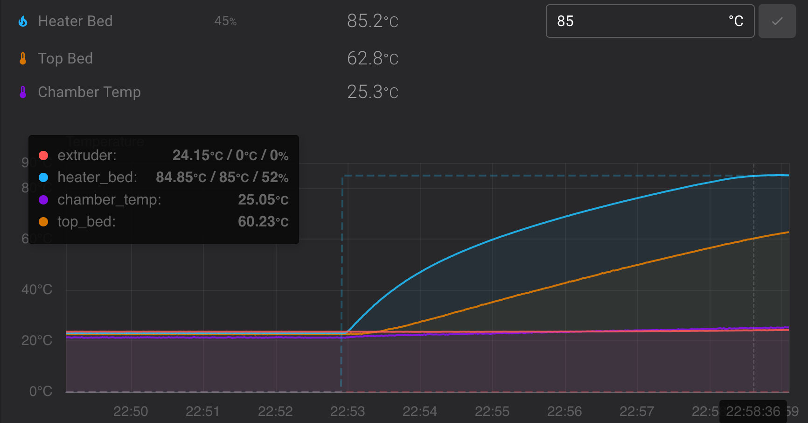

# TEMPERATURE_EQUILIBRIUM

This document provides information on the `TEMPERATURE_WAIT_EQUILIBRIUM` command.

## What is `TEMPERATURE_WAIT_EQUILIBRIUM` for?

`TEMPERATURE_WAIT_EQUILIBRIUM` is designed to wait for a temperature sensor to reach thermal equilibrium, meaning its temperature is no longer changing at a rate higher than a defined threshold. This allows you to delay your print until the heated bed or chamber are at their optimal temperature without having to guess what that temperature will be. It requires a second thermistor as far from the heat source as possible to measure the overall thermal stability of the system. This is useful for printers with think aluminum heated beds or chamber heaters. Usually the bed or chamber heater has a thermistor that controls the heating element. This sensor is placed on the heater to prevent thermal run away and allow active control. But this gives a very optimistic picture of the overall thermal system. Temperatures far away from the heat source can significantly lag the heat source and take many minutes to stabilize. In this example the bed heater reaches the target temperature in about 5 minutes but the sensor on top of the bed lags behind by 25 degrees:



Waiting for a fixed amount of time can be wasteful if the system is already hot. Waiting for a specific temperature can be unreliable if environmental conditions change between prints (e.g. leaving an enclosure open for PLA vs closed for ABS). `TEMPERATURE_WAIT_EQUILIBRIUM` solves this by looking at the rate of temperature change over time. When this rate of change drops below your selected threshold the wait ends. In the example above another 8 minutes of waiting will bring the top bed temp to within 4 degrees of the target at a rate of change less than 0.5C per minute.

## How To Use It
First start the heater and use the `TEMPERATURE_WAIT` command to bring the heater up to operating temperature. Then call `TEMPERATURE_WAIT_EQUILIBRIUM` on the additional sensor to wait for the thermal system to reach equilibrium:

```
TEMPERATURE_WAIT_EQUILIBRIUM SENSOR="temperature_sensor top_bed"
```

This waits for the rate of temperature change of the sensor `temperature_sensor top_bed` to drop below the default rate of 1C per minute. The `SENSOR` argument is required and must be the full name of the sensor. The sensor cannot be bound to a heater, it must be a stand alone sensor (type `temperature_sensor`). Two additional arguments can be used to tune the behavior for your printer:

```
TEMPERATURE_WAIT_EQUILIBRIUM SENSOR="temperature_sensor top_bed" RATE=0.5
```

This waits for the rate of temperature change to drop below 0.5C per minute. The smaller this number, the more stable the system will have to be for the temp wait to end. The minimum value is 0.1.

```
TEMPERATURE_WAIT_EQUILIBRIUM SENSOR="temperature_sensor top_bed" RATE=0.25 TIMESPAN=60
```

This waits for the rate of temperature change to drop below 0.25C per minute using the data captured over, at most, the last 60 seconds. The default measurement `TIMESPAN` is 30 seconds. The minimum `TIMESPAN` is 5 seconds and the max is 60 seconds. A larger`TIMESPAN` collects more data samples making the command less sensitive to noise, but also less sensitive to change. Increasing the `TIMESPAN` size may be required if the temperature sensor is noisy and the desired final rate is very small. A smaller TIMESPAN might be appropriate for more thermally responsive systems that stabilize more quickly or thermistors with low jitter.
