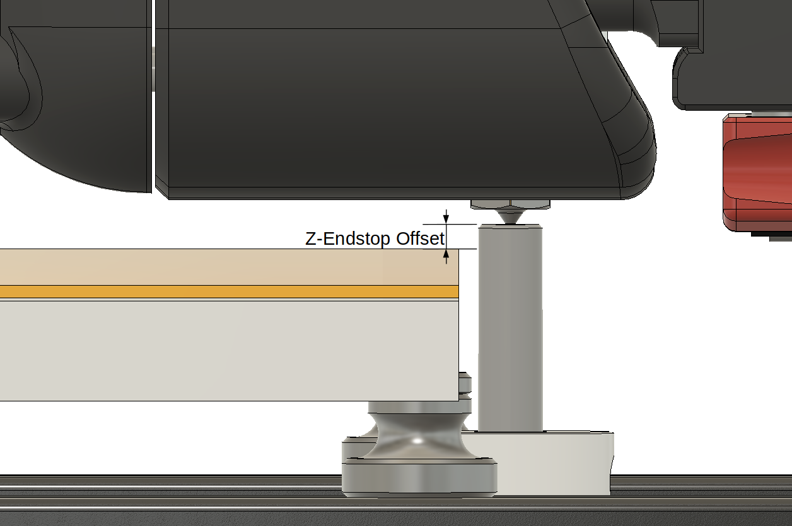
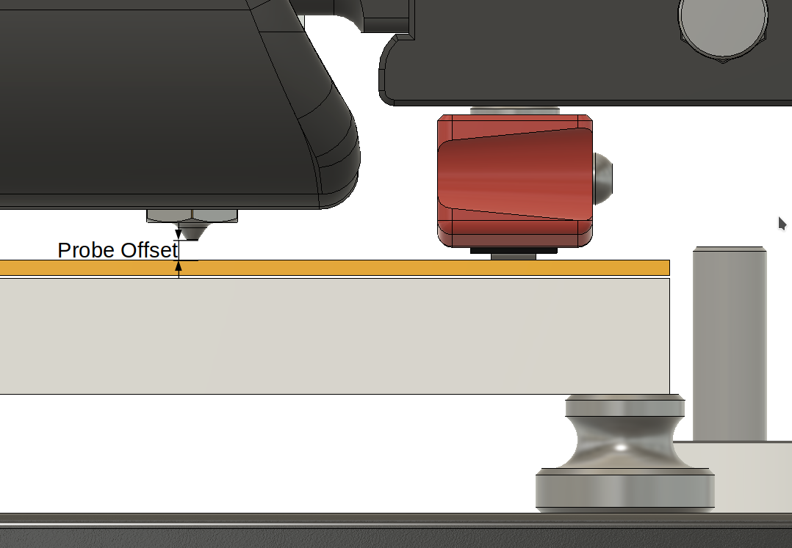
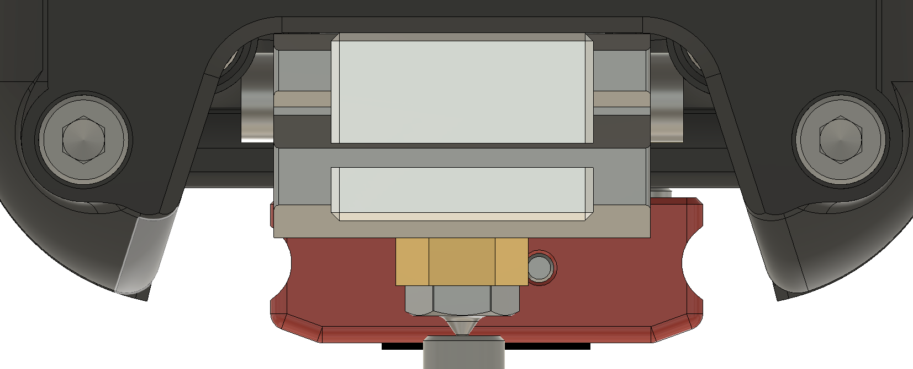
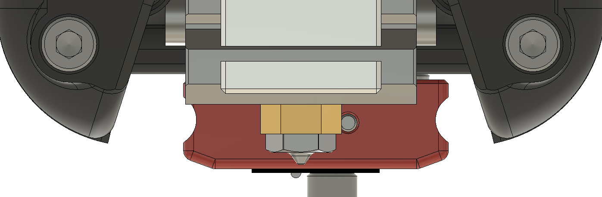
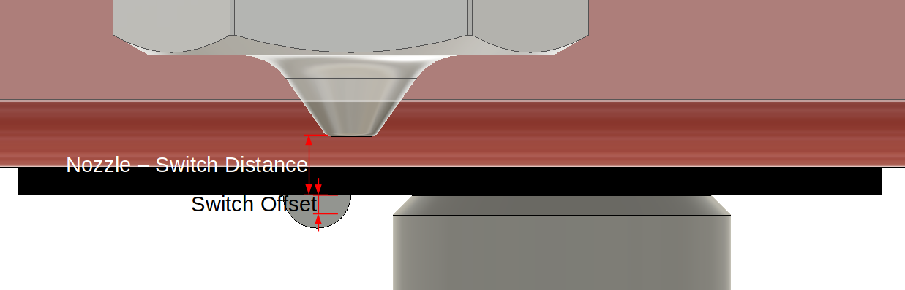
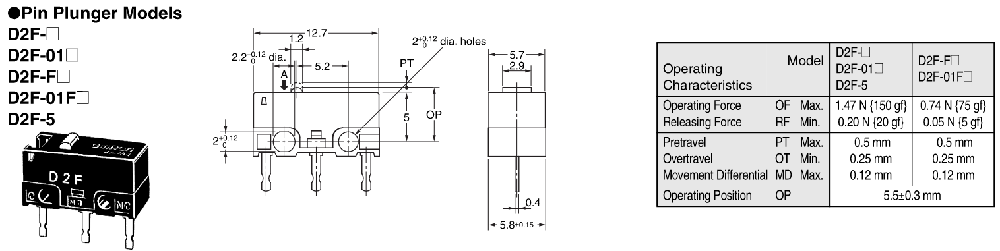

# Automatic Z-Offset Calibration

This document provides information on calibrating the nozzle's Z offset
automatically. With this enabled, manual Z offset or first layer
calibrations are needless. It computes always the correct offset independantly
of the current temperature, used nozzle or used print bed or flex plate.

# Why This

- The Z endstop used in Voron V1 or V2 printers is a clever one because the
  nozzle clicks on a switch which is fixed to the print bed. This enables the
  exchange of nozzles without changing the offset (between switch and bed):
  
- Or, by using a surface probing probe like a mag-probe as the Z endstop.
  This enables the exchange of flex plates without adapting the offset:
  
  An inductive probe would not work, since it does not probe the surface of
  the bed directly!
- But, isn't it possible to get both of it?

It is possible and this it is what this extension does!

# Requirements

But, there are some requirements to use it:

- A Z endstop where the tip of the nozzle drives on a switch (like the stock
  Voron V1/V2 enstop). It will not work with the virtual pin of the probe
  configured as endstop!
- A (magnetic) switch based probe at the print head
- Both, the Z endstop and mag-probe are configured properly and homing and any
  kind of bed leveling are working.
- Attach and detach macros of the mag-probe are needed for this configuration.

# What It Does

1. A normal homing of all axes using the Z endstop for Z (this is not part of
   this plugin). After that, there is a defined zero point in Z. From now on,
   everything is in relation to this point. So, a new homing would change
   everything, since the homing is not that precise.
2. Determine the height of the nozzle by probing the tip of it on the Z endstop
   (like the homing in step 1. But this one can result in a slightly different
   value):
   
3. Determine the height of the mag-probe by probing the body of the switch on
   the z-endstop:
   
4. Calculate the offset between the tip of the nozzle and the trigger point of
   the mag-probe:

   `nozzle switch offset = mag probe height - nozzle height + switch offset`

   

   The trigger point of the mag-probe cannot be probed directly. This is why
   the body of the switch is clicked on the endstop indstead of the trigger
   nob. This is why a small switch offset is used here to reflect the offset
   between the nob and the body of the switch while it is triggerd.
   This offset is fixed.
5. Determine the height of the print surface by probing one point with the
   mag-probe on the bed (preferably the center or the
   "bed_mesh:relative_reference_index" of a configured/used mesh).
6. Now, the final offset is calculated like this:

   `probe offset = probed height - calculated nozzle switch offset`

7. Finally, the calculated offset is applied by using the `SET_GCODE_OFFSET`
   command (a previous offset is resetted before!).

## Interference

Temperature or humindity changes are not a big deal since the switch is not
affected much by them and all values are probed in a small time period and only
the releations to each other are used. The nozzle height in step 2 can be
determined some time later and even many celsius higher in the printer's
chamber, compared to the homing in step 1. That is why the nozzle is probed
again and can vary a little to the first homing position.

## Example Output

The output of the calibration with all determined positions looks like this
(the offset is the one which is applied as GCode offset):

```
Z-CALIBRATION: ENDSTOP=-0.300 NOZZLE=-0.300 SWITCH=6.208 PROBE=7.013 --> OFFSET=-0.170
```

The endstop value is the homed Z position which is always zero or the configure
"stepper_z:position_endstop" setting - and in this case, it's even the same as
the probed nozzle hight.

# Configuration

To activate the extension, a `[z_calibration]` section is needed in the printer
configuration. The configuration properties are described
[here](Config_Reference.md#z_calibration) in details.

## Switch Offset

The "z_calibration:switch_offset" is the already mentioned offset from the
switch body (which is the probed position) to the actual trigger point above
it. A starting point for this value can be taken from the datasheet like from
the Omron switch (D2F-5: 0.5mm and SSG-5H: 0.7mm). It's good to start with a
little less depending on the squishiness you prefer for the first layer (it's
about 0.45 for the D2F-5). So, with a smaller offset value, the nozzle is more
away from the bed! The value cannot be negative.

For example, the datasheet of the D2F-5:



And the calculation of the offset base:

```
offset base = OP (Operation Position) - switch body height
     0.5 mm = 5.5 mm - 5 mm
```

## Attaching and Detaching the Probe

The attaching and detaching of the mag-probe can be done by creating a macro
for the `CALIBRATE_Z` command and surround it by the appropriate commands:

```
[gcode_macro CALIBRATE_Z]
description: Automatically calibrates the nozzles offset to the print surface and dock/undock MagProbe
rename_existing: CALIBRATE_Z_BASE
gcode:
  ATTACH_PROBE     # replace with the name of your specific attach macro
  CALIBRATE_Z_BASE
  DETACH_PROBE     # replace with the name of your specific detach macro
```

It is also possible to use the `start_gcode` and `end_gcode` properties to
call the attach and detach commands instead:

```
[z_calibration]
...
start_gcode: ATTACH_PROBE  # replace with the name of your specific attach macro
end_gcode: DETACH_PROBE    # replace with the name of your specific detach macro
```

If there are any space restrictions and it is not possible to probe the nozzle
on the endstop with the probe attached, the `before_switch_gcode` property can
be used to attach the probe instead of the `start_gcode`. Then, the probe is
not attached until the probe is probed on the endstop:

```
[z_calibration]
...
before_switch_gcode: ATTACH_PROBE  # replace with the name of your specific attach macro
end_gcode: DETACH_PROBE            # replace with the name of your specific detach macro
```

## Bed Mesh

If a bed mesh is used, the coordinates for probing on the print bed must be
exactly the relative reference index point of the mesh since this is the point
zero of the mesh! But, it is possible to omit these properties completely and
the relative reference index point of the mesh will be taken automatically (for
this, the "bed_mesh:relative_reference_index" setting is required and there is
no support for round bed/mesh so far)!

# How To Test It

Do not bother too much about absolute values of the calculated offsets. These
can vary a lot. Only the real position from the nozzle to the bed counts. To
test this, the result of the calibration can be queried by `GET_POSITION`
first:

```
> CALIBRATE_Z
> Z-CALIBRATION: ENDSTOP=-0.300 NOZZLE=-0.267 SWITCH=2.370 PROBE=3.093 --> OFFSET=-0.010000
> GET_POSITION
> mcu: stepper_x:17085 stepper_y:15625 stepper_z:-51454 stepper_z1:-51454 stepper_z2:-51454 stepper_z3:-51454
> stepper: stepper_x:552.500000 stepper_y:-47.500000 stepper_z:10.022500 stepper_z1:10.022500 stepper_z2:10.022500 stepper_z3:10.022500
> kinematic: X:252.500000 Y:300.000000 Z:10.022500
> toolhead: X:252.500000 Y:300.000000 Z:10.021472 E:0.000000
> gcode: X:252.500000 Y:300.000000 Z:9.990000 E:0.000000
> gcode base: X:0.000000 Y:0.000000 Z:-0.010000 E:0.000000
> gcode homing: X:0.000000 Y:0.000000 Z:-0.010000
```

Here, the Z position in "gcode base" reflects the calibrated Z offset.

Then, the offset can be tested by moving the nozzle slowly down to zero by
moving it in multiple steps. It's good to do this by using GCodes, since
the offset is applied as GCode-Offset. For example like this:

```
> G90
> G0 Z5
> G0 Z3
> G0 Z1
> G0 Z0.5
> G0 Z0.3
> G0 Z0.1
```

Check the distance to the print surface after every step. If there is a small
discrepancy (which should be smaller than the offset base from the switch's
datasheet), then adapt the "z_calibration:switch_offset" by that value.
Decreasing the "switch_offset" will move the nozzle more away from the bed.

And finally, if you have double checked, that the calibrated offset is correct,
you can go for fine tuning the "z_calibration:switch_offset" by actually
printing first layer tests. This needs to be done only once!

# How To Use It

## Command CALIBRATE_Z

The calibration is started by using the `CALIBRATE_Z` command. There are no
more parameters. A clean nozzle is needed for running this command.

It does not matter when this calibration is called (and at what temperatures).
But, it is importaint to call it just before starting a print when the printer
is hot. So, it is good to add the `CALIBRATE_Z` command to the `PRINT_START`
macro (which is called from the slicers start gCode). The sequence of this
macro can look like this:

1. Home all axes
2. Heat up the bed and nozzle (and chamber)
3. Get probe, make any bed leveling if needed (like QGL, Z-Tilt), park probe
4. Purge and clean the nozzle
5. Get probe, CALIBRATE_Z, park probe
6. (Adjust Z offset if needed)
7. Print intro line if used
8. Start printing...

**:exclamation: And remove any old Z offset adjustments here
(like `SET_GCODE_OFFSET`)**

For textured print surfaces, it might be necessary to go closer to the bed.
To adjust the offset from the slicers start GCode, the following command can be
added to the `PRINT_START` macro **after** calling the Z calibration:

```
    # Adjust the G-Code Z offset if needed
    SET_GCODE_OFFSET Z_ADJUST={params.Z_ADJUST|default(0.0)|float} MOVE=1
```

Then, a `Z_ADJUST=0.0` can be added to the `PRINT_START` command in the Slicer.
This does **not** reset the offset to this value but adjusts it by the given
amount!

>**NOTE:** Do not home Z again after running the Z calibration or it needs to
> be executed again!

## Command PROBE_Z_ACCURACY

There is also a `PROBE_Z_ACCURACY` command to test the accuracy of the Z
endstop (like the `PROBE_ACCURACY` command of the probe):

```
PROBE_Z_ACCURACY [PROBE_SPEED=<mm/s>] [LIFT_SPEED=<mm/s>] [SAMPLES=<count>] [SAMPLE_RETRACT_DIST=<mm>]
```

It calculates the maximum, minimum, average, median and standard deviation of
multiple probe samles on the endstop by taking the configured nozzle position
on the endstop. The optional parameters default to their equivalent setting in
the z_calibration config section.
