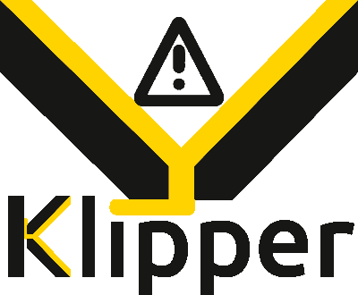

---
hide:
  - toc
title: Welcome
---

{ .center-image }

The Klipper firmware controls 3d-Printers. It combines the power of a
general purpose computer with one or more micro-controllers. See the
[features document](Features.md) for more information on why you
should use the Klipper software.

Start by [installing Klipper software](Installation.md).

Klipper software is Free Software. Read the
[documentation](Overview.md), see the [license](../COPYING), or
[download](https://github.com/Klipper3d/Klipper) the software. We
depend on the generous support from our [sponsors](Sponsors.md).
