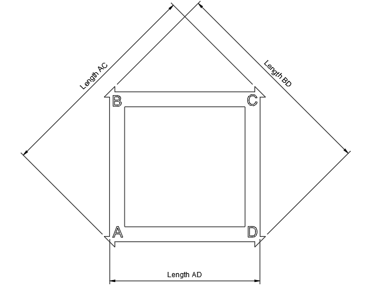

Software based skew correction can help resolve dimensional inaccuracies
resulting from a printer assembly that is not perfectly square.  Note
that if your printer is significantly skewed it is strongy recommended to
first use mechanical means to get your printer as square as possible prior
to applying software based correction.

# Print a Calibration Object
The first step in correcting skew is to print a
[calibration object](https://www.thingiverse.com/thing:2563185/files)
along the plane you want to correct.  There is also a
[calibration object](https://www.thingiverse.com/thing:2972743)
that includes all planes in one model.  You want the object oriented
so that corner A is toward the origin of the plane.

Make sure that the [skew_correction] module is not enabled in printer.cfg
prior to printing the calibration part.

# Take your measurements
The [skew_correcton] module requires 3 measurements for each plane you want
to correct; the length from Corner A to Corner C, the length from Corner B
to Corner D, and the length from corner A to corner D.  When measuring length
AD do not include the flats on the corners that some test objects provide.



# Update printer.cfg
Enter your lengths for the calibration print corresponding to the correct
plane under the [skew_correction] section in printer.cfg, for example:
```
[skew_correction]
xy_ac_length: 140.4
xy_bd_length: 142.8
xy_ad_length: 99.8
```
Restart your printer.  If desired, you can reprint the calibration part
with skew correction enabled. The following gcode can be used to calculate
skew of a single plane and output the results:

```
CALC_MEASURED_SKEW AC=<ac_length> BD=<bd_length> AD=<ad_length>
```

# Caveats

When using the [skew_correction] module it is suggested to home all axes
before attempting a move.  Homing a single axis to move could result in a
correction along the x and/or y axis, potentially leading to a homing error.

It is also important to keep in mind that it is possible for [skew_correction]
to generate a correction that moves the tool beyond the printer's boundries
on the X and/or Y axes.  It is recommended to arrange parts away from the
edges when using [skew_correction].
