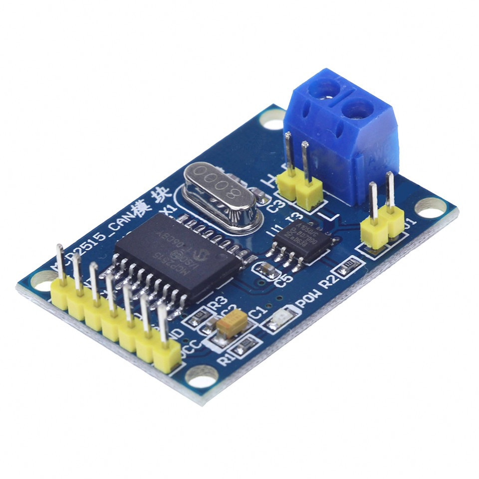
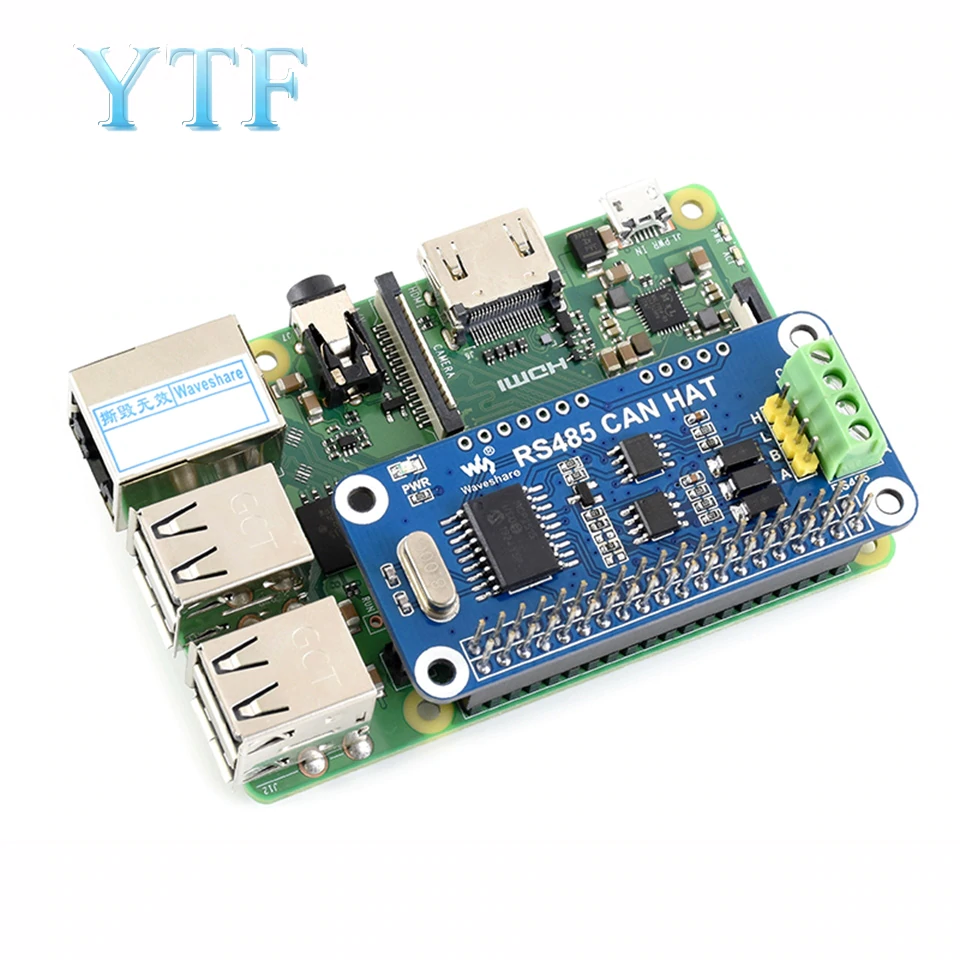
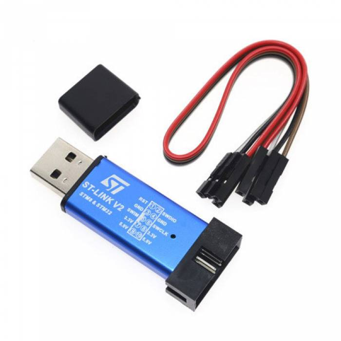
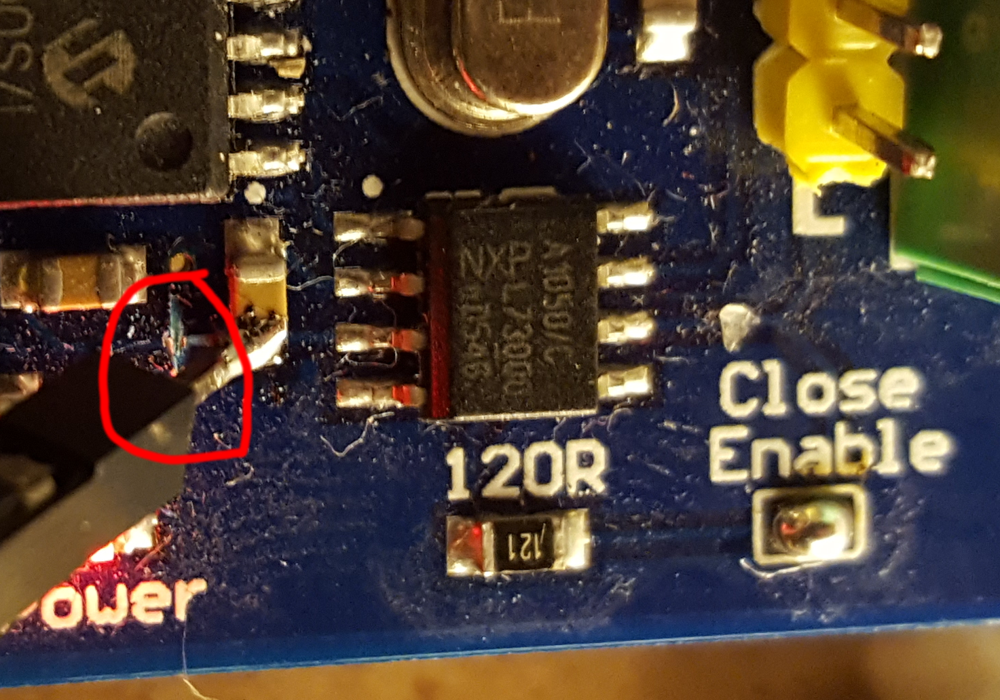

This document describes how the STM32F0 port operates and how to work with
tiny CAN-enabled boards.

Required components
===================

#### MCP2515 module


or this


#### St-link dongle




Adding CAN bus to Raspberry Pi
==============================
(Based on Quick Guide https://www.raspberrypi.org/forums/viewtopic.php?f=44&t=141052)

First of all, (only if you have small CAN module) it’s necessary to modify the CAN-module from ebay, because it has
only one VCC pin, but the MCP2515 needs to be powered from 3V3 and the TJA1050
CAN-transceiver needs to be powered from 5V. Powering both chips from 5V would
work, but then a level-shifter for the SPI would be needed. The Pi's GPIO pins
are NOT 5V tolerant. Cut a trace on the PCB and soldered a pin onto the trace
to deliver 5V only to the TJA1050. Be sure to cut the trace before the capacitor:



Next connect the module:

| MCP2515 | Raspberry Pi |
| --- | --- |
| VCC | 1 (3V3) |
| TJA 1050 VCC | 2 (5V) |
| GND | 6 (GND) |
| CS | 24 (CE0) |
| MISO | 21 (MISO) |
| MOSI | 19 (MOSI) |
| SCK | 23 (SCK) |
| INT | 22 (GPIO25) |

Install can-utils:
> sudo apt-get install can-utils

To activate the driver for the MCP2515 you have to add a kernel overlay, to do
so edit the /boot/config.txt
> sudo nano /boot/config.txt

And add the following lines (set oscillator value according to crystal on your board):

```
dtparam=spi=on
dtoverlay=mcp2515-can0,oscillator=8000000,interrupt=25
dtoverlay=spi1-1cs
```

Now reboot, after the reboot try to setup the the can interface:
> sudo ip link set can0 up type can bitrate 500000

If no errors occurred, the can interface should be ready now.
To make the CAN-interface permanent, add the following lines to /etc/network/interfaces

```
auto can0
iface can0 can static
    bitrate 500000
```

Communicating over CAN
======================

Use "Serial over CAN" emulator software to establish connection:
https://github.com/Delsian/CanSerial

Install st-link on Raspberry Pi
===============================

> sudo apt-get update

> sudo apt-get install cmake

> sudo apt-get install libusb-1.0-0-dev

> git clone https://github.com/texane/stlink stlink-repo

> cd stlink-repo

> make

> cd build/Release/

> sudo make install


Copy to /etc/udev/rules.d/49-stlinkv2.rules:

```
# stm32 discovery boards, with onboard st/linkv2
# ie, STM32L, STM32F4.
# STM32VL has st/linkv1, which is quite different

SUBSYSTEMS=="usb", ATTRS{idVendor}=="0483", ATTRS{idProduct}=="3748", \
    MODE:="0666", \
    SYMLINK+="stlinkv2_%n"

SUBSYSTEMS=="usb", ATTRS{idVendor}=="0483", ATTRS{idProduct}=="374b", \
    KERNEL!="sd*", KERNEL!="sg*", KERNEL!="tty*", SUBSYSTEM!="bsg", \
    MODE:="0666", \
    SYMLINK+="stlinkv2_%n"

SUBSYSTEMS=="usb", ATTRS{idVendor}=="0483", ATTRS{idProduct}=="374b", \
    KERNEL=="sd*", MODE:="0666", \
    SYMLINK+="stlinkv2_disk"

SUBSYSTEMS=="usb", ATTRS{idVendor}=="0483", ATTRS{idProduct}=="374b", \
    KERNEL=="sg*", MODE:="0666", \
    SYMLINK+="stlinkv2_raw_scsi"

SUBSYSTEMS=="usb", ATTRS{idVendor}=="0483", ATTRS{idProduct}=="374b", \
    SUBSYSTEM=="bsg", MODE:="0666", \
    SYMLINK+="stlinkv2_block_scsi"

SUBSYSTEMS=="usb", ATTRS{idVendor}=="0483", ATTRS{idProduct}=="374b", \
    KERNEL=="tty*", MODE:="0666", \
    SYMLINK+="stlinkv2_console"

# If you share your linux system with other users, or just don't like the
# idea of write permission for everybody, you can replace MODE:="0666" with
# OWNER:="yourusername" to create the device owned by you, or with
# GROUP:="somegroupname" and control access using standard unix groups.
```

Now "make flash" command can upload HEX into connected board

Pins allocation
===============

Configurations with CAN and Serial port uses different pins, and during enumeration
process firmware reports all possible pin names. But actually you can use only
existing pins, not involved in communication. Wrong pins will generate shutdown.
